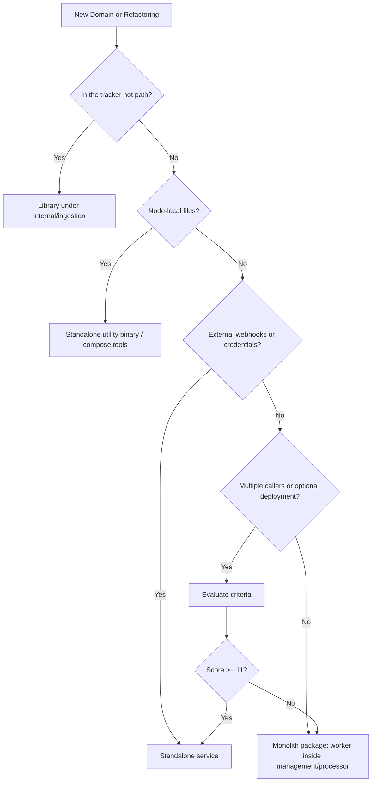

# Microservices vs. Monolith — Decision-Making Guide

This is a living document defining service boundaries for eSPX. Part 1 documents the current audits and platform decisions. Part 2 provides reusable evaluation criteria for future engineering work.

**Scope:** Applies to control-plane binaries and non-hot-path executables under `cmd/*`. The ingestion hot path (the `tracker` injector, `processor` handler, and stream subscribers) must never absorb unrelated domains.

---

## Part 1 — Current Audit and Platform Decisions

### Database Structure

Currently, all control-plane services share **one Postgres instance** in the `docker compose` configuration (named `ad_event_processor` in `.env`; renaming to `espx` is cosmetic but recommended for new environments) and **one ClickHouse database** with the same name.

1. **Per-Domain Schema** — The `payment`, `billing`, and `notifier` schemas are isolated within a single Postgres instance.
2. **Shared Tables / Ads Tables** — `campaigns`, `events`, `balance_ledger`, `outbox_events`, and `sync_idempotency` reside in the public schema.
3. **Auth Tables** — `users`, `sessions`, and `api_keys` reside in the public schema.

**Database sharing is intentional** — it does not hinder future consolidation. Isolation is enforced at the **schema** and **idempotency key prefix** level, not by running separate Postgres containers.

To rename the database if needed: update `DB_NAME`, `CH_DSN`, and initialization scripts, then run `pg_dump` or execute `ALTER DATABASE RENAME`.

### [IMPLEMENTED] Separation of `management` (2026-07)

1. **`cmd/management`** — HTTP admin panel (:8188), settlement gRPC server (:51053), and outbox/recon/pacing background workers.
2. **`cmd/notifier`** — gRPC server (:8085); `internal/notifier` package.
3. **`cmd/ivt-detector`** — Batch analysis job; `internal/ivtdetector` package calling management blacklist HTTP API.
4. **`cmd/log-evacuator`** — Optional compose `tools` profile (local log backup).
5. **`cmd/payment`** — Isolated gRPC service + webhook handlers.
6. **`cmd/billing`** — gRPC server (:51054); `internal/billing` package.

Refer to `docs/reports/MANAGEMENT_SEPARATION.md` for the technical report.

### [IMPLEMENTED] Scaling When Adding Services

1. **Level 1 — New Control-Plane Domain** — Run `CREATE SCHEMA <svc>`, place migration files under `internal/<svc>/migrations/`, use the same `DB_DSN`, and communicate via gRPC with an optional `x-internal-token` header.
2. **Level 2 — Connection Pool Limits** — Limit connection pools for each service in `docker-compose` and service configuration.
3. **Level 3 — Read-Heavy Analytical Queries** — Optimize indexes and queries on the shared Postgres instance; use dedicated ClickHouse queries for IVT/recon.
4. **Level 4 — Compliance / Blast Radius Minimization** — Separate Postgres **container** in compose (e.g., for payments only) as a last resort.

Do not run a separate Postgres container for every microservice by default.

---

### [IMPLEMENTED] `internal/ivtdetector` — Batch Analyzer

**Role:** ClickHouse cold-path analytics → idempotency claims → blacklist synchronization via the management HTTP API.

**Decision:** `cmd/ivt-detector` runs as a separate binary, decoupled from the management admin process.

---

### [IMPLEMENTED] `internal/notifier` — gRPC Service

**Role:** gRPC queue → `notifier.notifications` table → background delivery worker.

**Decision:** `cmd/notifier` runs as a standalone service on port `:8085`.

---

### [IMPLEMENTED] `internal/logevacuator` — Node Log Archiver

**Role:** Watches rotated tracker segment files `*.log.zst.ready` → copies to a local archive path with exactly-once checkpoints.

**Storage:**
1. Postgres — None.
2. Checkpoint file — `/var/lib/espx/log-evacuator.checkpoint` (or env override).
3. Archive directory — Local mounted directory (e.g., `./data/log-archive` in compose).

**Why it remains a standalone binary:**
1. Must run on the same physical host as the tracker log directory.
2. Minimal distroless image footprint; compose `tools` profile.
3. I/O failures during archiving are isolated from tracker ingestion.

**Why it is not merged with tracker/management:**
1. fsnotify calls and heavy file copies must not run on the gnet hot path.
2. The management and processor services do not own local tracker log directories.
3. No RPC benefits from consolidation.

**Decision:** Maintain **`cmd/log-evacuator` as a separate binary** (compose `tools` profile or local systemd unit). Do not merge it into the monolith.

---

### [CHANGED / CONSOLIDATED] Settlement gRPC Server — Co-located in `management`

**Role:** `ApplyPaymentCredit` → `balance_ledger` mutations from the payment outbox worker (`internal/management/settlement_handler.go`).

**Decision (Updated 2026-07-04):** The standalone `cmd/settlement` binary was removed as redundant; the settlement gRPC server now runs inside `cmd/management` on port `SETTLEMENT_SERVER_PORT`.

---

### [IMPLEMENTED] `cmd/management` — Admin Hub & Settlement gRPC

**Role:** REST admin API, settlement gRPC, outbox workers, reconciliation (recon), pacing, scheduler, and credit scoring. Excludes notifier and IVT detector, which remain separate binaries.

---

### `internal/payment` — Standalone Microservice

**Role:** Payment intents gRPC (:51052), Stripe webhooks + HTMX UI (:8187), database schema `payment.*`, and outbox worker → management settlement gRPC → `balance_ledger`.

**Integrations:**
1. Management → payment — `PaymentClient` to create checkout sessions.
2. Payment → management — `OutboxWorker` → `SettlementService.ApplyPaymentCredit`.
3. Compose — `payment` depends on `management`.

**Why `cmd/payment` remains separate:**
1. Webhook traffic is isolated on a dedicated port.
2. Provider outages and webhook retry storms are isolated.
3. Stripe API credentials reside in an isolated process.
4. Outbox polling (100 ms interval) is isolated to the payment process.
5. Management runs without payment if the internal token is unset.
6. Active execution path in compose.

**Consolidated Trade-offs:**
1. gRPC call when creating payment intents.
2. Shared Postgres instance (separate schema namespaces).
3. ~5k lines of code that would otherwise be merged into management.
4. gRPC call to management to credit customer balances in the ledger.

**Decision:** **Keep separate.** Scale as a singleton with explicit connection pool limits. Future plans include Stripe checkout integration, refunds, and an optional isolated Postgres container in compose.

---

### `internal/billing` / `cmd/billing`

**Role:** Monthly invoice generation via gRPC using `balance_ledger` aggregates; database schema `billing`; proxies HTMX queries from management when `BILLING_INTERNAL_TOKEN` is configured.

**Decision:** **Keep separate.** Read-heavy month-end calculation profiles; tax calculations run in their own schema. Future plans include automated cron schedules and notifier deliveries.

---

### Consolidation Status Summary

1. **Management** — Admin REST API & settlement gRPC (:8188, :51053).
2. **Settlement** — Co-located inside management (no standalone binary).
3. **Payment** — Standalone `cmd/payment` service.
4. **Notifier** — Standalone `cmd/notifier` service.
5. **IVT Detector** — Standalone `cmd/ivt-detector` analyzer.
6. **Log Evacuator** — Standalone local binary (compose `tools` profile).
7. **Auth / Billing** — Standalone gRPC services.

---

## Future Backlog Ideas

These are design options and roadmap experiments. They do not represent a final plan — evaluate using Part 2 criteria before splitting or merging binaries.

### `internal/management` / `cmd/management`

1. **Notifier gRPC Client** (Integration) — Triggers operator alerts on recon discrepancies, stream consumer lag, or Redis shard outages. [IMPLEMENTED]
2. **Priority Outbox Lanes** (Optimization) — Flushes `UPDATE_BLACKLIST` and `PAUSE_CAMPAIGN` commands before pacing updates. Reduces mitigation latency for fraud events.
3. **Admin List Optimization** (Ops / Scaling) — Materialized views or indexes in Postgres. Recon/audit queries do not require a separate database instance.
4. **OpenAPI / OpenRPC** (DX) — API schemas for `/admin/*` routes, excluding session cookie authentication. Allows automation without parsing HTMX.
5. **Slot Migration Webhook** (Integration) — Triggers notifier alerts when `MarkSlotMapMigrating` finishes. [IMPLEMENTED]
6. **Autoscaling Coordinator** (Split candidate) — Optional `cmd/slot-coordinator` binary. Slot map operations are CPU-intensive; scores ~9 points — only viable under highly elastic resizing schedules.
7. **Pacing Warmup** (Usability) — `POST /admin/campaigns/{id}/warm-budget` endpoint. Warms campaign budgets post Redis flush without a full catalog reload.
8. **Structured Audit Export** (Usability) — Daily CSV/JSON exports (using log-evacuator design patterns). The export loop runs decoupled from HTTP request routines.
9. **Per-Shard Health Dashboard** (Usability) — Exposes shard metrics on the `/admin/ops/shards` dashboard. Accelerates incident response.
10. **Smart Pacing Controller** (AdTech Business Logic) — Computes delivery coefficients using historical dayparting curves from ClickHouse instead of flat linear budgets.
11. **Credit Scoring & Dynamic Overdraft** (AdTech Business Logic) — Computes credit limits based on payment history, allowing campaigns to run slightly negative in Redis without halting traffic during checkout latency.
12. **Multi-Armed Creative Optimizer** (AdTech Business Logic) — Evaluates creative CTR in ClickHouse and updates weights (`brand:creatives`) on Redis shards in real time.
13. **Bid Floor Optimizer** (AdTech Business Logic) — Background optimization of floor prices using historical win/loss ratios. Updates Redis to prevent unprofitable bids.

### `internal/billing` / `cmd/billing`

1. **Automated Invoice Cron** (Optimization) — Automated cron generating invoices for the previous month. Currently `GenerateInvoice` is gRPC-only.
2. **Invoice Delivery** (Integration) — Renders PDFs and triggers `notifier.SendNotification` with download URLs. Completes the accounting chain.
3. **Credit Notes / Adjustments** (Optimization) — Negative ledger entries tied to refund types in `balance_ledger`.
4. **Custom Tax Engines** (Optimization) — Expands `TaxCalculator` beyond static `customer_tax_profiles`.
5. **Multi-Currency Invoices** (Optimization) — Groups ledger spends by currency instead of assuming USD. Aligns with micro-unit ledger formats.
6. **Invoice Dedup Portal** (Integration) — Integrates invoice statuses into the management HTMX UI via gRPC proxies.
7. **Invariant Fail webhook** (Integration) — Triggers notifier alerts if `CheckLedgerBalanceInvariant` fails.

### `internal/payment` / `cmd/payment`

1. **Stripe-go Checkout** (Optimization) — Connects `createStripeCheckoutSession` (currently stubbed).
2. **Refund & Chargeback Webhooks** (Optimization) — `ApplyPaymentDebit` RPC handler. Handles disputes and reversals.
3. **Dispute Lifecycle** (Optimization) — Exposes dispute statuses in the admin dashboard.
4. **3DS / SCA Redirect Handles** (Optimization) — Handles card challenges in HTMX checkout frames.
5. **Webhook Replay Tool** (Ops) — Replays `webhook_events` from logs using idempotency keys to resolve drift.
6. **Dedicated Postgres Container** (Ops / Compliance) — Runs payments on an isolated DB container in compose. [IMPLEMENTED]
7. **Provider Interface Abstraction** (Optimization) — Integrates additional gateways under the `Provider` interface.
8. **Payment Outage Notification** (Integration) — Pings notifier on `SETTLEMENT_FAILED` events.

### Settlement gRPC Server (in `management`)

1. **`ApplyPaymentDebit`** (Optimization) — Handles refund/chargeback events under the settlement ledger API.
2. **`GetLedgerEntry`** (Optimization) — Resolves payment statuses in the UI without direct billing database lookups.
3. **gRPC Interceptor Metrics** (Ops) — Latency and error tracking for the gRPC settlement channel.
4. **Batch Processing** (Optimization) — Allows payment workers to flush accumulated events after recovery.

### `internal/notifier` / `cmd/notifier`

1. **Management Notifier Client** (Integration) — Notifies operators on recon mismatches, stream consumer errors, or Sentinel events.
2. **Unified Alertmanager Flow** (Integration) — Standardizes Alertmanager webhook alerts through the notifier gRPC backend.
3. **Billing Outage Hooks** (Integration) — Triggered on accounting failures.
4. **Rate Limiting** (Optimization) — Protects endpoints from provider API rate blocks (Token Bucket).
5. **Template Registry** (Optimization) — Manages alert templates (`{{campaign_id}}` variables) centrally.
6. **Delivery Webhook Callback** (Optimization) — Fires webhooks on notification success/fail.
7. **Failed Queue Retry UI** (Ops) — Retries failed notifications manually from the management dashboard.
8. **`SendNotificationBatch` Streaming** (Optimization) — Lowers overhead on massive alert storms.

### `internal/ivtdetector` / `cmd/ivt-detector`

1. **gRPC `BlockIP` Handler** (Integration) — Replaces admin-key HTTP calls with secure internal RPC.
2. **In-Process Blocker** (Consolidation Candidate) — Runs analyzer checks in-process inside management if HTTP latency becomes a bottleneck.
3. **Datacenter ASN Rules** (Optimization) — Connects MaxMind ASN lists to ClickHouse query filters.
4. **Campaign-Specific CTR Rules** (Optimization) — Identifies bot click spikes targeting specific campaign IDs.
5. **`fraud_events` Telemetry** (Optimization) — Connects fraud stream features directly to ClickHouse tables.
6. **Prometheus Metrics** (Ops) — Tracks `ivt_candidates`, `ivt_enqueued`, and `ivt_backpressure`.
7. **Plugin Rule Registry** (Optimization) — Allows registering new rule engines under the `SuspiciousFinder` interface without modifying core code.
8. **Feedback loops** (Optimization) — Tunes rule thresholds based on recon discrepancies.
9. **Read-Only ClickHouse User** (Ops / Scaling) — Restricts IVT query credentials to read-only access to prevent analytical lockouts on the database.

### `internal/logevacuator` / `cmd/log-evacuator`

1. **Tracker Sidecars** (Ops) — Runs one evacuater container per tracker log volume mount in compose.
2. **Local Retention Policies** (Optimization) — Prunes logs based on age/disk ceilings.
3. **Log Evacuator Bandwidth Limits** (Optimization) — Limits write rates to prevent disk I/O conflicts during peak ingestion volume.
4. **Prometheus Metrics** (Ops) — Tracks bytes moved, run latency, and errors.
5. **Archive Encryption** (Optimization) — Encrypts archived blocks with AES-GCM for PII compliance.
6. **Local Retention Safety Margins** (Optimization) — Retains logs locally for N days before cleanup.
7. **Compose Log Profiles** (Ops) — Enforces local archiving by default.
8. **Archive Verification** (Optimization) — Compares post-copy SHA-256 hashes to guarantee data integrity.

### Cross-Cutting Tasks

1. **Rename DB** `ad_event_processor` → `espx` (Ops).
2. **`x-internal-token` Rotation** (Security) — Aligns token auth parameters across all backends.
3. **Chaos Profiles** (Testing) — Chaos test harnesses for payment, management, and billing services.

### Architecture Proposals (New Services)

#### Monolith Packages (managed by `cmd/management` or `cmd/processor`):
1. **Blacklist TTL Janitor** — Prunes temporary IP addresses from Postgres and Redis edge states when their TTL expires. Prevents memory bloat.
2. **Dynamic GeoIP Updater** — Periodically downloads and updates MaxMind databases on the shared volume without restarting trackers.
3. **Alertmanager Webhook Adapter** — Translates Prometheus alerts and forwards them to the notifier gRPC server.

#### Standalone Microservices (dedicated binaries under `cmd/`):
1. **`cmd/slot-coordinator` (Shard Rebalancing Coordinator)** — Manages slot remapping, keys moving, and budgets during Redis shard resizing (StaticSlotSharder N).
2. **`cmd/fraud-intelligence` (Stream Scoring Service)** — Evaluates real-time click fraud in sliding memory windows (subnet analysis, CTR spikes) to offload filters from the tracker.
3. **`cmd/ledger` (Standalone Ledger Service)** — Isolates the `balance_ledger` table and settlement gRPC endpoints into a dedicated database (`db-ledger`) for compliance.

---

## Part 2 — Decision Framework: Monolith vs. Microservice

Use this framework when adding a domain area or splitting/merging binaries in `cmd/*`.

### Step 0 — Workload Classification

1. **Hot-Path** — Tracker parsing/filtering, stream processing. Policy: Never split, never mix with unrelated domains.
2. **Control-Plane** — Auth, payment, billing, admin REST. Policy: Standalone service if evaluation score is high.
3. **Batch / Cron** — IVT scans, partition janitors, recon. Policy: Library + background routine inside an existing cold-path binary.
4. **Node Utility** — Log rotation, local backups (log-evacuator). Policy: Standalone binary deployed near the data source; no network API.

If the workload falls under **Batch/Cron** or **Node Utility**, stop — do not create a microservice unless it requires a shared RPC API for multiple clients.

---

### Criteria Matrix (Score 0 to 2)

1. **H — Hot-Path Isolation** — 0: No impact on ingestion latency/allocations. 2: Any risk to gnet/RPS if co-located.
2. **E — External Network Calls** — 0: Internal only. 2: Webhooks, OAuth, or public gateways (Stripe, SMS).
3. **S — Secret / Compliance Isolation** — 0: No sensitive credentials. 2: PCI DSS scope, gateway keys, SMS tokens that must not reside in the general admin process.
4. **F — Failure Blast Radius** — 0: Module crash does not affect admin operations. 2: Retry storms, circuit breaker locks, or OOM crashes would disrupt the admin console/API.
5. **L — Load Profile** — 0: Matches host CPU/RAM profiles. 2: Heavy polling, bursty webhooks, or expensive calculations.
6. **C — Caller Count** — 0: Callers are single-host or non-existent. 2: Multiple independent services require a stable gRPC contract.
7. **D — Data Ownership** — 0: Shares tables with the host. 2: Dedicated schema namespace + independent migrations.
8. **O — Operational Independence** — 0: Deployed strictly with the host. 2: Optional in compose; the system starts and runs even if this service is stopped.
9. **T — Team / Lifecycle** — 0: Same developers, unified release schedules. 2: Separate owners or mismatching release schedules.

**Score Evaluation (Max 18):**
1. **0–5 points** — **Monolith Package** — Package under `internal/<domain>/` loaded inside `cmd/management` or `cmd/processor`.
2. **6–10 points** — **Modular Monolith** — Standalone package under `internal/` + background routine in its own goroutine; re-evaluate if new clients are added.
3. **11+ points** — **Standalone Service (`cmd/<service>`)** — Standalone gRPC service, private schema namespace, and internal token authentication.

Always apply the **Veto Rules** regardless of the score.

---

### Veto Rules (Hard Constraints)

**Never inject into `tracker`:**
- Heavy reflection, HTTP client pools, cron loops, or Postgres write paths that are not required for ingestion confirmation.

**Never invoke external microservices from the hot path:**
- gRPC/HTTP calls to payment, notifier, etc., are forbidden inside `processTrack()` or the filter pipeline.

**Never separate components without active clients or webhooks:**
- If the score is high due to future plans but there are no current callers, use the **library + worker** approach until integration is active in the current sprint.

**Never split solely for "clean architecture":**
- Sharing `DB_DSN` and crossing schemas (payment → `balance_ledger`) means you already run a **modular monolith database**; splitting the process adds no isolation.

**Always isolate node-local I/O:**
- Log shipping, mmap brokers, and checkpoint files must be local utility binaries, not network microservices.

---

### Decision Tree

---

### New Standalone Service Checklist

When the criteria justify `cmd/<service>`:
1. Package `internal/<svc>/` + entry point `cmd/<svc>/main.go`.
2. gRPC contract `api/<svc>.proto` compiled via buf to vtproto.
3. Migrations under `internal/<svc>/migrations/` with `CREATE SCHEMA <svc>`. Uses shared `DB_DSN` without hardcoding database names.
4. Configurations under `internal/config/` with isolated connection pools.
5. Internal token validation (`x-internal-token`) for service-to-service calls.
6. Compose entry with memory limits; ports documented in `docs/ARCHITECTURE.md`.
7. Integrate at least one active client before enforcing execution in compose.

When the criteria suggest a monolith package:
1. Package under `internal/<domain>/`.
2. Worker registration inside `cmd/management/main.go` or `cmd/processor/main.go` using `StartBackgroundWorker`.
3. Reuse the host's connection pool or configure a private pool with a strict connection limit.
4. No gRPC/HTTP endpoints unless requested by external systems.

---

### Service Classification Summary

1. **tracker / processor** — Ingestion / processing split; criteria do not apply.
2. **management** (10/18) — H=2, E=0, S=1, F=1, L=1, C=2, D=2, O=0, T=1. Monolith hub; settlement gRPC integrated.
3. **auth** (14/18) — H=2, E=0, S=2, F=2, L=1, C=2, D=2, O=2, T=1. Standalone.
4. **payment** (16/18) — H=2, E=2, S=2, F=2, L=2, C=1, D=2, O=2, T=1. Standalone.
5. **billing** (11/18) — H=2, E=0, S=1, F=1, L=1, C=1, D=2, O=2, T=1. Standalone.
6. **notifier** (12/18) — H=2, E=0, S=2, F=2, L=1, C=0, D=2, O=2, T=1. Standalone `cmd/notifier`.
7. **ivt-detector** (7/18) — H=2, E=0, S=0, F=1, L=1, C=0, D=0, O=2, T=1. Standalone batch analyzer.
8. **log-evacuator** (8/18) — H=2, E=0, S=1, F=2, L=1, C=0, D=0, O=2, T=0. Standalone utility (no RPC).

---

### Related Documents

- `docs/ARCHITECTURE.md` — Topology, DB schemas, settlement flows.
- `docs/reports/MANAGEMENT_SEPARATION.md` — Management separation report.
- `.cursorrules` — Hot-path constraints (zero allocations, no external domains in ingest).
