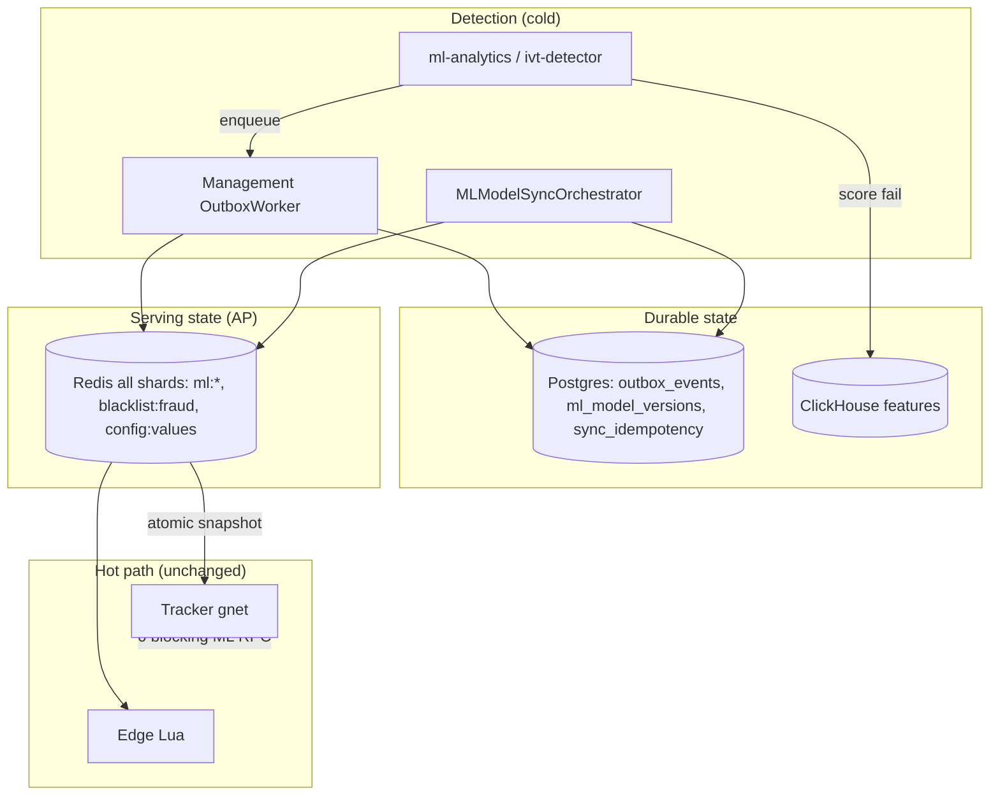
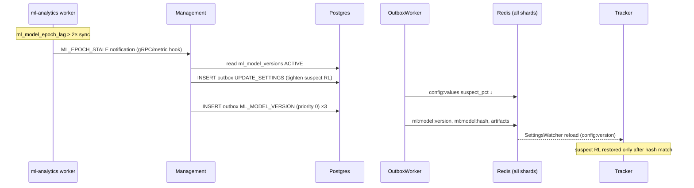
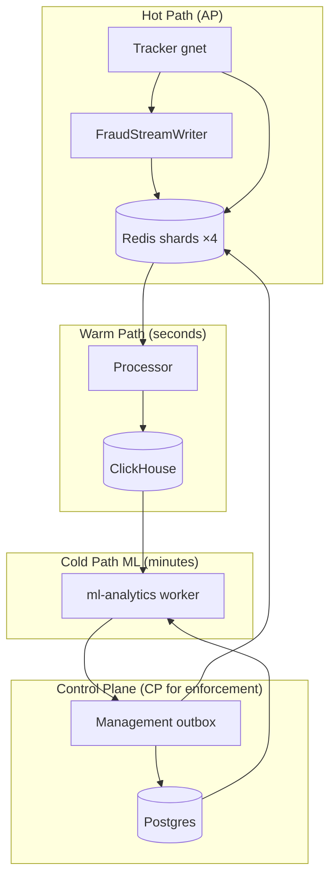

# ML Async Analytics for Cold-Path Anti-Fraud (eSPX)

This document proposes a **background ML analytics layer** for eSPX: anomaly detection and fraud scoring over tracker traffic, with **eventual enforcement** on the hot path. It is designed for high-RPS AdTech ingestion where synchronous ML inference on `/track` is unacceptable.

**Related:** [docs/MICROSERVICES.md](docs/MICROSERVICES.md), [docs/SHARDING_STRATEGY.md](docs/SHARDING_STRATEGY.md), [docs/RUNTIME.md](docs/RUNTIME.md), [GUIDE_CHAOS_RELIABILITY_RU.md](GUIDE_CHAOS_RELIABILITY_RU.md), [ML_ANALYTICS_MILESTONE.md](ML_ANALYTICS_MILESTONE.md) (implementation plan).

---

## 1. Goals and Non-Goals

### Goals

- Detect **GIVT** (General Invalid Traffic) and **SIVT** (Sophisticated Invalid Traffic) patterns that rule-based filters miss: bot farms, click injection, fingerprint rotation, campaign-level CTR spikes, geo-velocity anomalies, supply-chain spoofing signals.
- Operate **fully async**: train and score on the cold path; propagate decisions through the existing **outbox → Redis** control plane.
- Respect **CAP** under partition: trackers and edge remain **available** for filtering; ML state converges in the background with explicit version epochs.
- Support **rolling model deploy** where a fraction of Redis shards synchronize new model artifacts while the rest continue serving traffic with the previous version.
- Prefer **lightweight, quantized** models with a credible **Go inference path**.

### Non-Goals

- Synchronous per-request neural network inference inside `gnet` workers.
- Replacing Postgres as financial truth or Redis Lua as budget authority.
- Full OpenRTB 3.0 bid-request signing on the tracker (eSPX is a first-party tracker, not an exchange). We **borrow signal fields** from OpenRTB 2.6 / ads.cert for feature design and future SSAI/CTV integrations.

---

## 2. Industry Context (2025–2026)

### OpenRTB and supply-chain signals

| Standard | Relevance to eSPX ML features |
| :--- | :--- |
| **OpenRTB 2.6** (IAB Tech Lab, 2023-09) | CTV fields, `burl` billing notices, device/IP metadata for server-side anti-IVT. OpenRTB 2.2+ introduced real-time bot feedback between buyers and sellers. |
| **OpenRTB 2.x implementation guide** | Recommends `X-Forwarded-For` / `X-Device-IP` and `X-Device-User-Agent` on server-fired impression notifications so recipients run anti-IVT on **end-user** metadata, not the notifier host. |
| **OpenRTB 3.0 / AdCOM** | Inventory authentication (`cert`, `digest`, `ds`) and signed bid requests. Adoption is limited; treat as **optional enrichment** for publisher-authenticated inventory, not a hard dependency. |
| **ads.cert 2.0** (2021+, current direction) | **Call Signs** and **Authenticated Connections** for S2S trust (CTV/SSAI billing). Complements ML: crypto proves *who sent* the event; ML proves *whether behavior is human*. |
| **ads.txt / sellers.json / supplychain** | Domain and seller identity — useful as categorical features and blocklist seeds, not ML labels by themselves. |
| **MRC IVT Addendum** | Requires **post-serve GIVT filtration** for accredited measurement; **discourages** exposing all GIVT rules pre-bid (reverse-engineering risk). SIVT detection is encouraged but not universally mandated pre-bid. |
| **IAB Spiders & Bots List** | GIVT baseline — keep as deterministic L1 filter; ML targets SIVT and novel patterns. |

**Design implication:** eSPX ML should default to **post-ingest / near-real-time batch** scoring (seconds to minutes), with **graduated enforcement** (rate-limit → ghost IVT → blacklist) rather than hard-blocking every suspicious request synchronously. This aligns with MRC guidance and reduces adversarial adaptation.

---

## 3. Architectural Principles

### 3.1 DDIA (Kleppmann) — patterns already in eSPX

| DDIA concept | eSPX mapping | ML extension |
| :--- | :--- | :--- |
| **Event log / stream** | `FraudStreamWriter` → Redis stream; processor → ClickHouse | Primary training corpus; append-only, immutable features |
| **Materialized views** | ClickHouse rollups, IVT SQL rules | Pre-aggregated feature tables (`ml_features_1m`, `ml_features_1h`) |
| **Change data capture** | Outbox → Redis replication | Model version + threat intel propagation |
| **Idempotent consumers** | `ivt_idempotency`, `sync_idempotency` | `ml_enforcement_idempotency` for IP/ASN/campaign actions |
| **Eventual consistency** | `config:version`, slot map epochs | `ml:model:version`, `ml:threat:epoch` per shard |
| **Lambda architecture** | Hot rules + cold reconciliation | **Speed layer:** Redis counters / HLL; **Batch layer:** ClickHouse + model retrain |

ML is a **derived view** of the event log. Enforcement is an **async side effect** via outbox — same pattern as blacklist and campaign pause.

### 3.2 Tanenbaum — distributed systems under load

- **No blocking RPC on the hot path.** Trackers never call an ML service. They read **local Redis keys** and **atomic config snapshots** only.
- **Fail independently.** ML worker crash must not affect `/track`. Worst case: stale threat intel until the next successful cycle.
- **Explicit timeouts and backpressure.** Mirror `ivt-detector`: pause enforcement when `outbox_events` PENDING exceeds limit (`ErrOutboxBackpressure`).
- **Stateless workers, stateful stores.** ML binaries are cattle; Postgres + ClickHouse + Redis hold truth and serving artifacts.

### 3.3 CAP trade-off for ML state

Under network partition or slow shard:

| Choice | Behavior |
| :--- | :--- |
| **AP (default)** | Trackers keep filtering with **last-known** `ml:model:version` and threat sets. New blocks may lag; false-positive releases lag too. |
| **Fail-closed tightening** | On epoch gap or stale ML channel (> 2× sync interval), **tighten** suspect-tier RL only — never loosen block thresholds without a signed snapshot (same policy as UDP quota in [SHARDING_STRATEGY.md](docs/SHARDING_STRATEGY.md) §3). |
| **CP (money paths)** | Budget, idempotency, ledger — unchanged; Postgres + Lua remain authoritative. |

**Never** block the hot path waiting for ML consensus.

### 3.4 Currency micro-units (required)

eSPX stores **all money** as signed `int64` **micro-units** in Postgres, Redis budget keys, and the balance ledger. This is independent of the optional **processor micro-batch** (100 ms scoring windows) — do not conflate the two uses of “micro”.

| Concept | Definition |
| :--- | :--- |
| **Micro-unit** | Smallest billable currency increment: **1 major unit = 1_000_000 micro** (6 decimal places). Example: $0.10 click = `100_000` micro; $1.50 = `1_500_000` micro. |
| **Canonical columns** | `campaigns.budget_limit`, `campaigns.current_spend`, `customers.balance`, `balance_ledger.amount`, `amount_micro`, `budget_limit_micro`, `floor_micro` (RTB deals) — all BIGINT micro-units ([docs/architecture.md](docs/architecture.md)). |
| **Env conversion** | Dollar env vars (e.g. `CLICK_AMOUNT=0.1`) are converted via `getEnvMicro` (`× 1_000_000`) in `internal/config/env_parse.go`. |
| **Display / API** | Cold-path JSON may expose `*_micro` (int64) or formatted decimals (`formatMicro`); **never** persist floats as money truth. |
| **R5 tolerance** | Budget chaos invariant allows **±1 micro-unit** drift between Postgres authority and Redis cache: `(budget_limit - redis_remaining) = pg_current_spend + sync_delta` ±1 micro — not ±1 cent or ±1 dollar. |

**ML layer requirements:**

1. **Feature extraction** — spend velocity, CTR cost, campaign z-scores, and ledger-derived signals **must** read micro-unit integers from ClickHouse/Postgres (or dimensionless ratios like `current_spend / budget_limit`). Do not use `float64` dollars in training pipelines for money columns.
2. **ClickHouse** — store/export `spend_micro`, `budget_limit_micro` as `Int64`; if normalizing for models, document scale (e.g. divide by `1e6` only at export, keep provenance in `metadata.json`).
3. **Enforcement vs billing** — ghost IVT (`GhostIVTEnabled`) marks events non-billable; ML scoring must not write `budget:*` keys. Financial truth stays Postgres + Lua debit path.
4. **Chaos / DoD** — every ML enforcement test that touches spend asserts `AssertBudgetInvariant` with **±1 micro** tolerance and `current_spend ≤ budget_limit` in Postgres.
5. **Metrics** — use `ad_quota_drift_micro` and ledger counters in micro-units; ML dashboards should label axes `_micro` or “ratio”, not unqualified “dollars”.

```sql
-- Example: campaign spend velocity feature (micro-units, integer math)
SELECT
    campaign_id,
    sum(cost_micro) AS spend_micro_1h,  -- Int64, not Float64 dollars
    toFloat64(sum(cost_micro)) / greatest(toFloat64(any(budget_limit_micro)), 1.0) AS spend_ratio
FROM clicks
WHERE created_at >= now() - INTERVAL 1 HOUR
GROUP BY campaign_id;
```

See also [ML_ANALYTICS_MILESTONE.md](ML_ANALYTICS_MILESTONE.md) § Code style — cold-path money types.

### 3.5 Failure detection and recovery

Recovery is **cold-path only** — the hot path never blocks waiting for ML. Mechanisms reuse existing eSPX control-plane primitives: **Postgres outbox** (`outbox_events`), **`sync_idempotency`** claims, **`config:version`** propagation, **`SettingsWatcher`** atomic reload, and the **`ivt-detector`** scan/backpressure loop (`internal/ivtdetector/detector.go`).

Pattern mirrors [docs/RUNTIME.md](docs/RUNTIME.md) §5 (UDP recovery) and [docs/SHARDING_STRATEGY.md](docs/SHARDING_STRATEGY.md) epoch-gap policy. Financial recovery stays **`ReconWorker`** + `AssertBudgetInvariant` — ML never touches `budget:*` or `current_spend`.

#### Recovery topology



| Component | Recovery role | Existing code to extend |
| :--- | :--- | :--- |
| `cmd/ivt-detector` / `cmd/ml-analytics` | Scan loop, backpressure gate, idempotency claim/release | `Detector.Run`, `Detector.RunLoop`, `IdempotencyStore` |
| `cmd/management` `OutboxWorker` | Apply Redis side effects; reclaim stale `PROCESSING`; priority lanes | `outbox_worker.go`, `GetPendingOutboxEventsForUpdate` |
| `MLModelSyncOrchestrator` (new) | Per-shard `SYNC` / rollback; canary gate | Model after `SlotMigrationOrchestrator` |
| Tracker `SettingsWatcher` | Reload `ml:score:boost` snapshot; no RPC | `filter_layer`, `config:version` iterate |
| `BlacklistJanitor` | TTL expiry for temporary ML blocks | `StartBlacklistJanitor` |
| `OpsAlerter` | Page on sync stuck, scoring failures, janitor errors | `ops_alerter.go` |
| `ReconWorker` | Budget drift after incident — **not** ML scope | `recon_worker.go` |

#### Environment and tuning

| Variable | Default | Recovery use |
| :--- | :--- | :--- |
| `ML_ANALYTICS_ENABLED` | `false` | Kill-switch — worker exits loop; no new enqueues |
| `ML_SCAN_INTERVAL_MS` | `300000` (5 min) | Scan cadence; stale threshold = `2 ×` this value |
| `ML_SYNC_INTERVAL_MS` | `60000` | Model epoch publish cadence; STALE ML channel threshold |
| `ML_OUTBOX_PENDING_LIMIT` | `500` | Mirror `ivt-detector` `OutboxPendingLimit` — pause enforcement |
| `ML_MANAGEMENT_TIMEOUT_MS` | `10000` | gRPC `BlockIP` / `EnqueueMLThreat` deadline per candidate |
| `ML_CH_QUERY_RETRIES` | `3` | ClickHouse feature query backoff (1s, 2s, 4s) |
| `ML_SYNC_SHARD_TIMEOUT_SEC` | `180` | Auto-rollback shard stuck in `ML_SYNC` |
| `ML_SCORE_BOOST_TTL_SEC` | `3600` | Redis `ml:score:boost` expiry — passive decay on disable |
| `ML_IDEMPOTENCY_PREFIX` | `ml:enforce:` | Keys in `sync_idempotency` (parallel to `ivt:block:`) |

#### Durable tables (recovery state)

```sql
-- ml_model_versions: rollback pointer (§10.2)
CREATE TABLE ml_model_versions (
  id            BIGSERIAL PRIMARY KEY,
  artifact_hash BYTEA NOT NULL,
  metrics_json  JSONB NOT NULL DEFAULT '{}',
  status        TEXT NOT NULL CHECK (status IN ('DRAFT','SYNCING','ACTIVE','RETIRED')),
  created_at    TIMESTAMPTZ NOT NULL DEFAULT now()
);

-- ml_shard_sync_state: per-shard cutover (M-ML3)
CREATE TABLE ml_shard_sync_state (
  shard_id      INT NOT NULL,
  model_version BIGINT NOT NULL REFERENCES ml_model_versions(id),
  phase         TEXT NOT NULL CHECK (phase IN ('ACTIVE','SYNC','ROLLBACK')),
  started_at    TIMESTAMPTZ NOT NULL DEFAULT now(),
  PRIMARY KEY (shard_id, model_version)
);

-- sync_idempotency: reuse existing table
-- ML keys: 'ml:enforce:{ip}:{model_version}:{reason}' (ON CONFLICT DO NOTHING)
-- IVT keys: 'ivt:block:{ip}' (existing)
```

#### Outbox events and priority (recovery ordering)

Extend `GetPendingOutboxEventsForUpdate` priority `CASE` (`internal/ads/queries/management.sql`) so safety-critical ML propagation drains before bulk work:

| Priority | `event_type` | Redis effect | Recovery note |
| :---: | :--- | :--- | :--- |
| **0** | `UPDATE_BLACKLIST` | `SADD blacklist:fraud` all shards + `fraud:quarantine` pub/sub shard 0 | Existing — blocks beat pacing backlog |
| **0** | `ML_MODEL_VERSION` | `ml:model:version`, `ml:model:hash`, artifact keys | Snapshot burst after stale epoch |
| **0** | `BUDGET_FREEZE`, `PAUSE_CAMPAIGN`, `QUOTA_REPAIR` | existing | Unchanged |
| **1** | `ML_SCORE_BOOST` | `SET ml:score:boost:{campaign_id}` TTL all shards | Reversible; may lag under load |
| **1** | `ML_GHOST_IVT` | campaign ghost flag via `UPDATE_CAMPAIGN_FRAUD` path | Non-billable — no budget keys |
| **2** | `UPDATE_CAMPAIGN_PACING`, bulk sync | existing | Deferred during incident |

**Outbox worker self-healing** (already implemented — ML inherits):

- `reclaimStaleProcessing`: rows in `PROCESSING` > 1 min → `PENDING` (`outbox_worker.go`).
- Failed Redis apply → revert row to `PENDING` for retry.
- Poll interval 20 ms; burst drain when `processed > 0`.

#### Detector / scorer cycle state machine

Mirrors `ivt-detector` `RunLoop` — ML scorer plugs into same loop via `SuspiciousFinder` / `ThreatEnqueuer`:

```
                    ┌──────────────┐
         start ────►│   IDLE       │
                    └──────┬───────┘
                           │ ticker (ML_SCAN_INTERVAL)
                           ▼
                    ┌──────────────┐
              no    │ OUTBOX_CHECK │─── PENDING ≥ limit ──► BACKPRESSURE (skip cycle, warn metric)
                    └──────┬───────┘
                           │ ok
                           ▼
                    ┌──────────────┐
              err   │  CH_FEATURES  │─── retry ≤ ML_CH_QUERY_RETRIES ──► SKIP (no outbox)
                    └──────┬───────┘
                           │ rows
                           ▼
                    ┌──────────────┐
                    │   INFERENCE  │  (go-lgbm batch; cold path only)
                    └──────┬───────┘
                           │
                           ▼
              ┌────────────────────────┐
              │  FOR EACH candidate    │
              │  TryClaim(idempotency) │─── conflict ──► skip (exactly-once)
              └────────────┬───────────┘
                           │ claimed
                           ▼
              ┌────────────────────────┐
              │  gRPC EnqueueThreat    │─── error ──► Release(claim); abort batch
              └────────────┬───────────┘
                           │ ok
                           ▼
                    ┌──────────────┐
                    │  ENQUEUED    │──► outbox PENDING ──► OutboxWorker ──► Redis
                    └──────────────┘
```

**Idempotency contract** (extends `IdempotencyStore`):

1. **Claim** — `INSERT INTO sync_idempotency (id) VALUES ('ml:enforce:{ip}:{version}:{reason}') ON CONFLICT DO NOTHING`.
2. **Enqueue** — management TX inserts `outbox_events` + returns.
3. **On gRPC failure** — `Release(claim)` so next scan retries (proven in `TestChaos_ivtDetectorManagementRetry`).
4. **On outbox success** — claim retained; duplicate scans skip.
5. **Operator override** — manual blacklist remove does **not** delete idempotency key until ops confirms replay desired.

#### Model shard sync recovery state machine (M-ML3)

Per-shard row in `ml_shard_sync_state`; at most **one shard** in `SYNC` per orchestrator tick (R3 blast radius):

```
ACTIVE(V-1) ──orchestrator pick──► SYNC(V)
    ▲                                  │
    │                                  ├─ copy ml:artifact:V keys
    │                                  ├─ canary 10k CH replay
    │                                  │
    │         canary OK                ▼
    └──────────── CUTOVER ────── ACTIVE(V)
    │
    └─ timeout / FP breach / hash mismatch ── ROLLBACK ──► ACTIVE(V-1)
```

| Step | Action on failure |
| :--- | :--- |
| Copy artifact to shard | Retry 3×; then `ROLLBACK`, alert `ml_model_sync_stuck_total` |
| Canary FP rate > ceiling | `ROLLBACK`; keep `ml_model_versions.status=DRAFT` for V |
| Hash mismatch vs PG | Reject load; never swap `ml:model:active` pointer |
| Outbox lag during sync | Other shards stay `ACTIVE(V-1)`; ingest unaffected |

#### Symptoms and alerts

| Signal | Meaning | Severity | Alert route |
| :--- | :--- | :--- | :--- |
| `ml_scoring_errors_total` rising | ClickHouse down, bad query, or model load failure | Warn | OpsAlerter cooldown 300s |
| `ivt_backpressure_drops_total` / `ml_enforcement_paused_total` | Outbox `PENDING ≥ limit` | Warn — auto-resume | Log; no page unless sustained > 10 min |
| `ad_management_outbox_oldest_pending_seconds` > 30 | Control plane lag | **Page** | Existing outbox stuck alert |
| `ml_model_version_active` stale > 24h | No successful train/deploy | **Page** | New ML alert rule |
| `ml_model_sync_stuck_total` | Shard in `SYNC` > `ML_SYNC_SHARD_TIMEOUT_SEC` | **Page** | `AlertMLSyncStuck` |
| `ml_model_epoch_lag_seconds` > 2× sync | STALE ML channel | Warn | Triggers tighten path |
| Tracker suspect-tier RL tightened | Expected fail-closed under STALE | Info | Compare `config:values` fraud RL fields |
| `ml_false_positive_reports_total` spike | Operator overrides | Review | Weekly model review |
| `ad_tracker_health_degraded` | Redis/filter unhealthy | **Page** | Existing — independent of ML |

#### Automatic recovery matrix (detailed)

| Fault | Detection | Recovery action | Hot-path impact | Chaos proof |
| :--- | :--- | :--- | :--- | :--- |
| **ML worker crash** | k8s `CrashLoopBackOff`; missing `ml_scoring_duration_seconds` | Restart pod/CronJob; `RunLoop` resumes at next tick; last Redis keys served | None | `ml_worker_down` |
| **ClickHouse unavailable** | Query error after retries | Skip cycle; increment `ml_scoring_errors_total`; no outbox writes; no idempotency claims | None | `ml_clickhouse_down` |
| **Management gRPC failure** | `ErrManagementUnavailable`, context deadline | `IdempotencyStore.Release`; return error from `Run` — **do not** partial-enqueue remaining batch | None | `ml_management_retry` |
| **Outbox backpressure** | `COUNT(*) PENDING ≥ ML_OUTBOX_PENDING_LIMIT` | Return `ErrOutboxBackpressure`; `RunLoop` **continues** ticker (not fatal) | None | `ml_outbox_backpressure` |
| **Outbox worker crash mid-batch** | Rows stuck `PROCESSING` > 1 min | `reclaimStaleProcessing` → `PENDING`; Redis revert on partial apply | Delayed propagation | existing outbox reclaim |
| **Outbox drain after outage** | Lag metric falling | Priority 0 events first (`UPDATE_BLACKLIST`, `ML_MODEL_VERSION`); burst poll (`pollTimer.Reset(0)`) | Blocks arrive before boosts | `outbox_priority_lanes` pattern |
| **Duplicate enqueue** | `ON CONFLICT DO NOTHING` on idempotency | Skip candidate; `ml_exactly_once` | None | `ml_exactly_once` |
| **Redis shard apply fail** | `applyBlacklistPayload` / ML handler error | Event reverted `PENDING`; worker retries | Shard may lag peers | shard health endpoint |
| **Model sync timeout** | `ml_shard_sync_state.phase=SYNC` age > 180s | Orchestrator sets `ROLLBACK`; outbox pushes `V-1` hash; `ml_model_sync_stuck_total` | None on other shards | `ml_model_cutover_rollback` |
| **Bad model artifact** | `sha256(file) != ml_model_versions.artifact_hash` | Reject load; remain `ACTIVE(V-1)` | None | `ml_bad_model_artifact` |
| **ML epoch STALE** | `ml_model_epoch_lag_seconds > 2× ML_SYNC_INTERVAL` | Tighten suspect RL only via `UPDATE_SETTINGS` outbox | Stricter suspect tier | `ml_epoch_gap_tighten` |
| **ML epoch loosen attempt** | Gap without snapshot | Reject; keep tightened RL | N/A | `ml_epoch_gap_loosen_block` |
| **Shard 0 pub/sub lag** | `fraud:quarantine` delayed | Blacklist still on all shards via outbox `SADD`; edge cache refreshes on nginx config tick | Edge L3 ≤ outbox SLA | `ml_shard0_outbox_lag` |
| **Processor micro-batch lag** | `ad_processor_stream_lag_seconds` > 30 | Pause micro-batch; resume when lag drops | None on gnet | `ml_processor_lag` |
| **Concurrent enforcement** | Race on same IP | `sync_idempotency` + `FOR UPDATE SKIP LOCKED` outbox | None | `ml_concurrent_enforcement` |
| **Blacklist during budget stress** | ML block on active click stream | L3 reject only — **no** extra Redis debit; R5 unchanged | Filter reject 200/204 | `ml_budget_invariant` |

#### Stale ML channel procedure (fail-closed, outbox-mediated)

Analogous to UDP `CONFIG_REQUEST` / `CONFIG_SNAPSHOT` ([docs/RUNTIME.md](docs/RUNTIME.md) §5), but **no hot-path pull** — management drives recovery:



| Step | Detail |
| :---: | :--- |
| 1 **Detect** | `ml_model_epoch_lag_seconds = now - max(redis ml:model:applied_at)` per shard; worst shard wins |
| 2 **Tighten** | `UPDATE_SETTINGS` outbox: `fraud_rl_suspect_pct` halved (floor 10%); **block tier unchanged** |
| 3 **Snapshot** | Read `ml_model_versions WHERE status='ACTIVE'`; enqueue `ML_MODEL_VERSION` with `artifact_hash`, version id, full threat key set |
| 4 **Burst** | Outbox worker drains priority-0 rows; `replicateConfigVersionFromPrimary` pattern for `ml:model:hash` on all shards |
| 5 **Verify** | `GET /admin/ops/shards` — all shards report same `ml:model:hash`; lag < sync interval |
| 6 **Loosen** | Restore `fraud_rl_suspect_pct` only if epoch contiguous **or** snapshot hash matches PG row (mirror `udp_epoch_gap_loosen_block`) |

#### Catch-up after prolonged outage

ML enforcement is **forward-looking** (MRC post-serve). After worker/outbox/CH recovery:

| Question | Policy |
| :--- | :--- |
| Replay missed scan windows? | **No** — next cycle scores latest `ML_SCAN_INTERVAL` window only |
| Backfill blacklist for past fraud? | Optional one-shot admin job reading CH `ml_shadow_scores`; not automatic |
| Duplicate blocks on catch-up? | Prevented by `sync_idempotency` — stale IPs skipped |
| Boost TTL expired during outage? | Expected — soft enforcement decays; blacklist entries persist until janitor/override |
| Coexistence with `ivt-detector` | Both share outbox backpressure gate; IVT SQL rules and ML scores merge in management before single `UPDATE_BLACKLIST` per IP |

#### Manual recovery runbooks

**RB-1 — Disable ML (incident kill-switch)**

```bash
# 1. Stop new enforcement
kubectl set env deployment/ml-analytics ML_ANALYTICS_ENABLED=false
# or scale to 0

# 2. Verify worker idle
curl -s localhost:9090/metrics | grep 'ml_enforcement_enqueued_total'  # flat

# 3. Optional: clear soft boosts (blacklist requires explicit RB-2)
# management API POST /admin/ml/overrides { "action": "clear_all_boosts" }

# 4. Verify hot path
# control cohort p99 < 80 ms; AssertBudgetInvariant on sample campaigns
```

**RB-2 — False positive override (single IP)**

1. `POST /admin/ml/overrides` — `{ "ip": "...", "action": "remove" }`.
2. Management TX: `UPDATE_BLACKLIST` remove + delete `ml:score:boost` keys if present.
3. Outbox propagates `SREM blacklist:fraud` to **all** shards.
4. Audit log entry required (G8).
5. Verify: test click from IP passes L3 within outbox lag (< 30 s).

**RB-3 — Model rollback (bad deploy)**

```sql
-- 1. Mark bad version retired
UPDATE ml_model_versions SET status = 'RETIRED' WHERE id = :V_bad;
-- 2. Re-activate previous
UPDATE ml_model_versions SET status = 'ACTIVE' WHERE id = :V_prev;
```

3. `INSERT INTO outbox_events (event_type, payload) VALUES ('ML_MODEL_VERSION', ...)` with `V_prev` hash.  
4. `MLModelSyncOrchestrator` sets all shards `ROLLBACK` → `ACTIVE(V_prev)`.  
5. Verify: `ml_model_version_active == V_prev`; canary FP rate normal.

**RB-4 — Stuck idempotency (partial failure)**

```sql
-- Only after confirming management outbox has no PENDING UPDATE_BLACKLIST for this IP
DELETE FROM sync_idempotency WHERE id = 'ml:enforce:203.0.113.1:42:ml_lgbm';
-- Next scan may re-enqueue; coordinate with RB-2 if FP
```

**RB-5 — Outbox storm / ML paused**

1. Check `ad_management_outbox_oldest_pending_seconds`.
2. Scale management outbox throughput (already single worker — investigate stuck `PROCESSING` via `reclaimStaleProcessing`).
3. Confirm priority 0 draining: `SELECT event_type, status, count(*) FROM outbox_events GROUP BY 1,2`.
4. ML worker auto-resumes when `PENDING < ML_OUTBOX_PENDING_LIMIT` — no manual trigger.

#### Post-recovery verification checklist

Before closing an incident:

| # | Check | Pass criterion |
| :---: | :--- | :--- |
| 1 | Outbox lag | `ad_management_outbox_oldest_pending_seconds` < 30 s for 5 min |
| 2 | Scoring health | `ml_scoring_duration_seconds` p99 < 120 s on **two** consecutive cycles |
| 3 | Hot path | Control-cohort `/track` p95 < 50 ms, p99 < 80 ms for 30 s |
| 4 | Financial | `AssertBudgetInvariant` ±1 **currency micro-unit** (§3.4); `current_spend ≤ budget_limit` |
| 5 | Model consistency | All shards same `ml:model:hash`; `ml_model_epoch_lag_seconds` < sync interval |
| 6 | Config | `config:version` aligned across shards (`GET /admin/ops/shards`) |
| 7 | Idempotency | No orphan `PROCESSING` outbox rows > 1 min |
| 8 | CI proofs | Relevant `chaos_proof fault=ml_*` green |
| 9 | Operator | Document incident in audit log; FP samples attached if model rollback |

#### Interaction with existing fraud stack

| Layer | Behavior during ML recovery |
| :--- | :--- |
| **Rule-based IVT** (`ivt-detector` SQL) | Independent scan loop; shares backpressure limit; may block same IP — idempotency keys differ (`ivt:block:` vs `ml:enforce:`) |
| **L3 `blacklist:fraud`** | Source of truth after outbox apply; tracker `filter_layer` O(1) SET check |
| **`FraudRLTier`** | Suspect/IVT tiers may tighten under STALE; boost snapshot additive before tier map |
| **`FraudStreamWriter`** | Lossy — fraud telemetry may drop during overload; does not block recovery |
| **`ReconWorker`** | Run after major incident; fixes PG↔Redis budget drift independent of ML |
| **Edge `edge-fraud-tier.lua`** | Reloads from `config:values`; no ML model on nginx |

#### What recovery does **not** do

- Does **not** replay missed hot-path blocks synchronously (MRC post-serve bias; enforcement is forward-looking).
- Does **not** mutate `budget:*` Redis keys or Postgres `current_spend` (financial recovery is `ReconWorker`, not ML).
- Does **not** pull models onto trackers; only Redis threat sets and config snapshots update.
- Does **not** invoke synchronous ML inference on `/track` during catch-up.
- Does **not** loosen block/blacklist thresholds on epoch gap without signed Postgres snapshot.

---

## 4. Current eSPX Fraud Stack (Baseline)

```
  Client / SSP                Edge (Nginx Lua)              Tracker (gnet)
       │                            │                            │
       │  /track                    │  shard pick, RL, blacklist   │  DeviceFilter, geo, Lua
       └───────────────────────────►└───────────────────────────►│  fraud_score → tier
                                                                 │  FraudStreamWriter (lossy)
                                                                        │
                                                                        ▼
                                                              Redis fraud stream
                                                                        │
                    ┌───────────────────────────────────────────────────┘
                    ▼
              Processor → ClickHouse (clicks, impressions, fraud fields)
                    │
                    ▼
              ivt-detector (5 min batch, SQL rules)
                    │
                    ▼
              Management outbox → blacklist:fraud (all shards)
                    │
                    ▼
              Edge + tracker L3 blocklist check
```

**Existing signals** (`internal/ads/filter_errors.go`): datacenter IP, low TTC, TLS blocklist, device/UA mismatch, L3 blocklist. **Tiers** (`internal/edge/perimeter/fraud_tier_rl.go`): pass ≤30, suspect ≤60, IVT ≤80, block >80.

**Gap:** rules are static thresholds; no adaptive clustering, no cross-campaign graph features, no sequence models for click farms, no calibrated probability scores for operator review.

---

## 5. Proposed Layer: `ml-analytics` (Cold Path)

### 5.1 Service placement

Per [docs/MICROSERVICES.md](docs/MICROSERVICES.md) §3 — full score breakdown in **§15**.

| Component | Score | Placement |
| :--- | :---: | :--- |
| Batch trainer + scorer | ~9/18 | `cmd/ml-analytics` (CronJob / long-running worker) or extend `cmd/ivt-detector` Phase 1 |
| Feature SQL + registry | — | `internal/mlanalytics/` |
| Model artifact store | — | S3-compatible / local volume + Postgres `ml_model_versions` |
| Hot-path read model | — | Redis keys only (no new RPC) |

Phase 1: extend `ivt-detector` with pluggable `MLScorer` behind a feature flag.  
Phase 2: separate `cmd/ml-analytics` when training GPU jobs and scoring decouple.

### 5.2 End-to-end data flow



**Stages:**

1. **Ingest (0 ms extra):** no ML on request path. Optional: enqueue richer fraud stream fields (ASN, TLS hash, shard id) — already supported in `fraudStreamSlot`.
2. **Land (1–30 s):** processor writes ClickHouse; materialized views update rolling features.
3. **Score (1–5 min):** `ml-analytics` runs batch inference on recent windows; emits `ThreatCandidate` records.
4. **Enforce (async):** management enqueues outbox events: `blacklist:add`, `fraud_score_boost`, `campaign:ghost_ivt`, `ml:threat:set`.
5. **Propagate (1–30 s):** outbox worker mirrors to all Redis shards; `fraud:quarantine` pub/sub on shard 0 for edge cache warming.

---

## 6. Shard-Weighted Background Synchronization

Model and threat-intel updates must not STW all shards. Reuse the **slot migration drain** mental model from [SHARDING_STRATEGY.md](docs/SHARDING_STRATEGY.md) §5.

### 6.1 Roles per epoch

For each model version `V` and sync round:

| Shard set | Fraction (default) | Behavior |
| :--- | :---: | :--- |
| **ACTIVE** | 75% (3 of 4) | Serve traffic; filter with model `V-1` artifacts in Redis |
| **SYNC** | 25% (1 of 4) | Enter `ML_SYNC` mode: copy `ml:artifact:V` keys, warm local threat Bloom filter, run validation canary queries |
| **CUTOVER** | rolling | Atomic swap `ml:model:active` pointer; shard returns to ACTIVE |

### 6.2 State machine (per shard)

```
ACTIVE(V-1) ──management marks SYNC──► SYNC(V) ──hash match + canary OK──► ACTIVE(V)
     │                                      │
     │                                      └── timeout / fail ──► ACTIVE(V-1) rollback
     └── traffic never paused; only artifact generation uses old version
```

**Canary on SYNC shard:** replay last 10k ClickHouse events through offline scorer; require FP rate ≤ configured ceiling vs labels. On failure, abort cutover for that shard.

### 6.3 Config propagation

| Key | Content |
| :--- | :--- |
| `ml:model:version` | Monotonic int, matches Postgres `ml_model_versions.id` |
| `ml:model:hash` | SHA-256 of artifact bundle |
| `ml:threat:ip:{bucket}` | Roaring bitmap or Redis SET shards (IP /24 buckets) |
| `ml:threat:asn` | SET of ASNs with elevated fraud prior |
| `ml:score:boost:{campaign_id}` | Temporary fraud score offset (TTL) |

Trackers **do not** load ONNX. They read **precomputed threat sets** and score boosts written by management — O(1) SET membership, same as `blacklist:fraud`.

Optional Phase 3: **processor-side** micro-batch scoring (100 ms windows) writes boosts to Redis — still not on `gnet` path.

---

## 7. Model Zoo — Lightweight and Quantized

### 7.1 Selection criteria

| Criterion | Target |
| :--- | :--- |
| Inference latency (batch 10k rows) | < 2 s on 4 vCPU |
| Model size | < 5 MB per artifact |
| Features | Tabular, low-dimensional (< 64 floats) |
| Go runtime | Pure Go preferred on hot deploy targets; ONNX acceptable on cold worker |
| Explainability | Tree models / SHAP-friendly for operator audit |

### 7.2 Recommended models

| Model | Role | Train (offline) | Serve (Go) | Quantization |
| :--- | :--- | :--- | :--- | :--- |
| **Isolation Forest** | Unsupervised anomaly baseline | Spark / scikit-learn / LinkedIn IF | ONNX → [`onnxruntime_go`](https://github.com/yalue/onnxruntime_go) | Dynamic INT8 via ONNX Runtime |
| **LightGBM** | Supervised fraud classifier (imbalanced) | Python LightGBM | **[`go-lgbm`](https://github.com/zhongdai/go-lgbm)** (pure Go, no CGO) or `ezoic/scigo` | Leaf values quantize well; export `.txt` model |
| **Tiny MLP autoencoder** | Sequence / reconstruction error for click timing | PyTorch → ONNX | `onnxruntime_go` INT8 on **ml-analytics only** | `quantize_dynamic` |
| **Streaming centroid** | Online drift (no neural net) | Welford / EWMA in Go | Native Go in `internal/mlanalytics` | n/a |

**Primary recommendation for eSPX:** **LightGBM + Isolation Forest ensemble** on tabular features.

- **LightGBM** via `go-lgbm`: zero CGO, fits k3s cold-path pods, `PredictDense` for batch scoring in `ml-analytics`.
- **Isolation Forest** via ONNX: train in Python with [`isolation-forest-onnx`](https://pypi.org/project/isolation-forest-onnx/), infer in Go if you already ship `onnxruntime` for autoencoder; otherwise export thresholds to SQL rules as bootstrap.

**Avoid on tracker:** `onnxruntime_go` (CGO + shared lib), large transformers, GPU-only pipelines.

### 7.3 Ensemble scoring (cold path)

```
score = w1 * lgbm_prob + w2 * iforest_norm + w3 * rule_score
```

| Output range | Enforcement |
| :--- | :--- |
| 0–30 | No action (align with `FraudRLTierPass`) |
| 30–60 | `ml:score:boost` + edge suspect RL |
| 60–80 | Ghost IVT (`ghost_ivt_enabled` per campaign) |
| 80–100 | Outbox `blacklist:fraud` + `fraud:quarantine` |

Weights and thresholds are **per-campaign** via existing `CampaignFraudConfigDTO` (`internal/management/service_fraud.go`).

---

## 8. Feature Engineering

### 8.1 Feature vector (≤ 48 floats)

Aligned with OpenRTB / MRC anti-IVT fields where eSPX already captures them:

| Group | Features | Source |
| :--- | :--- | :--- |
| **Identity** | IP /24 hash, ASN, datacenter flag, TLS JA3 hash bucket | MaxMind, `DeviceFilter`, edge |
| **Velocity** | events/min per IP, per campaign, per UA; unique campaigns per IP (1h) | ClickHouse MV |
| **Ratio** | click/impression, click/complete, low-TTC rate | IVT rules (existing) |
| **Device** | UA family, CH-UA mismatch flag, screen/geo consistency | Event payload |
| **Campaign** | spend velocity z-score (`current_spend_micro` / `budget_limit_micro`), CTR vs 7d baseline | Postgres + CH (int64 micro-units) |
| **Graph** | shared-fingerprint cluster size (UA + TLS + IP subnet) | CH join |
| **Supply** | `ads.cert` call-sign present (future), `burl` vs client event delta | Edge metadata |

### 8.2 ClickHouse materialized views (sketch)

```sql
-- ml_features_1m: fed to batch scorer every 1–5 min
-- Money columns: Int64 micro-units (§3.4); ratios derived in Go or CH as Float64
CREATE MATERIALIZED VIEW ml_features_1m
ENGINE = SummingMergeTree()
ORDER BY (window_start, ip_address, campaign_id)
AS SELECT
    toStartOfMinute(created_at) AS window_start,
    ip_address,
    campaign_id,
    count() AS events,
    countIf(event_type = 'click') AS clicks,
    sum(cost_micro) AS spend_micro,
    uniqExact(user_id) AS unique_users,
    uniqExact(ua) AS unique_uas
FROM impressions  -- UNION with clicks via pipeline; cost_micro from event settlement
GROUP BY window_start, ip_address, campaign_id;
```

### 8.3 Labeling strategy

| Label | Source |
| :--- | :--- |
| Positive (fraud) | Confirmed `blacklist:fraud`, operator review, chargeback, `ivt_*` rule hits with manual confirm |
| Negative | Clean traffic from whitelisted ASN / known-good publishers |
| Soft | Ghost IVT events (train without hard block) |

Use **cost-sensitive learning** (false negative cost ≫ false positive) per MRC post-serve bias.

---

## 9. Integration with Existing Topology

### 9.1 Kubernetes / Compose placement

| Pod / container | ML role |
| :--- | :--- |
| `tracker-0..3` | Read `ml:threat:*`, `ml:score:boost:*`; **no model files** |
| `nginx` edge | Existing `edge-fraud-tier.lua`; add optional `ml_threat` tier bump |
| `processor` | Optional Phase 3 micro-batcher |
| `management` | New outbox handlers: `MLThreatPayload`, `MLModelVersionPayload` |
| `ml-analytics` | New Deployment/CronJob; CH + PG access; no public ingress |
| `ivt-detector` | Phase 1 host for `MLScorer` interface |

### 9.2 Code touchpoints (minimal)

| Package | Change |
| :--- | :--- |
| `internal/mlanalytics/` | **New:** feature store client, scorer, ensemble, model registry |
| `internal/ivtdetector/` | Implement `SuspiciousFinder` backed by ML scores |
| `internal/management/outbox_handlers.go` | Apply `ml:threat` and score boost payloads |
| `internal/ads/filter_layer.go` | Read `ml:score:boost` from Redis snapshot (atomic config reload) |
| `internal/ads/fraud_stream_queue.go` | Optional: add `ml_shadow_score` field for training feedback |
| `deploy/k8s/apps/` | `deployment-ml-analytics.yaml`, CronJob for retrain |

### 9.3 Enforcement path (cutoff)

```mermaid
sequenceDiagram
  participant CH as ClickHouse
  participant ML as ml-analytics
  participant M as Management
  participant OB as Outbox Worker
  participant R as Redis (all shards)
  participant T as Tracker

  CH->>ML: batch features (1m window)
  ML->>ML: LightGBM + IForest inference
  ML->>M: ThreatCandidate (IP, score, reason)
  M->>M: idempotency claim (ml_enforcement)
  M->>OB: enqueue blacklist / boost / ghost
  OB->>R: SADD blacklist:fraud, SET ml:score:boost
  R-->>T: config reload / L3 check
  Note over T: fail-closed on L3; tier RL on suspect
```

**Cutoff mechanisms (ordered by severity):**

1. **Score boost** — adds to `fraud_score` before tier mapping (soft).
2. **Ghost IVT** — billable=false, logged for training (`GhostIVTEnabled`).
3. **Edge rate limit** — `FraudRLTierIVT` / `Block` (existing).
4. **L3 blacklist** — `blacklist:fraud` SET membership, replicated to all shards.
5. **Campaign pause** — outbox `campaign:status` (existing) for catastrophic campaign-level attacks.

---

## 10. Training and MLOps (Cold Path Only)

### 10.1 Pipeline

```
ClickHouse export (Parquet, 7–30d)
    → Python train (LightGBM + IForest + calibration)
    → Validate (holdout, chaos replay from var/load-test/)
    → Export (model.txt + iforest.onnx + metadata.json)
    → Upload artifact + INSERT ml_model_versions
    → Management triggers shard-weighted SYNC (§6)
```

### 10.2 Versioning and rollback

Postgres table `ml_model_versions`:

| Column | Purpose |
| :--- | :--- |
| `id` | Monotonic version |
| `artifact_hash` | Content-addressed bundle |
| `metrics_json` | AUC, precision@k, FP rate on ghost traffic |
| `status` | `DRAFT` → `SYNCING` → `ACTIVE` → `RETIRED` |
| `created_at` | Rollback pointer |

Rollback = re-activate `V-1` row; outbox pushes previous hash to all shards (same as slot map rollback).

#### Manual Rollback Procedure
If a newly deployed model version exhibits high false positives or performance degradation, operators can trigger a manual rollback to the previous active version using the following SQL commands:

1. **Identify the target model version**:
   ```sql
   SELECT id, artifact_hash, status FROM ml_model_versions ORDER BY created_at DESC;
   ```
2. **Revert status of the bad model**:
   ```sql
   UPDATE ml_model_versions SET status = 'RETIRED' WHERE id = 'bad_version_id';
   ```
3. **Re-activate the previous version**:
   ```sql
   UPDATE ml_model_versions SET status = 'SYNCING' WHERE id = 'previous_version_id';
   ```
   This will automatically trigger the `MLModelSyncOrchestrator` in the management service to perform a rolling redeployment of the previous model version across all Redis shards.

### 10.3 Observability

| Metric | Alert |
| :--- | :--- |
| `ml_scoring_duration_seconds` | p99 > 120s |
| `ml_enforcement_enqueued_total` | spike vs 7d baseline |
| `ml_model_version_active` | stale > 24h |
| `ml_false_positive_reports_total` | operator overrides |
| `ad_fraud_score_histogram` | existing — split by `reason=ml_*` |

---

## 11. OpenRTB / ads.cert Feature Roadmap

| Phase | Signal | ML use |
| :--- | :--- | :--- |
| **Now** | IP, UA, device hints, TLS, geo, TTC | Tabular ensemble |
| **Near** | `burl` vs pixel timing skew | Supervised label for SSAI fraud |
| **Mid** | ads.cert Call Sign on S2S notifications | Binary feature + hard reject on auth failure |
| **Future** | OpenRTB 3.0 `spec` integrity fields | Publisher-tier prior; not required for tracker MVP |

---

## 12. Phased Rollout

| Phase | Scope | Risk |
| :--- | :--- | :--- |
| **0 — Shadow** | Score in `ml-analytics`, log only, compare to `ivt-detector` rules | None |
| **1 — Boost** | Write `ml:score:boost` for score 30–60 | Low; reversible TTL |
| **2 — Ghost + blacklist** | Auto ghost IVT 60–80; blacklist >80 with idempotency | Medium; monitor FP |
| **3 — Shard sync** | Rolling `ml:model:version` deploy (§6) | Ops complexity |
| **4 — Processor micro-batch** | 100 ms windows → Redis (still off gnet) | Latency budget on processor |

Detailed acceptance criteria: **§16 (DoD)**. Chaos and CI gates: **§17**.

---

## 15. Microservice Matrix (`ml-analytics`)

Scoring uses the same criteria as [docs/MICROSERVICES.md](docs/MICROSERVICES.md) §3 (0–2 per row, max 18).

### Phase 1 — `MLScorer` inside `cmd/ivt-detector`

| Criterion | Score | Rationale |
| :--- | :---: | :--- |
| **H** Hot-path isolation | 1 | Indirect: reads precomputed Redis keys only; no ML import on tracker |
| **E** External ingress | 1 | gRPC/HTTP to management settlement API only |
| **S** Secret / compliance | 1 | CH + PG DSN; no PCI |
| **F** Failure blast radius | 1 | Stale threat intel; outbox backpressure limits storm |
| **L** Load profile | 2 | Heavy ClickHouse batch + inference |
| **C** Caller count | 1 | Management gRPC consumer |
| **D** Data ownership | 1 | `ml_model_versions`, `ml_enforcement_idempotency` in shared PG schema |
| **O** Operational indep. | 2 | `ML_ANALYTICS_ENABLED=false`; ingest works without it |
| **T** Team lifecycle | 1 | Same release train as ivt-detector |
| **Total** | **11/18** | Phase 2: extract to `cmd/ml-analytics` when training decouples |

### Phase 2 — standalone `cmd/ml-analytics`

| Criterion | Change | New total |
| :--- | :--- | :---: |
| **C** | Processor may read shadow scores (Phase 4) | 12 |
| **D** | Optional `ml` schema + goose migrations | 13 |
| **T** | Independent CronJob / deploy | 14 |

At **≥11** the component qualifies as a dedicated binary; at **14** it gains independent deploy cadence without a new public gRPC surface (batch worker pattern, same as ivt-detector).

**Hard rule:** score **H=2** (direct hot-path import of ML runtime) is **forbidden**. Any design that pulls `onnxruntime_go`, `go-lgbm`, or training code into `internal/ads` fails the matrix review.

---

## 16. Definition of Done (DoD)

DoD is **per rollout phase** (§12). A phase ships only when every checkbox in that phase is satisfied **and** the merge checklist (§17.6) passes.

### Global DoD (all phases)

| # | Criterion | Verification |
| :---: | :--- | :--- |
| G1 | Hot path adds **0 ms** and **0 allocs/op** on touched tracker paths | `go test -benchmem` on `filter_layer`, `fraud_stream_queue`; perf-gate CI |
| G2 | No synchronous ML RPC from tracker, nginx, or Lua | `go list -deps ./cmd/tracker` must not import `internal/mlanalytics` scorer packages |
| G3 | Postgres R5 invariant holds after every enforcement test | `AssertBudgetInvariant` ±**1 currency micro-unit** (§3.4); `current_spend ≤ budget_limit` |
| G4 | Enforcement is idempotent per `(ip, model_version, reason)` | `ml_enforcement_idempotency` + existing `ivt_idempotency` pattern |
| G5 | Outbox backpressure defers ML actions when `PENDING > limit` | Mirror `ErrOutboxBackpressure` from `ivt-detector` |
| G6 | `chaos_proof` lines for every new fault class | `scripts/chaos/test_chaos.sh`; increment `CHAOS_MIN_PROOFS` |
| G7 | Metrics and alerts wired per §10.3 | Grafana dashboard panel or Prometheus rule stub |
| G8 | Operator can override FP via management API | Remove blacklist / clear `ml:score:boost` with audit log |
| G9 | Recovery paths documented and testable | §3.5 automatic + manual matrix; chaos proofs for retry, rollback, stale epoch |

### Phase 0 — Shadow

- [ ] `internal/mlanalytics/` package with `Scorer` interface + LightGBM stub or golden-file model
- [ ] ClickHouse feature query returns rows; empty CH → skip cycle, no error storm
- [ ] Scores logged to structured log / CH `ml_shadow_scores` table; **no** outbox writes
- [ ] Unit: table-driven tests for ensemble math, threshold boundaries (30/60/80)
- [ ] Integration: seeded CH events → expected score ordering vs rule-only baseline
- [ ] Chaos: `ml_worker_down` — tracker p99 unchanged (R1)
- [ ] DoD metric: shadow precision/recall report vs `ivt-detector` labels on 24h sample

### Phase 1 — Score boost

- [ ] Management API or gRPC `EnqueueMLThreat` with idempotency key
- [ ] Outbox handler `ML_SCORE_BOOST` → `ml:score:boost:{campaign_id}` on **all** shards
- [ ] Tracker reads boost from atomic config snapshot (same reload path as `config:version`)
- [ ] Integration: boost shifts `FraudRLTier` per `MapFraudRLTier` boundaries
- [ ] Chaos: `ml_outbox_backpressure`, `ml_exactly_once`, `ml_management_retry` (§17.3)
- [ ] DoD metric: `ml_enforcement_enqueued_total{action="boost"}` stable; no outbox DLQ growth

### Phase 2 — Ghost IVT + blacklist

- [ ] Score 60–80 → ghost event when `GhostIVTEnabled`; 80+ → `blacklist:fraud` via outbox
- [ ] `fraud:quarantine` pub/sub on shard 0 after blacklist add (existing path)
- [ ] Campaign-level thresholds respected (`CampaignFraudConfigDTO`)
- [ ] Chaos: `ml_budget_invariant`, `ml_concurrent_enforcement` (≥32 goroutines, `-race`)
- [ ] Chaos: `ml_false_positive_override` — operator remove clears enforcement < 60 s
- [ ] DoD metric: FP rate on ghost traffic ≤ configured ceiling; FN spot-check on labeled fraud set

### Phase 3 — Shard-weighted model sync

- [ ] Postgres `ml_model_versions` with `DRAFT → SYNCING → ACTIVE → RETIRED`
- [ ] Management marks one shard `ML_SYNC`; others stay `ACTIVE` on `V-1`
- [ ] Canary replay (10k events) gates cutover; failure rolls back to `V-1`
- [ ] `ml:model:hash` mismatch → reject artifact load
- [ ] Chaos: `ml_model_sync_single_shard`, `ml_model_cutover_rollback`, `ml_bad_model_artifact`
- [ ] Chaos: `ml_epoch_gap_tighten`, `ml_epoch_gap_loosen_block` (§17.3)
- [ ] DoD metric: cutover completes ≤ 120 s per shard; zero dual-version debit anomalies

### Phase 4 — Processor micro-batch (optional)

- [ ] 100 ms windows on processor only; bounded goroutine pool
- [ ] Processor stream lag `ad_processor_stream_lag_seconds` < 30 s under chaos
- [ ] Chaos: `ml_processor_lag` — ML boost pauses when lag exceeds ceiling
- [ ] DoD metric: processor p99 +10 ms max vs baseline (R1 abort >30 s over threshold)

---

## 17. Testing Requirements

Testing follows [GUIDE_CHAOS_RELIABILITY_RU.md](GUIDE_CHAOS_RELIABILITY_RU.md) (R1–R10) and extends [docs/SHARDING_STRATEGY.md](docs/SHARDING_STRATEGY.md) §7 for ML-specific faults. **Postgres remains the single point of trust** for budget assertions.

### 17.1 Mapping to global rules (R1–R10)

| Rule | ML analytics extension |
| :--- | :--- |
| **R1** Steady-state | Before ML chaos: record `/track` p95/p99 on **control cohort**; ML fault must not raise control p99 above 80 ms for 30 s |
| **R2** Real faults | SIGKILL `ml-analytics` pod; `tc netem` on ClickHouse port; inject corrupt model artifact file |
| **R3** Blast radius | One fault per CI test: either ML worker **or** one Redis shard in SYNC, never both |
| **R4** Unreliable network | Duplicate `ThreatCandidate` enqueue; idempotency rejects replay; stale model epoch tightens only |
| **R5** Anti-slop | ≥32 concurrent goroutines on enforcement path; real PG/CH/Redis via testcontainers; **no** `sqlmock` |
| **R6** Pyramid | Unit (ensemble math) → integration (CH seed → score) → chaos (worker kill) → optional game-day replay |
| **R7** `chaos_proof` | Every `TestChaos_ML*` emits `chaos_proof fault=ml_*`; count toward `CHAOS_MIN_PROOFS` |
| **R8** Observability | Assert `ml_scoring_duration_seconds`, `ad_management_outbox_oldest_pending_seconds` during faults |
| **R9** Experiment design | Each test documents hypothesis, control cohort, single fault, abort criteria, proof line |
| **R10** Overhead | **Required** for: outbox event types, Redis key layout, model sync, enforcement mutations. **Skip** for: shadow-only logging, docs, HTMX panels |

### 17.2 Test pyramid (ML profile)

```
┌─────────────────────────────────────────────────────────────┐
│ 4. CHAOS     TestChaos_ML* — worker kill, CH down, sync roll  │
├─────────────────────────────────────────────────────────────┤
│ 3. INTEGRATION  CH seed → scorer → management stub → Redis   │
├─────────────────────────────────────────────────────────────┤
│ 2. SMOKE     model.txt loads; feature query ≤ 5 s on empty  │
├─────────────────────────────────────────────────────────────┤
│ 1. UNIT      ensemble weights, tier boundaries, hash verify  │
└─────────────────────────────────────────────────────────────┘
```

**Package layout:**

| Package | Tests |
| :--- | :--- |
| `internal/mlanalytics/` | Unit: `scorer_*_test.go`, `ensemble_test.go` |
| `internal/mlanalytics/` | Integration: `scorer_integration_test.go` (CH testcontainer) |
| `internal/mlanalytics/` | Chaos: `ml_chaos_test.go` |
| `internal/management/` | Chaos: `ml_outbox_chaos_test.go` (outbox apply + priority) |
| `internal/ads/` | Chaos: `ml_hotpath_chaos_test.go` (boost read under load; 0 allocs) |
| `internal/ivtdetector/` | Extend `detector_chaos_test.go` for `MLScorer` backpressure |

CI: add `./internal/mlanalytics/...` to `scripts/chaos/test_chaos.sh` package list when Phase 1 lands.

### 17.3 Mandatory chaos scenarios

Each scenario follows R9. Default abort: control-cohort p99 > 80 ms for 30 s, or R5 budget diff > **1 currency micro-unit** (§3.4).

| Scenario | Hypothesis | CI test (target) | `chaos_proof` |
| :--- | :--- | :--- | :--- |
| ML worker down | `/track` steady; enforcement pauses; no panic | `TestChaos_MLWorkerDown` | `fault=ml_worker_down` |
| ClickHouse unavailable | Scorer skips cycle; no outbox storm | `TestChaos_MLClickHouseDown` | `fault=ml_clickhouse_down` |
| Outbox backpressure | ML pauses when `PENDING ≥ limit` | `TestChaos_MLOutboxBackpressure` | `fault=ml_outbox_backpressure` |
| Exactly-once enforcement | Concurrent cycles → one block per IP | `TestChaos_MLExactlyOnce` | `fault=ml_exactly_once` |
| Management retry | Failed enqueue releases idempotency claim | `TestChaos_MLManagementRetry` | `fault=ml_management_retry` |
| gRPC settlement path | `BlockIP` over gRPC without admin HTTP | `TestChaos_MLGRPCBlockIP` | `fault=ml_grpc_block_ip` |
| Budget invariant under block | Blacklist enforcement does not double-debit | `TestChaos_MLBudgetInvariant` | `fault=ml_budget_invariant` |
| Concurrent enforcement race | 32 goroutines; `-race` clean | `TestChaos_MLConcurrentEnforcement` | `fault=ml_concurrent_enforcement` |
| Single-shard model SYNC | 25% shard on `V`, 75% on `V-1`; traffic OK | `TestChaos_MLModelSyncSingleShard` | `fault=ml_model_sync_single_shard` |
| Cutover rollback | Canary FP breach aborts; stays on `V-1` | `TestChaos_MLModelCutoverRollback` | `fault=ml_model_cutover_rollback` |
| Bad model artifact | Hash mismatch rejected; no Redis write | `TestChaos_MLBadModelArtifact` | `fault=ml_bad_model_artifact` |
| ML epoch gap tighten | Stale `ml:model:version` → suspect RL tighten only | `TestChaos_MLEpochGapTighten` | `fault=ml_epoch_gap_tighten` |
| ML epoch gap loosen block | Loosen block thresholds without snapshot → denied | `TestChaos_MLEpochGapLoosenBlock` | `fault=ml_epoch_gap_loosen_block` |
| False-positive override | Operator remove clears boost/blacklist | `TestChaos_MLFalsePositiveOverride` | `fault=ml_false_positive_override` |
| Shard 0 outage + ML | Shards 1–3 ingest; outbox pending until shard 0 recovers | `TestChaos_MLShard0OutboxLag` | `fault=ml_shard0_outbox_lag` |
| Hot-path zero alloc | Boost lookup does not allocate on filter path | `TestChaos_MLHotPathZeroAlloc` | `fault=ml_hotpath_zero_alloc` |
| Processor lag (Phase 4) | Micro-batch pauses when stream lag > ceiling | `TestChaos_MLProcessorLag` | `fault=ml_processor_lag` |

**Steady-state hypothesis (R1) for ML tests:**

1. Control-cohort campaigns on unaffected shards: p95 < 50 ms, p99 < 80 ms.
2. Error rate on `/track` < 0.1% excluding valid filter rejections.
3. `current_spend ≤ budget_limit` in Postgres after enforcement.
4. `ad_management_outbox_oldest_pending_seconds` < 30 s after fault recovery.

### 17.4 Unit and integration requirements

| Area | Requirement |
| :--- | :--- |
| Ensemble | Table-driven: weights, clamp 0–100, tier mapping matches `MapFraudRLTier` |
| Model loader | Reject unsupported version, corrupt file, feature dimension mismatch |
| Feature query | Empty window → nil candidates; no divide-by-zero |
| Idempotency | Same IP + version claimed once per 24h (configurable TTL) |
| CH integration | Seed clicks/impressions; scorer ranks known fraud IP above control IP |
| Outbox payload | Round-trip JSON `MLThreatPayload`; unknown action → error, no partial Redis write |

### 17.5 Network impairment (ML extension)

Document `loss_pct`, `delay_ms`, `jitter_ms` in `chaos_proof` when using `tc netem` (R2).

| Profile | Target | Invariant |
| :--- | :--- | :--- |
| `ch_light` | 1% loss, 5 ms delay on CH port | Scorer retries ≤3; skips cycle; hot path unaffected |
| `ch_severe` | 20% loss, 50 ms delay | No outbox enqueue from partial reads; `ml_scoring_errors_total` increments |
| `mgmt_partition` | Management gRPC unreachable 30 s | Idempotency released; retry on reconnect |
| `redis_sync_lag` | One shard 200 ms slower during SYNC | Other shards serve `V-1`; cutover abort if hash not replicated in 120 s |

### 17.6 Merge checklist (ML changes)

Sharding or ML control-plane changes **must** satisfy before merge:

- [ ] Steady-state metrics defined (§17.3 R1 row)
- [ ] R10 overhead check — new `TestChaos_ML*` only if enforcement/outbox/sync changed
- [ ] Hypothesis and abort criteria in test doc comment (R9)
- [ ] Integration tests use real Redis/Postgres/ClickHouse (R5)
- [ ] Budget invariant asserted on control cohort where enforcement runs
- [ ] `chaos_proof` added; `CHAOS_MIN_PROOFS` incremented in `scripts/chaos/test_chaos.sh`
- [ ] `./scripts/chaos/test_chaos.sh` passes
- [ ] Hot-path packages (`internal/ads`) show `0 allocs/op` on changed benchmarks
- [ ] `ML_ANALYTICS_ENABLED` defaults false; production enable is explicit ops action
- [ ] Postgres R5 on control cohort; no `budget:*` mutation from ML worker directly

### 17.7 When chaos is unnecessary (R10)

Skip new `TestChaos_ML*` for:

- Shadow-mode-only logging (Phase 0) with no outbox types
- Admin UI read handlers for ML metrics
- Comment or documentation updates
- Offline training scripts outside `cmd/` hot path

**Required** when touching: outbox handlers, `ml:*` Redis keys, model sync state machine, tracker boost read path.

### 17.8 Game-day extension (manual)

For release candidates, extend `scripts/load/run_game_day.sh`:

1. Enable Phase 1+ ML on staging.
2. Inject synthetic fraud cohort (k6 dirty traffic script).
3. Verify ML blacklist within 2× scan interval.
4. Abort if control p99 > 80 ms for 30 s or R5 violation (existing game-day criteria).

Record baseline in `var/load-test/<run>/` via `scripts/load/snapshot_runtime.sh`.

### 17.9 Constrained load testing (reduced environment)

Full standards: [ML_ANALYTICS_MILESTONE.md](ML_ANALYTICS_MILESTONE.md) § Constrained load testing.

Purpose: observe **CPU / memory / network / outbox starvation** on an ~8 GiB laptop using cgroup limits + Go runtime knobs — without production host cost. This complements chaos tests (fault injection) with **sustained saturation**.

#### Quick start

```bash
bash scripts/load/host_tune.sh verify
bash scripts/load/run_dirty_load.sh smoke          # 500 RPS × 2m, 2 trackers
bash scripts/load/run_dirty_load.sh full           # 2000 RPS × 5m, constrained
bash scripts/load/run_spike_load.sh                # 10× spike, 30s hold
```

Compose: `docker compose -f docker-compose.yml -f docker-compose.load-test.yml`.

#### Go runtime matrix (must match cgroup CPUs)

| Knob | Tracker (constrained) | Processor | ML worker (target) |
| :--- | :--- | :--- | :--- |
| `GOMAXPROCS` | 2 | 2 | **1** |
| `GOMEMLIMIT` | 350MiB | 512MiB | **128MiB** |
| `GOGC` | 50 | 100 | 100 |

k6 on host: `GOMAXPROCS=4` (default in `run_dirty_load.sh`).

#### Network / FD preflight

```bash
bash scripts/load/host_tune.sh report   # sysctl + ulimit + ss -s
# Requires: ulimit -n ≥ 100000, tcp_max_tw_buckets ≥ 262144 for 2k RPS clients
```

Optional: `tc netem` on `lo` or CH port for ML-L3 (scoring skip under delay).

#### ML saturation scenarios (after M-ML1)

| ID | Intent |
| :--- | :--- |
| ML-L1 | ML worker CPU-starved (`GOMAXPROCS=1`) under dirty load — hot path must hold p99 |
| ML-L2 | Low `ML_OUTBOX_PENDING_LIMIT` — backpressure + auto-resume |
| ML-L3 | ClickHouse netem — `ml_scoring_errors_total`, no outbox storm |
| ML-L4 | Spike + outbox priority — blacklist before boost |
| ML-L5 | `GOMEMLIMIT` crush on ml-analytics — worker restart, trackers AP |

Run A/B with `ML_ANALYTICS_ENABLED=false` to isolate ingest vs control-plane cost.

#### Abort criteria

Control-cohort p99 < 80 ms (30 s), error rate < 0.1%, R5 ±1 micro-unit, no tracker OOM. ML enforcement may lag; hot path and money paths must not.

#### Artifacts

`var/load-test/<ts>/` — `k6.log`, `bottleneck-report.md`, `runtime-pre/`, `runtime-post/` from `snapshot_runtime.sh` + `analyze_bottlenecks.sh`.

---

## 18. Example: Pure Go Batch Scorer (sketch)

```go
// internal/mlanalytics/scorer_lgbm.go — cold path only
package mlanalytics

import (
    "github.com/zhongdai/go-lgbm"
)

type LGBMScorer struct {
    model *lgbm.Model
    dims  int
}

func (s *LGBMScorer) ScoreBatch(rows [][]float32, out []float64) error {
    flat := flatten(rows)
    return s.model.PredictDense(flat, len(rows), s.dims, 0, 4, out)
}
```

ONNX Isolation Forest runs in the same package behind a `Scorer` interface; trackers never import this package.

---

## 19. Summary

| Principle | Decision |
| :--- | :--- |
| Money types | **int64 micro-units** (1 unit = 1e6 micro) for all spend features and R5 checks — §3.4 |
| Sync vs async | **Async only** — ML on ClickHouse batch cadence |
| CAP | **AP** for threat intel; **fail-closed tighten** on staleness |
| Shard sync | **25% SYNC / 75% ACTIVE** rolling model deploy |
| Models | **LightGBM (`go-lgbm`) + Isolation Forest (ONNX)**; tiny autoencoder optional |
| Enforcement | Existing **outbox → Redis blacklist + fraud tiers** |
| Standards | OpenRTB 2.6 metadata + ads.cert trust signals; MRC-aligned post-serve bias |
| Service matrix | **11/18** Phase 1 (ivt-detector host); **14/18** standalone Phase 2 — see §15 |
| DoD | Per-phase checklists §16; global G1–G8 gates |
| Testing | R1–R10 mapping §17.1; 17 mandatory `TestChaos_ML*` scenarios §17.3 |
| Recovery | §3.5 — automatic matrix, stale-channel procedure, manual rollback, post-incident verify |
| Load test | §17.9 + [ML_ANALYTICS_MILESTONE.md](ML_ANALYTICS_MILESTONE.md) constrained profile — GOMAXPROCS/GOMEMLIMIT/netem |

The ML layer is a **cold-path brain** that feeds the **existing nervous system** (outbox, Redis, edge RL). It does not require redesigning the hot path — only new materialized features, a batch worker, and threat keys that trackers already know how to consume.
