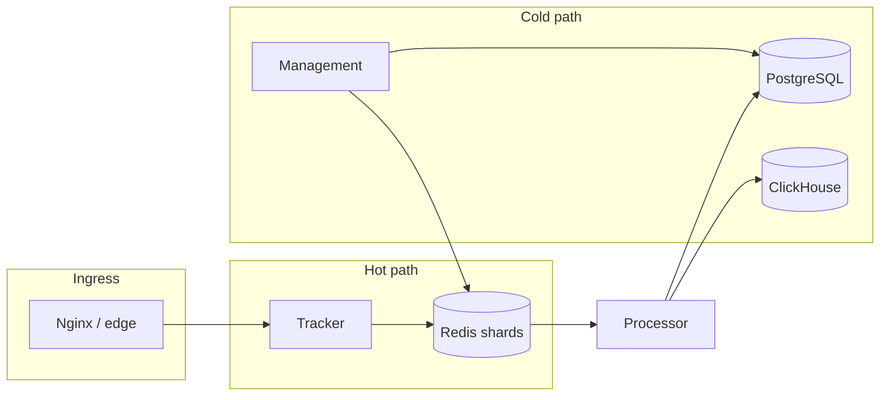

# eSPX

**Event Stream Pacing** — real-time ad event ingestion, budget enforcement, and settlement.

Built for ad networks, arbitrage teams, and operators who need a predictable hot path: every event is either accepted and debited atomically, or rejected with a clear reason — not reconciled later from a report.

## Why eSPX

| Need | What you get |
| :--- | :--- |
| **Budget under control** | Debit at event time; PostgreSQL is the money source of truth, Redis is the fast edge layer |
| **Scale without surprises** | Campaign-based sharding, one filter round-trip per event, horizontal tracker scaling |
| **Fraud resistance** | Geo, schedule, IVT/ML on the cold path; emergency breaker and edge blacklist on ingress |
| **Transparent money flow** | Top-up → ledger → spend → invoice; reconciliation and audit built in |
| **Your perimeter** | Self-hosted / on-prem; licensing and tenant plans for multi-customer deployments |

Under the hood: Go, Redis, PostgreSQL, ClickHouse. Architecture, SLAs, and hot-path contracts live in the [docs](#documentation) — not here.

## How it works (at a glance)



1. **Ingress** — rate limits, blacklist, shard selection.
2. **Tracker** — filters and atomic budget debit; event enqueued to a stream.
3. **Processor** — settlement to Postgres and analytics to ClickHouse.
4. **Management** — admin UI, billing, outbox, pacing, shard migrations.

Full topology, ports, and services: [Architecture](docs/ARCHITECTURE.md). Shipped capabilities by milestone: [SHIPPED](docs/SHIPPED.md).

## Stack (one line)

**gnet** trackers, **Redis** edge state (client-sharded, not Cluster), **PostgreSQL** ledger, **ClickHouse** telemetry. gRPC services for auth, payment, billing, and notifications. Admin via HTMX + JSON API (`internal/adminapi`).

## Quick start

```bash
make dev-up          # local compose stack
make test            # unit + integration
```

Commands, CI, perf gate, and runbooks: [Development Guide](docs/DEVELOPMENT.md).

## Documentation

| Topic | Document |
| :--- | :--- |
| Architecture and data flow | [ARCHITECTURE.md](docs/ARCHITECTURE.md) |
| Development and CI | [DEVELOPMENT.md](docs/DEVELOPMENT.md) |
| Hot path (gnet, zero-alloc) | [GO.md](docs/GO.md) |
| Edge, Redis, Lua, UDP control | [EDGE.md](docs/EDGE.md) · [REDIS.md](docs/REDIS.md) |
| Databases | [DATABASE.md](docs/DATABASE.md) |
| Admin, billing, reports | [MANAGEMENT.md](docs/MANAGEMENT.md) |
| Shipped today | [SHIPPED.md](docs/SHIPPED.md) |
| Roadmap | [MILESTONE.md](docs/MILESTONE.md) |
| Licensing and tenant plans | [LICENSING.md](docs/LICENSING.md) · [SUBSCRIPTIONS.md](docs/SUBSCRIPTIONS.md) |

## License

See [LICENSING.md](docs/LICENSING.md) for on-prem licensing and the license server.
