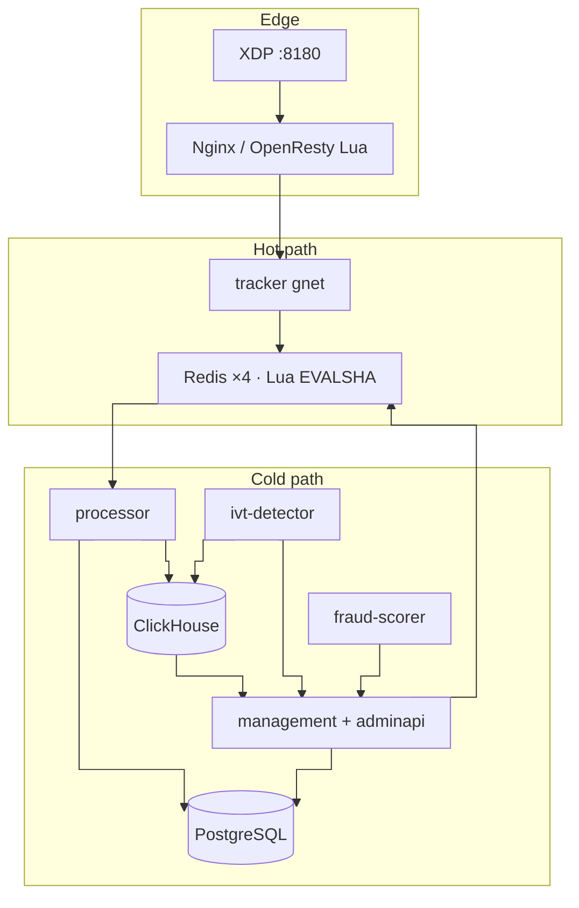

# eSPX

Event Stream Pacing — ad event ingestion, atomic budget enforcement, async settlement.

Each `/track` request is accepted and debited, or rejected with an explicit cause. PostgreSQL holds financial truth; Redis holds hot state; ClickHouse holds telemetry. The tracker hot path does not import `internal/fraudscoring`.

---

## Business logic

### Event acceptance

A `/track` request carries an ad event: `campaign_id`, `customer_id`, `event_type` (impression, click, conversion), bid amount in micro-units, and device/geo context. Default ingress is OpenRTB 3.0 (`TRACKER_INGRESS_SCHEMA=openrtb_3`); optional `espx_native` accepts `TrackRequest` JSON or vtproto `AdEvent`.

The tracker returns one of three outcomes:

| Outcome | Meaning |
| :--- | :--- |
| **Accepted** | Budget debited (or local-quanta debited + Lua `skip_budget=1`), event enqueued to `ad:events:stream`, landing URL returned |
| **Rejected** | No debit; HTTP status and `filterRejectKind` metric identify the cause (budget, geo, schedule, fcap, duplicate, etc.) |
| **Fraud-accepted** | Event recorded for analytics but not billed; used when fraud tier allows ghost-IVT logging |

Accept-or-reject is decided at event time. Post-hoc budget correction is reconciliation-only (`ReconWorker` → `RECONCILIATION_ADJUST` outbox), not a substitute for hot-path enforcement.

### Campaign delivery

Campaigns move through `ACTIVE` → `PAUSED` / `EXHAUSTED`. Configuration lives in PostgreSQL; the tracker holds an in-memory registry reloaded from Redis pub/sub on shard 0 (`campaigns:update`), with broker fallback and stale-serve when shard 0 is unreachable (M14).

Delivery controls applied before Lua:

| Control | Layer | Fail policy |
| :--- | :--- | :--- |
| Emergency breaker | Go | Closed (503) |
| Geo targeting (MaxMind) | Go | Open on lookup error |
| Schedule / daypart | Go | Closed |
| Placement / L3 blocklist | Go + Lua (M9-02) | Closed |
| ML fraud boost | Go (Redis snapshot `ml:score:boost:{id}`) | Tier thresholds per campaign |
| Consent purposes | Go | Closed when required bits missing |
| License / subscription | Go | Closed when expired |

Pacing modes: `ASAP` (spend while budget remains) or `EVEN` (token-bucket in Tier C Lua). Frequency caps, deduplication, idempotency, time-to-click, and impression-timestamp checks run in Lua (Tier C) or partially in Tier B for impressions.

### Budget and billing

All monetary amounts use **micro-units** (1 unit = 1,000,000 micro-units). The budget invariant is `current_spend ≤ budget_limit` (±1 micro-unit), enforced by atomic Lua debit or local quanta + broker delta reconciliation.

| Store | Role |
| :--- | :--- |
| Redis `{uuid}budget:campaign:{uuid}` | Hot remaining budget per campaign |
| Redis `{uuid}budget:quota:{uuid}` | Distributed quota pool (when `QUOTA_MODE=live`) |
| PostgreSQL `balance_ledger` | Immutable append-only ledger; balance = `SUM(amount)` |
| PostgreSQL `campaigns.current_spend` | Aggregated spend; synced from Redis dirty sets via `SyncWorker` |

**Settlement path:** Lua `XADD` → per-shard `ad:events:stream` → `processor` → PostgreSQL event row + `balance_ledger` FEE entry + ClickHouse batch → `XAck` after durable write. `SyncWorker` propagates PG spend deltas back to Redis budget keys.

**Local quanta (M8):** High-RPS quota-mode campaigns debit in tracker RAM (`TrySpendLocal`, ~13 ns/op), publish `BudgetDelta` to broker topic `budget-deltas`, then call Tier B Lua with `skip_budget=1` for idempotency and stream enqueue only. Refill at 80% depletion via `local-quota-refill.lua`; pause/SIGTERM flush via `local-quota-return.lua`.

### RTB (programmatic lane)

When `RTB_MODE≠off`, an in-process auction runs before `FilterEngine.Check`:

| Mode | Behavior |
| :--- | :--- |
| `off` | Direct campaign from request body |
| `shadow` | `RunAuctionEval`; metrics only; request campaign unchanged |
| `live` | `RunAuction`; winning `campaign_id` and `ClearingPriceMicro` replace request fields |

Auction uses in-memory catalog, PMP deals, geo index, ML fraud boost in ranking, optional pre-bid IVT and `schain` validation. `POST /openrtb/bid` serves OpenRTB 2.6 bid traffic. Admin live gate and bid-shading APIs live in `management`. Detail: [docs/RTB.md](docs/RTB.md).

### Fraud and IVT

Hot path: incremental fraud accumulator, tier thresholds (`Pass` / `Suspect` / `IVT` / `Block`), and `GetFraudScoreBoosts()` snapshot (~93 ns/op, 0 allocs). Critical signals (L1 reject, L3 blocklist) go to a dedicated 512-slot fraud ring; analytical signals use a 3584-slot ring with /24 aggregation at ≥80% fill (M11).

Cold path: `ivt-detector` (ClickHouse batch rules) and `fraud-scorer` (LightGBM + Isolation Forest) write to management outbox → Redis (`ML_SCORE_BOOST`, `ML_GHOST_IVT`, `ML_BLACKLIST_ADD`). Tracker never imports `internal/fraudscoring`.

### Ingress quotas

Three independent axes: **RPS** (tracker `ingress_quota` + optional UDP `:8191`), **RPD** (Redis `ingress:day:{customer_id}:{YYYYMMDD}` inside Lua, HTTP 429), **events/month** (`usage_meters` → overage billing). RPD headers: `X-RateLimit-Limit-Day`, `X-RateLimit-Remaining-Day`, `X-RateLimit-Reset-Day`.

---

## Design decisions

eSPX targets **self-hosted / on-prem ad networks and buy-side stacks**: event-time budget enforcement, auditable settlement, and tracker p99 < 80 ms under burst traffic. The choices below trade hyperscaler elasticity for predictable cost, operable blast radius, and hard financial invariants.

| Area | Choice | Why this is optimal here |
| :--- | :--- | :--- |
| **Hot / cold split** | `internal/ingestion` + gnet on `/track`; admin, ML, billing in separate binaries | **Technical:** GC pauses, HTTP admin I/O, and model inference are incompatible with 0-allocs/op and 80 ms p99. **Context:** Buyers reject or ghost-charge on latency; ops changes and model retrains must not share fate with ingest. Separate deploy units match how customers run tracker fleets vs. a single management VM. |
| **Three stores** | Redis (hot), PostgreSQL (ledger + config), ClickHouse (telemetry) | **Technical:** Lua gives atomic debit+dedup in one RTT; PG gives ACID + `balance_ledger`; CH gives 100M+ row scans off the hot path. **Context:** Finance and disputes require PG truth; product analytics and IVT rules need CH history without paying OLTP cost per impression. One of each store is deployable on modest hardware; no managed multi-PB warehouse required. |
| **Client-side sharding** | 4 standalone Redis masters; `crc32_castagnoli & 1023 → slot_table`; not Redis Cluster | **Technical:** Every event is one `EVALSHA` with hash-tagged keys on one master; Cluster redirects break that contract. Lookup is ~5.6 ns via `atomic.Value`. **Context:** Four shards fit typical on-prem RAM budgets and ops headcount; Sentinel failover is well understood. Elastic triplets (M2) address hot-campaign skew without jumping to Cluster ops complexity. |
| **Atomic Lua budget** | Tier B/C: debit + pre-checks + `XADD` in one round trip; M8 `skip_budget` for local quanta | **Technical:** Go-side GET/debit/INCR allows TOCTOU overspend; Lua serializes on the shard master (p99 < 10 ms). **Context:** Ad billing is accept-or-reject at impression time — post-hoc reconciliation is a business failure. Single RTT keeps per-event cost low enough for high-volume CPM/CPA lines. vs alternatives: [Why Redis Lua](#why-redis-lua-not-native-modules-keydb-or-aerospike). |
| **Async settlement** | Per-shard streams → processor → PG/CH; `XAck` after durable write | **Technical:** `/track` returns after Redis accept, not PG fsync. **Context:** Ingest RPS and ledger write throughput decouple; processor can batch and backpressure without blocking buyers. Matches “fast ack, eventual ledger” model standard in RTB and affiliate networks. |
| **Transactional outbox** | PG txn + `outbox_events` → workers → Redis | **Technical:** Prevents split brain when PG rolls back. **Context:** Campaign pause, blacklist, and budget mirror must be legally and financially consistent with PG config. Operators expect admin UI changes to stick; outbox is the cheapest correct pattern without 2PC across PG and Redis. |
| **Edge before tracker** | XDP L4 + Nginx Lua (blacklist, rate limit, DFA parse, shard pick, optional tarpit) | **Technical:** Drops SYN floods and junk at line rate; TLS/H2/H3 terminate at Nginx; tracker keeps one H1.1 DFA. **Context:** Attack traffic and scrapers are common in open `/track` endpoints; burning Go workers on garbage raises $/M requests. Edge shard pick must match Go `StaticSlotSharder` so customers can scale trackers horizontally without client changes. |
| **gnet + zero alloc** | Table-FSM parse, vtproto pools, no boxing/closures on hot path | **Technical:** Heap allocs → GC STW → p99 breach under spike. CI enforces 0 allocs/op. **Context:** At 50k–200k RPS per node, default Go HTTP stacks and per-request allocations are uneconomical; custom stack is justified only on this path. |
| **Local budget quanta (M8)** | RAM debit + broker `budget-deltas`; Lua `skip_budget=1` for idempotency/`XADD` | **Technical:** Removes one Redis RTT per impression on quota-mode lines; M3 recon + broker deltas preserve `current_spend ≤ budget_limit`. **Context:** High-RPS campaigns are the revenue core; shaving ~80 µs Lua RTT per event materially raises effective capacity per tracker host before adding hardware. |
| **In-process RTB** | `RunAuction` before `FilterEngine` (~30 ns/op, 0 allocs) | **Technical:** In-memory catalog + ranking; no RPC hop. **Context:** Programmatic lanes need sub-ms auction inside the same request as budget check; external exchange adds latency and splits budget authority. Shadow/live modes let operators validate yield before cutover. |
| **Cold-path fraud / ML** | `ivt-detector` + `fraud-scorer` → outbox → Redis snapshots | **Technical:** CH batch and inference are seconds-scale; tracker reads `ml:score:boost` at ~93 ns/op. **Context:** False-positive cost is reputational; rules and models can iterate daily without tracker redeploy. Fits teams that run batch IVT, not real-time embedding on every bid. |
| **Immutable ledger** | `balance_ledger` micro-units; balance = `SUM(ledger)` | **Technical:** No lost updates on concurrent settlement. **Context:** Customers reconcile against invoices and disputes; append-only ledger is audit-friendly and matches how finance teams expect top-up → spend → invoice to work. |
| **Elastic triplets (opt-in)** | M2 orchestrator on M1 slot migration | **Technical:** Adds shard capacity without Redis Cluster. **Context:** Default N=4 is enough for most tenants; triplets activate only when a single campaign dominates a shard — avoiding premature complexity for small installs. |

### Why Redis Lua (not native modules, KeyDB, or Aerospike)

The hot path needs **one atomic step per event** on a single shard: read budget/quota, apply migration fence and `routing_epoch`, run dedup/idempotency/fcap/pacing/TTC pre-checks, debit (or skip when local quanta already debited via `skip_budget=1`), and `XADD` to `ad:events:stream`. Five scripts are embedded (`budget-fast`, `unified-filter`, `local-quota-refill`, `local-quota-return`, `ip-rate-limit`); hot path uses Tier B or C in **one `EVALSHA`** (~81k ns/op end-to-end with real Redis; p99 < 10 ms/shard SLA). Anything that cannot run as a single server-side atomic unit forces multiple round trips and reintroduces TOCTOU overspend (documented as R-LUA-01 in [docs/DATA.md](docs/DATA.md)).

#### Redis Lua (chosen)

| Property | Effect |
| :--- | :--- |
| **Atomicity model** | Script runs uninterrupted on the shard master thread — same guarantee a native module would provide for single-key/hash-tag sets. |
| **Deploy surface** | Scripts are **embedded in the tracker binary** (`go:embed`), `SCRIPT LOAD` on startup. Budget rule changes ship with the tracker version customers already roll; no `.so` on database nodes. Sticky eval pins (M9) and M14 branch metrics ship in the same binary. |
| **Ops stack** | Stock Redis 7 + Sentinel + replicas. On-prem installs use Docker/apt images without custom builds. Failover, backups, and hiring pool match mainstream Redis. |
| **Feature fit** | Streams (`XADD`), pub/sub (`campaigns:update` on shard 0), hash tags (`{uuid}…`), `COPY`/`RESTORE` for slot migration, global key fan-out (M14) — all already used in M1/M2/M9/M14. |
| **Testability** | `testcontainers-go` Redis + chaos suite (`TestChaos_LUA*`) exercise real `EVALSHA` paths in CI. |
| **Iteration cost** | Budget tiers (B/C), tier degradation (M9-04), consolidated pre-checks (M9-02) landed as Lua diffs without recompiling Redis or coordinating module ABI across 4 masters. |

Lua’s cost is real: Redis 5.1, no JIT, scripts must stay non-blocking, and long scripts block the whole shard (R-LUA-04). eSPX accepts that because scripts are bounded, tier B skips heavy gates on impressions, and local quanta (M8) removes budget RTT on the highest-RPS lines.

#### C/Rust Redis module (rejected for primary path)

A native module could run the same logic faster per opcode, but **does not remove the single-shard atomic requirement** and adds:

- **Release coupling:** Module `.so` must match exact Redis minor version and libc on every master and promoted replica. Tracker and DB tiers version independently — a budget fix would require coordinated Redis restarts or `MODULE LOAD`, higher rollback risk than `SCRIPT LOAD`.
- **Operational blast radius:** Native code on the data plane needs separate security review, crash dumps on `SIGSEGV`, and distro-specific builds. Self-hosted customers often forbid non-packaged Redis extensions.
- **Marginal win vs SLA:** Filter work is dominated by **network RTT** (~80 µs Lua Tier B), not Lua interpreter overhead. M9 sticky eval pins already removed client-side allocs; M8 removes the budget portion of Lua on quota lines. A faster module does not fix multi-RTT Go-side filter patterns (forbidden by style guide).
- **Duplication:** Stream writes, recon snapshot scripts, slot-migration fences, and refill scripts would still need Lua or module equivalents — two server extension mechanisms instead of one.

Modules remain reasonable for **optional** edge features (e.g. custom probabilistic structures) if a future bottleneck proves CPU-bound inside Redis after RTT is eliminated. They are not the default for financial atomicity in this codebase.

#### KeyDB (rejected)

KeyDB is a Redis fork with multi-threading and optional active-active replication.

- **Compatibility risk:** eSPX relies on Lua 5.1 semantics, `EVALSHA`, streams, and Sentinel behavior tested against **vanilla Redis**. Fork drift in script caching, replication, or `COPY` during slot migration is unpriced risk for budget invariants.
- **Wrong scaling axis:** Per-shard atomicity still serializes on one logical key chain per campaign. Multi-threaded KeyDB increases throughput for **independent keys**, not for a single hot `{campaign_id}budget:*` chain. Horizontal scale is already **4 shards + elastic triplets (M2)**, not bigger single-node Redis.
- **Active-active:** Cross-master writes break the “one authoritative debit per campaign per shard” model unless you add conflict resolution — unacceptable for `current_spend ≤ budget_limit`.
- **Business context:** Support and documentation target Redis; asking on-prem buyers to run a fork for marginal CPU gains trades a well-understood SLA for vendor-specific behavior.

#### Aerospike (rejected)

Aerospike fits high-cardinality KV at cluster scale, but **does not match eSPX’s existing data plane or team constraints**:

- **Rewrite cost:** Entire key catalog (`CampaignRedisKeyCatalog`), hash-tag colocation, `ad:events:stream` consumers, pub/sub registry reload, outbox fan-out to shards, and M1 `DUMP`/`RESTORE` migration tooling are Redis-specific. Aerospike partitions + UDFs (Lua or C) would be a multi-milestone replatform, not an optimization.
- **Atomic scope:** Aerospike offers record-level atomicity within one partition; cross-record transactions are limited. eSPX maps **one campaign’s budget, dedup, fcap, and stream enqueue** to one hash-tagged key set on one shard — Redis Lua already matches that boundary. You would still need server-side UDFs; C UDF deploy has the same ops burden as Redis modules, with a smaller on-prem install base in ad-tracking.
- **Streams and cold path:** Processor settlement, fraud stream aggregation (M11), and management outbox patterns are built on **Redis streams and the Redis protocol**. Aerospike would fork the consumer ecosystem or require a bridge process (extra latency, ops).
- **Economics:** Aerospike cluster TCO and licensing (commercial features, K8s operator maturity) target higher baseline scale than typical **4-shard self-hosted** tenants. Redis + Sentinel + optional M8 local quanta hits the SLA at lower fixed cost.
- **Business context:** Buyers need **auditable, explainable** budget rejection at event time. A bespoke Aerospike UDF stack complicates support; Redis Lua scripts are inspectable text in the repo and in `SCRIPT EXISTS` on the node.

#### Summary

| Option | Atomic debit + stream enqueue | Fits current M1/M8/M9 stack | On-prem ops | Primary blocker |
| :--- | :---: | :---: | :---: | :--- |
| **Redis Lua** | Yes (1× `EVALSHA`) | Yes | Stock Redis + Sentinel | Script CPU / blocking (mitigated by tiers + quanta) |
| **C/Rust module** | Yes | Partial (second extension layer) | Custom `.so` per Redis build | Deploy coupling; RTT-dominated SLA |
| **KeyDB** | Yes (Lua compatible) | Unverified fork semantics | Non-standard Redis | Active-active / fork risk vs finance invariants |
| **Aerospike** | UDF required | No (full replatform) | Cluster + UDF deploy | Rewrite streams, migration, outbox; higher TCO |

For this product — **event-time billing, self-hosted, 4-shard Redis, PG ledger** — Lua is the best trade: native atomicity, one RTT, scripts versioned with the tracker, and no second datastore operations model. Deeper key/Lua policy: [docs/DATA.md](docs/DATA.md) Part I §3–5.

#### Why Lua is not the bottleneck

Lua is the **largest single step** on `/track`, but it is not what breaks the **80 ms handler p99** first under normal load. Three separate claims:

**1. It fits inside the SLA budget**

| Stage | Typical scale | SLA / ceiling |
| :--- | ---: | :--- |
| HTTP/1 DFA + OpenRTB parse | ~0.1–0.5 µs (bench; wire only) | — |
| Go `FilterEngine` + RTB auction | ~1–50 µs (geo sampled; auction ~30 ns/op) | `RunAuction` p99 < 15 µs |
| **One `EVALSHA` (Tier B)** | **~80 µs median** bench; **p99 < 10 ms / shard** | `FILTER_TIMEOUT_MS` ≤ 100 ms total |
| End-to-end handler | varies with RTT, load, GC tails | p99 < 80 ms |

Tier B at ~80 µs leaves **two orders of magnitude** below the handler ceiling before counting network jitter, TLS at the edge, or cross-AZ Redis RTT. Wire parse and in-process auction are not the limiter either ([docs/CAPABILITIES.md](docs/CAPABILITIES.md) §M12 — Lua dominates them in absolute time, but all are ≪ 80 ms).

**2. Most “Lua latency” is network and queueing, not the interpreter**

`BenchmarkLuaScript_Happy` (~81k ns/op) is an **end-to-end tracker→Redis→tracker** measurement with a real server, not Lua VM CPU in isolation. That budget includes:

- TCP write/read and client serialization (mitigated by M9 sticky eval pins: 0 allocs/op on the wire path)
- Redis single-threaded **command queue** behind other campaigns on the same shard
- Only a small fraction is Lua 5.1 executing ~15–40 `GET`/`INCR`/`XADD`-class ops on hash-tagged keys

A faster C/Rust module would shrink the last fraction; it would **not** remove the RTT or the shard queue. That is why the style guide forbids multiple round trips: **one hop is the optimization target**, not opcode speed inside Redis.

**3. What actually becomes the bottleneck first**

| Failure mode | Symptom | Mitigation in this codebase |
| :--- | :--- | :--- |
| **Hot shard / script blocking** | p99 Lua → 10 ms+ on one master | 4 shards + elastic triplets (M2); Tier B on impressions; tier degradation (M9-04); R-LUA-04 chaos tests |
| **Extra Redis round trips** | Linear RTT add per hop | Single `EVALSHA` (M9); local quanta (M8) on quota lines |
| **GC / heap on tracker** | Handler p99 spikes unrelated to Redis | 0 allocs/op; `GOGC=300` + `GOMEMLIMIT` (M13) |
| **Cross-AZ or overloaded Redis** | RTT dominates even short scripts | Co-locate tracker + Redis per cell; circuit breaker; edge drop before tracker |
| **Wrong tier** | Tier C (~92k ns bench) on impression flood | `LUA_FAST_PATH_ENABLED=true` default |

Under load-test abort rules, chaos watches **handler p99 > 80 ms for 30 s**, not Lua microseconds. Lua p99 > 10 ms/shard is an early **shard capacity** signal (add shard, migrate hot campaign, enable quanta), not proof that the language was the wrong choice.

**Summary:** Lua is the mandatory atomic debit + enqueue primitive; it is tuned to **one RTT** and **< 10 ms p99 per shard** so the tracker can spend its budget on everything else. The bottleneck at scale is **Redis shard throughput and RTT**, which sharding, Tier B, and local quanta address — not Lua interpreter performance vs a native module.

---

## SLAs

| Metric | Target |
| :--- | :--- |
| `ad_http_request_duration_seconds` (tracker handler) | p95 < 50 ms, p99 < 80 ms, max 100 ms |
| Redis Lua (`budget-fast` / `unified-filter`) | p99 < 10 ms / shard |
| Geo filter (sampled) | p99 < 10 µs |
| `RunAuction` | p99 < 15 µs; candidates scanned p99 < 500 |
| Hot-path parse / filter / auction | 0 allocs/op (`make test-alloc-gate`) |
| Budget invariant | `current_spend ≤ budget_limit` (±1 micro-unit) |

Production: `FILTER_TIMEOUT_MS` ≤ 100.

---

## Topology



Default ingress: Nginx terminates TLS/H2/H3; upstream H1.1 to tracker. Default body schema: OpenRTB 3.0 (`TRACKER_INGRESS_SCHEMA=openrtb_3`). Detail: [docs/EDGE.md](docs/EDGE.md), [docs/ARCHITECTURE.md](docs/ARCHITECTURE.md).

Request path: parse → geo → [RTB if `RTB_MODE≠off`] → `FilterEngine.Check` → Tier B/C Lua (or local quanta + `skip_budget` Lua) → stream `XADD` → response.

---

## Services

| Binary | Port(s) | Role |
| :--- | :--- | :--- |
| `tracker` | 8181–8184 | gnet ingest, `FilterEngine`, RTB, Lua; optional UDP ingress quota `:8191` |
| `processor` | 8186 | Redis streams → PG / CH; budget sync |
| `management` | 8188, 51053 | Admin HTTP (`/api/v1`, legacy `/admin`), outbox, recon, settlement gRPC |
| `auth` | 51051 | gRPC: PASETO, API keys |
| `payment` | 51052, 8187 | Stripe webhooks |
| `billing` | 51054 | Invoices from `balance_ledger` |
| `notifier` | 8085 | Alerts |
| `ivt-detector`, `fraud-scorer` | — | CH batch → management outbox → Redis |
| `edge-xdp`, `edge-bpf-sync` | — | XDP L4 SYN cookies, autoban, passive IVT fingerprints |
| `broker`, `log-shipper`, … | — | Optional mmap log pipeline; `budget-deltas` topic for M8 recon |

Libraries: `internal/adminapi`, `internal/licensing`, `internal/rtb`, `internal/ingestion`.

---

## Management and administration

Administrative traffic does not share the tracker event loop. Mutations that affect delivery (pause, blacklist, pacing, budget) run in a PostgreSQL transaction plus `outbox_events`; direct HTTP writes to Redis are forbidden. Reporting reads PostgreSQL and ClickHouse; balances derive only from `balance_ledger`.

### HTTP surface

| Prefix | Audience | Examples |
| :--- | :--- | :--- |
| `/api/v1/*` | Operators, automation | Campaign stats, balance, recon, billing, ops |
| `/api/v1/selfserve/*` | Tenant API keys | Create/pause/resume campaigns, payment intents, invoices |
| `/admin/*` | Legacy HTMX UI | Mirrored under `/api/v1` where applicable |

RBAC permissions gate routes (`campaigns:read`, `customers:write`, `shards:read`, `audit:read`, etc.). Contracts are godoc on handlers and DTOs in `internal/adminapi`, not OpenAPI.

### Reporting and dashboards

| Area | Routes | Source |
| :--- | :--- | :--- |
| Campaign stats | `GET /api/v1/campaigns/{id}/stats` | PG `campaign_stats` + CH hourly MVs (`stale=true` when CH lag > 5 min) |
| Balance | `GET /api/v1/customers/{id}/balance`, `/balance/export` | `balance_ledger` sum; CSV export with cursor pagination |
| Forecast | `POST /api/v1/forecast/campaign` | CH 90-day trends + PG budget limits |
| Reports | `GET /api/v1/reports/*` | Placements, keywords, pacing drift, IVT by source, geo ROI, spend velocity, … |
| Dashboards | `GET /api/v1/dashboards/*` | Operator shard health (shipped); buyer/CFO/fraud/adops (stubs) |
| Saved views | `GET/POST /api/v1/views` | Operator-defined report filters |

### Billing and payments

| Area | Routes | Notes |
| :--- | :--- | :--- |
| Invoices | `/api/v1/billing/invoices/*` | PDF, void, preview, ledger lines, delivery retry |
| Wallet / statement | `/api/v1/customers/{id}/wallet`, `/billing/statement` | Composite PG + CH read |
| Tax profile | `GET/PUT /api/v1/customers/{id}/tax-profile` | Per-customer tax config |
| Disputes | `GET /api/v1/disputes` | Payment gRPC proxy |
| Exports | `POST /api/v1/billing/exports` | Async job + download |
| Self-serve | `/api/v1/selfserve/payment-intents`, `/invoices` | Stripe via `payment` service |

`billing` service generates monthly invoices from ledger; `payment` handles Stripe webhooks and settlement outbox.

### Operations

| Route | Purpose |
| :--- | :--- |
| `GET /api/v1/ops/shards` | Shard health, slot map version, routing epoch |
| `GET /api/v1/ops/outbox`, `/ops/dlq` | Outbox backlog and dead-letter inspection |
| `POST /api/v1/ops/dlq/{id}/retry` | Retry failed side effects |
| `GET /api/v1/recon/runs` | PG ↔ Redis ↔ CH reconciliation history |
| `GET /api/v1/audit/export` | Audit log export |
| `POST /api/v1/consent` | Consent records; `ConsentRetentionWorker` enforces retention |

Additional operator APIs: postback config/DLQ (`/api/v1/postbacks/*`), cost-sync credentials (`/api/v1/cost-sync/*`), margin-guard policies (`/api/v1/margin-guard/*`), licensing usage (`/api/v1/customers/{id}/usage`, `/quota-status`).

### Background workers

| Worker | Function |
| :--- | :--- |
| `OutboxWorker` | 20 ms poll; 20+ event types → Redis/registry (priority lanes) |
| `ReconWorker` | PG spend ↔ Redis budgets ↔ CH hourly MVs; `RECONCILIATION_ADJUST` on drift |
| `SyncWorker` ×4 | Redis dirty sets → PG `UpdateSpend` → Redis commit |
| `PacingControllerWorker` | Daypart and spend pacing profile updates |
| `ScheduleWorker` | Time-based activate/pause |
| `CampaignDrainWorker` | Finalize cancelled campaigns |
| `ShardOrchestrator` | Capacity EWMA → hot-campaign micro-migration (opt-in) |
| `VolumeMeterWorker` | Events/month metering for licensing |
| `LedgerInvariantWorker` | Ledger drift scan |
| `ivt-detector` / `fraud-scorer` | CH batch → outbox → Redis blacklists and ML snapshots |

Outbox event types include: `CREATE_CAMPAIGN`, `PAUSE_CAMPAIGN`, `RESUME_CAMPAIGN`, `CANCEL_CAMPAIGN`, `UPDATE_CAMPAIGN_PACING`, `UPDATE_CAMPAIGN_FRAUD`, `UPDATE_BLACKLIST`, `UPDATE_SETTINGS`, `RECONCILIATION_ADJUST`, `ML_SCORE_BOOST`, `ML_GHOST_IVT`, `ML_BLACKLIST_ADD`, `RELOAD_RTB_CATALOG`, `PAUSE_PLACEMENT`, `PURGE_USER_DATA`, and others. Full dispatch: `internal/management/outbox_handlers.go`.

### Entitlements

Two layers merge in `internal/licensing/`:

| Layer | Scope |
| :--- | :--- |
| Product license (JWT per `deployment_id`) | Deployment rights, instance ceilings |
| Tenant subscription (PostgreSQL per `customer_id`) | Per-tenant features and quotas |

Effective limit = `min(license, subscription)` per axis. Hot path reads a JWT snapshot only; `VolumeMeterWorker` records events/month for overage billing.

Detail: [docs/MANAGEMENT.md](docs/MANAGEMENT.md).

---

## Redis and Lua

### Topology and routing

```text
slot  = crc32_castagnoli(campaign_id) & 1023
shard = slot_table[slot]    # 4 standalone Redis masters (non-cluster)
```

- **Model:** Client-side `StaticSlotSharder` (`atomic.Value` snapshot; `GetShard` ~5.6 ns/op). Not Redis Cluster — every `EVALSHA` targets one master with hash-tagged keys on that shard.
- **Shard 0:** Pub/sub (`campaigns:update`), auth lockout, creative structures; global keys fan-out to all shards via outbox (M14-01).
- **Failover:** Sentinel quorum 2; promotion ~10–15 s. Circuit breaker opens after 150 consecutive errors.
- **Slot migration (M1):** `CampaignRedisKeyCatalog` drives COPY/DRAIN; migration fence (`code 11`) or dual-write delta stream; PG re-warm at cutover.
- **Elastic triplets (M2):** `campaign_routing`, `routing_epoch`, `ShardOrchestrator`, TCP HMAC cutover — opt-in (`ELASTIC_SHARDING_ENABLED`).
- **Shard-0 survival (M14):** Registry stale-serve, broker `campaigns:update` fallback, ingest reroute for triplet campaigns; `503 registry_stale` / `503 shard_unavailable`. Runbook: [docs/DEVELOPMENT.md](docs/DEVELOPMENT.md) §Shard-0 outage.

### Key layout

| Class | Examples | Placement |
| :--- | :--- | :--- |
| **Global (replicated)** | `blacklist:*`, `ml:score:boost:{id}`, `config:values`, placement pause hashes | All shards via outbox; tracker reads local copy when shard 0 circuit-open |
| **Campaign-local** | `{uuid}budget:campaign:{uuid}`, `{uuid}budget:quota:{uuid}`, `{uuid}dup:*`, `{uuid}idempotency:*`, `{uuid}ingress:day:*` | Home shard per `campaign_id` hash |
| **Streams** | `ad:events:stream`, `slot_migration:delta` | Per-shard |
| **Migration** | `budget:migration_fence:{uuid}`, `budget:frozen` | Source shard during COPY |

Hash tags (`{uuid}…`) colocate all keys for one campaign on one shard so a single Lua script stays atomic.

### Embedded Lua scripts

Scripts ship in the tracker binary (`go:embed`), `SCRIPT LOAD` on startup, hot path uses `EVALSHA` with `NOSCRIPT` → `EVAL` fallback.

| Script | Tier / role | When used |
| :--- | :--- | :--- |
| `budget-fast.lua` | **Tier B** | Impressions (default). Budget debit, fraud/placement/RPD pre-checks, idempotency, `XADD`. No fcap/pacing/TTC. |
| `unified-filter.lua` | **Tier C** | Clicks and impressions needing fcap, even pacing, TTC, quota-refill probes. Same pre-checks as Tier B. |
| `local-quota-refill.lua` | Cold | `QuotaRefillWorker`: atomically moves chunk from `budget:quota` to local ledger |
| `local-quota-return.lua` | Cold | Pause/eviction/SIGTERM: return unused local quanta to Redis + broker delta |
| `ip-rate-limit.lua` | Legacy | Embedded but **not** on hot path (M9-03); IP limits enforced at XDP PPS and nginx `limit_req` only |

**Tier selection:** `LUA_FAST_PATH_ENABLED=true` (default) routes impressions to Tier B. Tier C when fcap, pacing, TTC, or strict quota paths apply.

**Local quanta path:** `TrySpendLocal` → publish `BudgetDelta` → Tier B with `skip_budget=1` (idempotency + stream only).

**Tier degradation (M9-04):** When filter deadline has < 2 ms left, Tier C skips non-critical gates and returns code `20` (`filter_tier_degraded_total`).

**Lua return codes (Tier B):** `0` ok, `3` budget exhausted, `11` migration fenced, `12` daily quota, `14` placement blocked, `21` fraud signal (accepted with flag), `20` degraded ok.

**Sticky eval pins (M9-08):** One `redis.Conn` per pinned worker × shard; `EVALSHA` on sticky conn achieves 0 allocs/op on wire path. Shutdown: `CloseFilterEvalPins()` before shard client close.

**Observability (M14):** `filter_lua_branch_total{branch}`, `FILTER_SLOW_MS` slog per campaign+tier.

IP rate limit composite key at edge: `campaign_id` + `user_id`, fallback client IP.

Detail: [docs/DATA.md](docs/DATA.md) Part I §3–5.

### Edge Lua (OpenResty)

Nginx/OpenResty on `:8180` / `:443` terminates TLS, H2, and H3; upstream to tracker is HTTP/1.1. Shard pick must match Go `StaticSlotSharder` (`edge-slot-map.lua`, `edge-shard-balancer.lua`).

| Module | Role |
| :--- | :--- |
| `access-check.lua` | Two-phase gate: phase 1 (rate limit, circuit breaker, blacklist) without body; phase 2 delegates to `edge-phase2.lua` |
| `edge-phase2.lua` | `read_body`, DFA parse, per-campaign `edge-rl.lua`, proxy to tracker pool |
| `edge-parse-dfa.lua` | Byte DFA: `openrtb_3` extracts `request.item[0].id`; `espx_native` scans `campaign_id` |
| `edge-rl.lua` | Per-campaign rate limit (`campaign_id` + `user_id`, IP fallback) |
| `edge-blacklist-sync.lua` | Timer sync of Redis blacklist into `ngx.shared` cache; fail-closed when stale |
| `edge-slot-map.lua` | Slot table + `routing_epoch` reload from management/broker |
| `edge-shard-balancer.lua` | `get_shard()` upstream balancer parity with Go |
| `edge-tarpit.lua` | Optional slow/drop on oversized headers or body (M14-08, `EDGE_TARPIT_ENABLED`) |
| `edge-fraud-tier.lua` | Edge-side fraud score tier for RL tightening |
| `edge-metrics.lua` | Prometheus counters for parse rejects, blacklist stale, protocol ingress |

Ingress schema must match tracker: `TRACKER_INGRESS_SCHEMA=openrtb_3` (default) or `espx_native`.

Detail: [docs/EDGE.md](docs/EDGE.md), [docs/EBPF.md](docs/EBPF.md) (XDP L4 before nginx).

---

## Hot path (summary)

See [Redis and Lua](#redis-and-lua) for script tiers, key layout, and edge modules.

| Component | Notes |
| :--- | :--- |
| gnet/v2 + HTTP/1 DFA | Table FSM on ring buffer; optional h2c (`handler_http2.go`) |
| `PinnedWorkerPool` | Campaign-hash worker pinning |
| `FilterEngine` | Go filters under monotonic `FilterDeadlineMono` |
| Tier B (`budget-fast.lua`) | Default for impressions; one `EVALSHA` |
| Tier C (`unified-filter.lua`) | Clicks / fcap / pacing / TTC |
| Local quanta (M8) | `TrySpendLocal` + broker `budget-deltas`; `LOCAL_QUOTA_MODE` canary; pause/SIGTERM flush (M14) |
| Sticky eval pins (M9) | 0 allocs/op on `EVALSHA` wire path |
| `FraudStreamWriter` | Dual ring: 512 critical + 3584 analytical (M14); M11 /24 aggregation at ≥80% analytical fill |
| Wire hardening (M14) | JSON depth cap (16/32), H2 hostile disconnect, optional edge tarpit |
| Lua observability (M14) | `filter_lua_branch_total{branch}`; `FILTER_SLOW_MS` slow-script logs |

Rules and PR checklist: [docs/GO.md](docs/GO.md). Runtime: tracker `GOGC=300`, `GOMEMLIMIT=700MiB` (M13).

---

## Benchmarks

`linux/amd64`, Intel i5-11400H @ 2.70 GHz, Go 1.25, `go test -benchmem -count=3` (2026-07-24). Median of three runs.

### Parse and routing

| Benchmark | ns/op | allocs/op |
| :--- | ---: | ---: |
| `BenchmarkHTTP1DFA_Happy` | ~65 | 0 |
| `BenchmarkHTTP1DFA_Worst` | ~501 | 0 |
| `BenchmarkHTTP2DFA_Happy` | ~8.5 | 0 |
| `BenchmarkHTTP2DFA_Worst` | ~117 | 0 |
| `BenchmarkHTTP3DFA_Happy` | ~2.1 | 0 |
| `BenchmarkHTTP3DFA_Worst` | ~52 | 0 |
| `BenchmarkParseOpenRTB3FSM` | ~325 | 0 |
| `BenchmarkTrackRequest_ParseJSONOpt` | ~171 | 0 |
| `BenchmarkStaticSlotSharder_1024` | ~5.6 | 0 |
| `BenchmarkSlotHash_CRC32` | ~2.3 | 0 |

### Filter, RTB, quanta, fraud

| Benchmark | ns/op | allocs/op |
| :--- | ---: | ---: |
| `BenchmarkFilterFraudBoost` | ~93 | 0 |
| `BenchmarkAuction` | ~30 | 0 |
| `BenchmarkAuction_highDensity` | ~112 | 0 |
| `BenchmarkLocalQuantaSpend` | ~13 | 0 |
| `BenchmarkFraudAggregate` (M11) | ~23 | 0 |

### Redis Lua (requires testcontainer Redis)

| Benchmark | Tier | ns/op | allocs/op |
| :--- | :--- | ---: | ---: |
| `BenchmarkLuaScript_Happy` | B (impression) | ~81k | 0 |
| `BenchmarkLuaScript_Worst` | C (click + fcap) | ~92k | 0 |

Source: [docs/CAPABILITIES.md](docs/CAPABILITIES.md) §M9 (real Redis, 2026-07-24).

### Broker (`pkg/broker`)

| Benchmark | ns/op | allocs/op |
| :--- | ---: | ---: |
| `BenchmarkSegmentWrite` | ~26 | 0 |
| `BenchmarkTopicRegistryLookup` | ~1.2 | 0 |
| `BenchmarkReadFrame` | ~32 | 0 |
| `BenchmarkBrokerThroughput/Produce-Sequential` | ~15.5k | 1 |
| `BenchmarkBrokerThroughput/Fetch-Sequential` | ~15.4k | 1 |

```bash
go test -run='^$' -bench='BenchmarkHTTP1DFA|BenchmarkParseOpenRTB3FSM|BenchmarkAuction|BenchmarkFilterFraudBoost' -benchmem ./internal/ingestion/... ./internal/rtb/...
go test -run='^$' -bench='BenchmarkLuaScript' -benchmem ./internal/ingestion/...   # needs Docker
make test-alloc-gate
```

---

## Quick start

```bash
make dev-up
make test
make test-alloc-gate
```

CI gates: `scripts/perf-gate/`, `scripts/chaos-drills/test_chaos.sh`.

---

## Documentation

| Document | Scope |
| :--- | :--- |
| [docs/ARCHITECTURE.md](docs/ARCHITECTURE.md) | Topology, request flow, SLAs |
| [docs/GO.md](docs/GO.md) | Tracker hot path |
| [docs/DATA.md](docs/DATA.md) | Redis, PostgreSQL, ClickHouse |
| [docs/EDGE.md](docs/EDGE.md) | Nginx/OpenResty ingress |
| [docs/EBPF.md](docs/EBPF.md) | XDP L4 |
| [docs/RTB.md](docs/RTB.md) | In-process auction |
| [docs/MANAGEMENT.md](docs/MANAGEMENT.md) | Control plane |
| [docs/CAPABILITIES.md](docs/CAPABILITIES.md) | Shipped milestones (M1–M14) |
| [docs/BACKLOG.md](docs/BACKLOG.md) | Open gaps |
| [docs/DEVELOPMENT.md](docs/DEVELOPMENT.md) | Local setup, CI, runbooks |

---

## Licensing

Product license (JWT per deployment) and tenant subscriptions merge in `internal/licensing/`. Binary: `cmd/license-server`. Detail: [docs/MANAGEMENT.md](docs/MANAGEMENT.md) §5–6 and [Management and administration](#management-and-administration) above.
