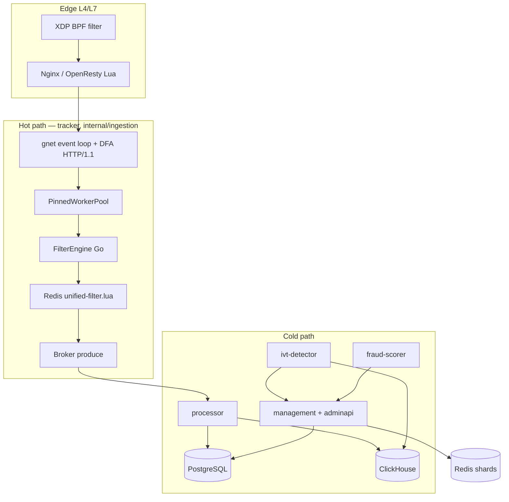

# eSPX

**Event Stream Pacing** — real-time ad event ingestion, atomic budget enforcement, and async settlement.

eSPX is an engine for ad networks and media buying operations requiring a deterministic hot path: each event is either atomically accepted and debited or rejected with an explicit cause, eliminating post-factum report reconciliation.

## Capabilities

| Problem | Solution |
| :--- | :--- |
| **Budget Control** | Event-time debiting; PostgreSQL serves as the source of truth for financial records, Redis operates as an edge cache |
| **Scaling** | Client-side campaign sharding, single Lua round-trip per event, horizontal tracker scaling |
| **Fraud Prevention** | Multi-tier (L1/L2/L3) ingress cascade, cold-path ML scoring, edge blacklists, and XDP L4 filtering |
| **Financial Ledger** | Top-up → ledger → spend → invoice workflow with built-in reconciliation and auditing |
| **Deployment Perimeter** | Self-hosted / on-premise execution; multi-tenant plan management |

---

## Architecture: Hot Path vs Cold Path

The architecture enforces strict decoupling: the hot path does not import cold-path packages (including `internal/fraudscoring`). Machine learning scoring runs isolated in `fraud-scorer` / `processor`; the tracker reads snapshot coefficients from Redis.



### Hot Path (`internal/ingestion`)

Target: **0 heap allocations/op** across parse, filter, and response execution. CI (`make test-alloc-gate`) enforces zero-allocation bounds.

| Component | Function |
| :--- | :--- |
| **gnet/v2** | `epoll` I/O multiplexing, fixed event loops (~2 per CPU core) |
| **DFA HTTP/1.1 scanner** | Zero-copy parsing directly from socket ring buffers |
| **PinnedWorkerPool** | Hash-based worker pinning per campaign for L1/L2 cache locality; 64-byte padding against false sharing |
| **vtproto pools** | Reuse of Protocol Buffer structures; `appendReuseBytes` for byte slices |
| **FilterEngine** | Chain of Go filters under a unified monotonic deadline (`FilterDeadlineMono`) |
| **UnifiedFilter** | Single Redis `EVALSHA` call covering budget, pacing, deduplication, rate limiting, TTC, frequency capping, and stream enqueueing |
| **StaticSlotSharder** | `crc32(campaign_id) & 1023` mapped to a 1024-slot array; lookups resolved via `atomic.Value` |
| **FraudStreamWriter** | Lossy MPSC ring buffer (4096 slots) for asynchronous telemetry non-blocking to gnet loops |
| **LatencyRing / FraudStream** | Lossy fixed buffers; drops events upon buffer overflow |

Hot path constraints prohibit: `interface{}`/`any` boxing, request loop closures, `sync.Map`, per-request `fmt.Sprintf`, per-request `strings.Builder`, per-request `context.WithTimeout`, and dynamic Prometheus label creation.

### Cold Path

| Service | Function |
| :--- | :--- |
| **processor** | Consumes broker/Redis streams → executes PostgreSQL settlement and ClickHouse batch inserts |
| **management** | HTMX administration interface, billing engine, transactional outbox, pacing controller, slot migration orchestrator |
| **auth / payment / billing / notifier** | gRPC and standard library HTTP services |
| **ivt-detector** | ClickHouse batch analysis → emits blacklists, ghost flags, and score adjustments via outbox |
| **fraud-scorer** | LightGBM + Isolation Forest (+ optional ONNX); outputs scores to Redis `ml:score:boost:{campaign_id}` |
| **broker** | Log-based message broker implementation (gnet TCP + mmap segments) |
| **edge-xdp / edge-bpf-sync** | L4 XDP packet filtering and BPF map state synchronization |

Tracker SLA (`ad_http_request_duration_seconds`): **p95 < 50 ms**, **p99 < 80 ms**, hard limit 100 ms. Production configuration: `FILTER_TIMEOUT_MS` ≤ 100.

---

## Benchmarks: gnet + Custom Broker

Executed on `linux/amd64`, Intel i5-11400H @ 2.70 GHz, `go test -benchmem`.

### Tracker / Ingestion (Hot Path)

| Benchmark | ns/op | B/op | allocs/op |
| :--- | ---: | ---: | ---: |
| `StaticSlotSharder_1024` (GetShard) | **5.7** | 0 | **0** |
| `FilterEngine.Check` (no timeout) | **25.0** | 0 | **0** |
| `AdsPacketHandlerProto` accept | **167** | 0 | **0** |
| `FilterFraudBoost` (ML snapshot apply) | **90** | 0 | **0** |
| `TrackRequest_ParseJSON` | **186** (~818 MB/s) | 0 | **0** |
| `RunAuction` (RTB) | **27** | 0 | **0** |
| `RunAuction` high density | **115** | 0 | **0** |

Reproduction command:

```bash
go test -benchmem -run='^$' -bench='BenchmarkStaticSlotSharder|BenchmarkFilterFraudBoost|BenchmarkHotPath|BenchmarkAuction' ./internal/ingestion/... ./internal/rtb/...
make test-alloc-gate
```

### Custom Message Broker (`pkg/broker`)

Log-based message broker leveraging **gnet TCP**, **mmap log segments**, and Redis leader election. Binary wire protocol for Produce/Fetch operations; built-in retention and replication.

| Benchmark | ns/op | B/op | allocs/op | Description |
| :--- | ---: | ---: | ---: | :--- |
| `SegmentWrite` (mmap append) | **28** | 0 | **0** | Segment write execution |
| `TopicRegistryLookup` | **1.2** | 0 | **0** | Topic ID map lookup |
| `ReadFrame` (wire decode) | **32** | 0 | **0** | Wire frame parsing |
| `BrokerThroughput/Produce` | **14 300** | 24 | 1 | 256 B payload end-to-end |
| `BrokerThroughput/Fetch` | **14 300** | 173 | 1 | Sequential fetch |

```bash
go test -benchmem -run='^$' -bench='BenchmarkBrokerThroughput|BenchmarkSegmentWrite|BenchmarkReadFrame' ./pkg/broker/...
```

The tracker emits slot-map reloading instructions and stream events through the broker; processor and log-shipper components operate as consumers committing offsets to Redis.

---

## GC and Memory Management on the Hot Path

The hot path eliminates runtime heap allocations per request by sourcing memory from gnet socket ring buffers, vtproto allocation pools, fixed-size stack arrays (`[N]byte`), and pre-allocated slices (`[]byte`). This minimizes garbage collector invocation frequency and reduces Stop-The-World (STW) pause duration under peak load.

| Mechanism | Effect |
| :--- | :--- |
| **0 allocs/op** during parse/filter/respond | Reduced allocation rate resulting in fewer GC cycles |
| **`GOMEMLIMIT`** (700 MiB tracker, 1500 MiB processor) | Soft heap limit enabling GC cycles prior to OOM invocation |
| **`GOGC=50`** (tracker) | Accelerated heap reclamation, trading CPU cycles for reduced steady-state heap size |
| **Container Isolation** (tracker / processor) | Prevents processor batch GC pauses from blocking gnet event loops |
| **vtproto + sync.Pool** | Struct instance reuse replacing per-event allocations |
| **Lossy Ring Buffers** (fraud, latency) | Fixed memory bounds; drops overflowing items to prevent unbounded heap growth |
| **Monotonic Deadlines** | Avoids per-request `time.Now()` and `context.Context` heap allocations |

With sufficient memory capacity, setting `GOGC=off` reduces STW frequencies further if steady-state heap remains predictable. The design goal is bounded STW durations during traffic spikes.

---

## Fraud Prevention Architecture

The fraud detection layer utilizes dynamic signal accumulation inside `fraudAccumulator` (up to 4 distinct reason flags, score range 0–100), mapping outputs to campaign tiers and response levels.

### Action Tiers

| Tier | Response | Trigger Condition |
| :--- | :--- | :--- |
| **L1 Reject** | HTTP 403 response, event is not debited | Active L3 blocklist entry **or** ≥ 2 L1-high signals |
| **L2 Shadow (ghost)** | HTTP 200 (accepted), `ShadowEvent=true`, appended to fraud stream | 1× L1-high, L2-weak signal, or Suspect/IVT/Block campaign tier |
| **L3 Quarantine** | IP added to `blacklist:fraud` (shard 0), propagated via outbox | Cold-path output from IVT rules, ML models, or manual intervention |

An active L3 record or two L1-high signals short-circuits the **UnifiedFilter (Lua budget)** check, skipping unnecessary Redis network round-trips.

### Hot Path Signals (Go + Lua)

| Code | Weight | Category | Origin |
| :--- | ---: | :--- | :--- |
| `datacenter_ip` | 45 | L1-high | MaxMind anonymous/proxy/datacenter flags |
| `low_ttc` | 45 | L1-high | Time-to-click below threshold set in unified Lua script |
| `tls_blocklist` | 45 | L1-high | TLS fingerprint match against static blocklist |
| `missing_imp_ts` | 35 | L2-weak | Click missing prior impression timestamp (TTC fail-closed) |
| `device_mismatch` | 35 | L2-weak | DeviceFilter mismatch between UA/device and campaign targeting |
| `l3_blocklist` | 100 | L3 | Match in `SISMEMBER blacklist:fraud` on Redis shard 0 |

### FilterEngine Execution Sequence

1. License / Entitlements check
2. **Emergency Breaker** — Global circuit breaker
3. **Geo** — MaxMind lookup (fail-open on error)
4. **Schedule** — Campaign dayparting validation
5. **Placement Blacklist** — Paused placement list per shard
6. **Fraud Blacklist (L3)** — Ingress check for cold-path quarantine lists
7. **Fraud (datacenter IP)** — MaxMind anonymous IP verification
8. **Device** — Device attribute mismatch evaluation
9. **Consent** — GDPR purpose validation
10. **ML Boost** — Snapshot apply from `ml:score:boost:{campaign_id}` (0 allocations, ~90 ns)
11. **UnifiedFilter Lua** — Executes budget evaluation, pacing, deduplication, rate limits, TTC, frequency capping, idempotency checks, migration fencing, and stream XADD operations

Campaign tier thresholds follow: `pass ≤ suspect ≤ ivt ≤ block` (default values: 20/50/75/90). Setting `GhostIVTEnabled` activates L2 ghost processing for the suspect threshold range.

### Cold Path: ivt-detector + fraud-scorer

**ivt-detector** (ClickHouse rule execution via scheduled batching):

| Rule | Function |
| :--- | :--- |
| `high_click_to_imp_ratio` | Identifies anomalous IP-level CTR thresholds |
| `shared_fingerprint_cluster` | Clusters overlapping client device fingerprints |
| `campaign_ctr_spike` | Detects sudden campaign-level CTR anomalies |
| `interval_botnet` | Detects deterministic click timing intervals indicative of automated botnets |
| `datacenter_asn` | Flags hosting provider ASNs by IP range |
| `fraud_scoring_rule` | Evaluates ML ensemble outputs to trigger boost, ghost mode, or blacklisting |

**fraud-scorer**: Executes LightGBM + Isolation Forest inference models, with optional ONNX support (`-tags fraudscoring_onnx`). Microbatch output maps to transactional outbox events:

| Outbox Event | Action |
| :--- | :--- |
| `ML_SCORE_BOOST` | Writes `ml:score:boost:{campaign_id}` to Redis |
| `ML_GHOST_IVT` | Enables ghost mode for traffic identified as suspect |
| `ML_BLACKLIST_ADD` | Appends IP address to `blacklist:fraud` and Nginx access deny lists |
| `ML_MODEL_VERSION` | Executes canary deployments of model versions per shard |

Model updates deploy as a single-shard canary, evaluating false-positive metrics prior to full promotion or rollback.

### Edge Filtering (L4/L7)

| Layer | Implementation |
| :--- | :--- |
| **XDP** (`edge_filter.c`) | Ingress LPM allow/deny rules, per-IP SYN rate limiting (64/s), global SYN rate limiting (50k/s per 8 cores), token-bucket PPS limiting (2000), and TCP anomaly drops |
| **Nginx Lua** | Edge blacklist enforcement, rate limiting, and `get_shard()` mapping aligned with Go StaticSlot logic |
| **UDP Control** | Pushes shard maps and campaign state updates without HTTP overhead |

Planned roadmap (M10): SYN cookie generation, RST flood mitigation, and TCP fingerprinting linked to `ML_GHOST_IVT` (scoring without hard L4 blocking).

### Fraud Telemetry

`FraudStreamWriter` utilizes an MPSC ring buffer containing 4096 fixed-size entry slots, flushing via batch Redis `XADD` operations. Buffer exhaustion triggers lossy event dropping with metric increments, preserving non-blocking behavior in gnet loops.

---

## Redis Sharding Architecture

### Current Strategy: StaticSlot (Phase 2)

```
campaign_id ──crc32──► slot = hash & 1023 ──► slot_table[1024] ──► shard_id
```

- **4 standalone Redis master nodes** (production topology, non-clustered)
- Shard lookup table stored as an immutable snapshot in `atomic.Value`; reloads execute without mutex contention on `GetShard` (~5.7 ns lookup cost)
- Master slot table state persisted in PostgreSQL; `SlotMapWatcher` uses polling and broker topic push notifications for reloads
- Shard 0 handles pub/sub (`campaigns:update`), authentication lockouts, brand creatives, and `blacklist:fraud`
- Budget and filter key entries utilize hash-tags `{campaign_uuid}` to guarantee single-shard key co-location

**JumpHash status**: Deprecated, pending removal from production (M9-07). `HybridBalancer.SelectAndShard` is restricted to RTB canary evaluation.

### Planned Strategy (M1 → M2)

Elastic sharding capabilities remain blocked pending complete key migration implementation.

| Phase | Status | Objective |
| :--- | :--- | :--- |
| **M1 Slot Migration** | Active | `SlotMigrationOrchestrator`: COPY (`DUMP`/`RESTORE`) → drain → activate. `MIGRATION_FENCE_ENABLED` blocks debiting during COPY. Pre-warms PostgreSQL state for target shards; executes `AssertBudgetInvariant` |
| **CampaignRedisKeyCatalog** | Active | Unified directory of hash-tagged keys for migration, warming, and reference |
| **Edge Sync** | Partial | `edge-slot-map.lua` + `edge-bpf-sync`. Maintains parity between Edge shard mapping and Go `GetShard` output |
| **M2 Elastic Triplets** | Blocked on M1 | `ShardOrchestrator`: EWMA metrics tracking per shard/campaign; automated triplet migration on overload (> 85% utilization for > 5 min) |

Cutover sequence: **fence → pause → pre-warm PG state on target → increment epoch → drain source shard → execute R5 invariant verification**.

---

## Component Topology and Tech Stack

| Binary | Location |
| :--- | :--- |
| tracker | `cmd/tracker` |
| processor | `cmd/processor` |
| management | `cmd/management` |
| broker | `cmd/broker` |
| fraud-scorer | `cmd/fraud-scorer` |
| ivt-detector | `cmd/ivt-detector` |
| auth / payment / billing / notifier | `cmd/*` |

**Technology Stack:** Go 1.25+, gnet/v2, pgx/v5 + sqlc, Redis (client-sharded), PostgreSQL, ClickHouse, embedded Lua scripts, vtproto, MaxMind IP database, Prometheus, HTMX administration UI.

Redis unified-filter Lua execution: **p99 < 10 ms** per shard. Geo filter lookup: **p99 < 10 µs** (sampled).

---

## Quick Start

```bash
make dev-up          # Start local docker-compose environment
make test            # Execute unit and integration tests
make test-alloc-gate # Run zero-allocation verification suite on hot path
```

Performance assertion gates and fault injection suites: `scripts/perf-gate/`, `scripts/chaos-drills/`.

---

## Licensing

On-premise license server and verification tooling: `cmd/license-server`. Tenant deployment tiers configured via deployment configuration files.
