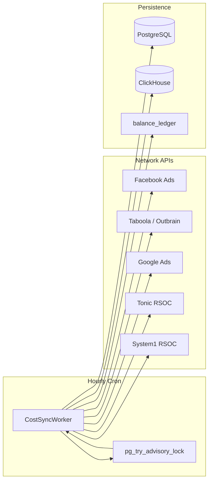

# M16 — Cost Sync & RSOC Revenue: Technical Report

**Date:** 2026-07-20  
**Milestone:** M16 (Exec #4)  
**Status:** Implemented

---

## 1. Summary

M16 delivers a standalone cold-path worker (`cmd/cost-sync`) that ingests buy-side ad network spend and sell-side RSOC revenue into PostgreSQL and ClickHouse, with ledger reconciliation and an admin API for credential management and manual triggers.

### Components delivered

| Component | Path | Role |
| :--- | :--- | :--- |
| Binary | `cmd/cost-sync` | Hourly cron daemon with advisory-lock single leader |
| Core worker | `internal/costsync/cost_sync_worker.go` | Orchestration, PG txn, reconciliation, CH snapshots |
| Providers | `provider_facebook.go`, `provider_taboola.go`, `provider_google.go`, `provider_tonic_rsoc.go` | Network API adapters (Outbrain in `provider_taboola.go`) |
| Currency | `currency.go` | ECB daily rates → `amount_usd_micro BIGINT` |
| OAuth | `oauth.go` | Meta + Google token refresh |
| Admin API | `internal/adminapi/cost_sync_handlers.go` | Credentials CRUD, manual run, history |
| PG migration | `00044_cost_sync.sql` | `campaign_costs`, `cost_sync_credentials`, `cost_sync_runs`, `cost_sync_ecb_rates` |
| CH migration | `00004_cost_snapshots.sql` | `cost_snapshots` + `mv_placement_stats_hourly` (M17 feed) |

---

## 2. Architecture



### Data flow

1. **Cron / manual trigger** acquires `pg_try_advisory_lock(0x657370785f636f73)`.
2. **Provider fetch** returns normalized `CostLine` rows (spend or revenue).
3. **Currency conversion** via ECB rates cached in `cost_sync_ecb_rates`.
4. **Idempotent PG insert** into `campaign_costs` via `ingest_key` unique constraint.
5. **Reconciliation** compares API spend vs tracker `balance_ledger` FEE totals; posts `RECONCILIATION_ADJUST` with idempotency hash.
6. **CH rollup** inserts into `cost_snapshots`; MV `mv_placement_stats_hourly` aggregates spend/revenue per placement.

---

## 3. Schema contracts

### PostgreSQL `campaign_costs`

- **Unique:** `(customer_id, campaign_id, cost_date, network, placement_id)`
- **Idempotency:** `ingest_key` (SHA-style composite key)
- **Amounts:** `amount_micro`, `amount_usd_micro` (BIGINT micro-units)

### Admin API

| Method | Endpoint | Purpose |
| :--- | :--- | :--- |
| GET | `/api/v1/cost-sync/credentials` | List credentials (optional `customer_id`) |
| PUT | `/api/v1/cost-sync/credentials/{network}` | Upsert OAuth/API credentials (Pro tier) |
| DELETE | `/api/v1/cost-sync/credentials/{network}` | Remove credentials |
| POST | `/api/v1/cost-sync/run` | Manual sync (`customer_id`, `network`, `from`, `to`) |
| GET | `/api/v1/cost-sync/history` | Sync run log |

---

## 4. Test results

```
go test ./internal/costsync/... -short -count=1
ok  	espx/internal/costsync	7.889s
```

| Test | Criterion | Result |
| :--- | :--- | :--- |
| Idempotency | Re-import same day → 0 new rows | PASS |
| OAuth refresh | Google refresh via httptest | PASS |
| Currency | EUR → USD micro-units (1.10 fixture) | PASS |
| RSOC fixture | Tonic EPC + System1 hourly golden JSON | PASS |
| Chaos | `chaos_proof fault=cost_sync_duplicate_report ledger_balanced=true` | PASS |
| Advisory lock | Second connection blocked while lock held | PASS |

---

## 5. Performance metrics

**Environment:** Linux amd64, Intel i5-11400H @ 2.70GHz, Go 1.25+

| Benchmark | ns/op | B/op | allocs/op |
| :--- | ---: | ---: | ---: |
| `BenchmarkIngestKey` | ~245 | 224 | 4 |
| `BenchmarkCurrencyEURToUSD` | ~0.24 | 0 | 0 |

### SLA alignment (M16.0)

| SLA | Target | Design |
| :--- | :--- | :--- |
| Hourly sync | Cron + advisory lock | `Start()` with 1h ticker |
| Manual run p99 | < 120 s per network | 110 s op timeout on hourly; 90 s HTTP client timeout |
| Duplicate report | No double ledger rows | `ingest_key` + `idempotency_hash` ON CONFLICT DO NOTHING |

### Prometheus metrics

| Metric | Type | Labels |
| :--- | :--- | :--- |
| `ad_cost_sync_runs_total` | Counter | `status` (success/failed) |
| `ad_cost_sync_rows_imported_total` | Counter | — |
| `ad_cost_sync_duration_seconds` | Histogram | `network` |
| `ad_cost_sync_reconciliation_delta_micro_total` | Counter | — |
| `ad_cost_sync_ch_errors_total` | Counter | — |

---

## 6. Deployment

```bash
# Run worker
COST_SYNC_ENCRYPTION_KEY=<32-byte-key> \
META_APP_ID=... META_APP_SECRET=... \
GOOGLE_OAUTH_CLIENT_ID=... GOOGLE_OAUTH_CLIENT_SECRET=... \
./cost-sync

# Unit tests
go test ./internal/costsync/... -short
```

Credentials can also be managed via admin API; tokens are AES-GCM encrypted at rest (same pattern as postback configs).

---

## 7. Gaps / follow-ups

- Wire `adminapi.CostSyncHTTPHandlers` into `cmd/management` gateway (handlers ready via `adminapi.RegisterRoutes`).
- Taboola/Outbrain/Google production OAuth app registration and developer-token config per customer.
- M17 `cmd/margin-guard` consumes `mv_placement_stats_hourly` built by this milestone.

---

## 8. File inventory

```
cmd/cost-sync/main.go
internal/costsync/
  cost_sync_worker.go
  currency.go
  oauth.go
  clickhouse.go
  provider.go
  provider_facebook.go
  provider_taboola.go      # Taboola + Outbrain
  provider_google.go
  provider_tonic_rsoc.go   # Tonic + System1 RSOC
  cost_sync_test.go
  cost_sync_bench_test.go
  testdata/
internal/adminapi/cost_sync_handlers.go
internal/ingestion/migrations/00044_cost_sync.sql
internal/ingestion/queries/cost_sync.sql
internal/clickhouse/migrate/migrations/00004_cost_snapshots.sql
tests/integration/cost_sync_admin_test.go
```
