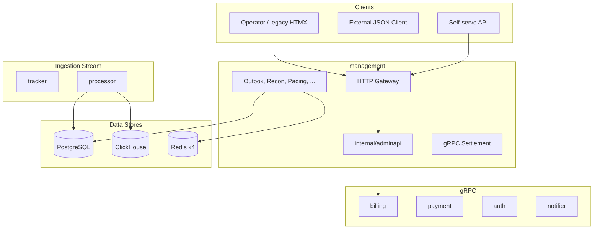

# Management

Cold-path control plane: HTTP admin, gRPC settlement, background workers, licensing. Hot path (`/track`, Redis Lua, XDP) is out of scope.

[DATA.md](./DATA.md) · [ARCHITECTURE.md](./ARCHITECTURE.md) · [STYLE.md](./STYLE.md) · [BOUNDARIES.md](./BOUNDARIES.md)

---

## 1. Topology

Administrative traffic does not share the tracker event loop. Reporting and mutations use PostgreSQL as system of record; Redis receives config via outbox only.



### 1.1 Binaries

| Binary | Role |
| :--- | :--- |
| `management` | HTTP gateway, RBAC, workers, settlement gRPC, proxy to billing/payment/auth/notifier |
| `billing` | Invoices, tax profiles, PDF, monthly cron |
| `payment` | Payment intents, Stripe webhooks, settlement outbox |
| `auth` | PASETO tokens, sessions, API keys |
| `notifier` | Email/Telegram, invoice delivery |
| `processor` | Redis streams → PG events, `balance_ledger`, CH batches |
| `ivt-detector`, `fraud-scorer` | CH batch → management outbox → Redis blacklists |

### 1.2 Route prefixes

| Prefix | Purpose |
| :--- | :--- |
| `/admin/*` | Legacy admin (mirrored under `/api/v1`) |
| `/api/v1/*` | REST reporting and automation |
| `/api/v1/selfserve/*` | Tenant campaigns, payments, API keys |
| `/api/v1/billing/*`, `/api/v1/ops/*` | Admin API (M2.8) |

### 1.3 Mutation rules

- Config changes that affect the hot path (pause, blacklist, pacing, budget) run in one PostgreSQL transaction plus `outbox_events`. Direct HTTP writes to Redis are forbidden.
- Balances come only from `balance_ledger` (`SUM` of micro-unit rows). Reporting is read-only over the ledger.
- API contracts are godoc on handlers and DTOs (R9), not OpenAPI.

---

## 2. HTTP surface

### 2.1 Reporting (`/api/v1`)

| ID | Route | Source |
| :--- | :--- | :--- |
| RPT-01 | `GET /campaigns/{id}/stats` | PG `campaign_stats` + CH hourly MVs; `stale=true` if CH lag > 5 min |
| RPT-02 | `GET /customers/{id}/balance` | PG `balance_ledger` sum |
| RPT-03 | `GET /customers/{id}/balance/export` | Streaming CSV, cursor pagination, chunk ≤ 10 MB |
| RPT-04 | `GET /recon/runs` | PG `recon_runs` |
| RPT-05 | `GET /disputes` | Payment gRPC proxy |
| RPT-06 | `POST /forecast/campaign` | CH 90-day trends + PG budget limits |
| RPT-07 | `POST /consent` | PG; retention via `ConsentRetentionWorker` |

### 2.2 Self-serve (`/api/v1/selfserve`)

| ID | Route | Description |
| :--- | :--- | :--- |
| SS-01 | `POST /campaigns` | Create campaign |
| SS-02 | `POST /campaigns/{id}/pause` | Pause |
| SS-03 | `POST /campaigns/{id}/resume` | Resume |
| SS-04 | `POST /payment-intents` | Payment session |
| SS-05 | `GET /invoices` | List invoices |
| SS-06 | `POST /api-keys` | Generate API key |

### 2.3 Workers

| Worker | Interval / trigger | Function |
| :--- | :--- | :--- |
| `OutboxWorker` | 20 ms poll | `outbox_events` → Redis/registry; 20+ event types, priority lanes |
| `CampaignDrainWorker` | — | Finalize campaign cancellation |
| `ReconWorker` | — | PG spend ↔ Redis budgets ↔ CH hourly MVs |
| `PacingControllerWorker` | — | Daypart and spend pacing profiles |
| `QuotaManager` | — | Regional quota (shadow/live) |
| `SyncWorker` ×4 | — | PG spend deltas → Redis budget keys |
| `ScheduleWorker` | — | Schedule-based activate/pause |
| `InvoiceWorker` | monthly | Invoice generation (`billing`) |
| `LedgerInvariantWorker` | — | Ledger drift scan |

---

## 3. Data patterns

| Pattern | Description |
| :--- | :--- |
| CQRS-lite | PG = finance/config; Redis = hot ephemeral; CH = analytics |
| Transactional outbox | `SELECT FOR UPDATE SKIP LOCKED`; at-least-once to Redis |
| Immutable ledger | `balance_ledger` BIGINT micro-units; no balance recompute outside ledger |
| Composite read | `CompositeReadService`: single-roundtrip PG + CH for statements and forecasts |
| Fan-out | 4-shard Redis merge with `partial: true` and cursor pagination |

Detail: [DATA.md](./DATA.md).

---

## 4. Multi-region

Target model ([DATA.md](./DATA.md) Part VII):

1. Hot path in regional cells (tracker, Redis ×4, processor).
2. Global PostgreSQL for finance and configuration.
3. Cross-region delivery via `outbox_region_delivery` (at-least-once).
4. No cross-region Redis replication.

---

## 5. Entitlements

Two layers merged in `internal/licensing/` into `Entitlements`:

| Layer | Key | Issuer | Scope |
| :--- | :--- | :--- | :--- |
| Product license | `deployment_id` | Vendor license server (JWT) | Deployment rights, instance ceilings |
| Tenant subscription | `customer_id` | Operator (PostgreSQL) | Per-tenant features and quotas |

```text
effective_limit = min(license.limits[X], subscription.limits[X])
effective_feature = license.features[X] AND subscription.features[X]
```

---

## 6. Ingress quotas (RPD)

Third axis beside RPS and events/month:

| Axis | Window | Enforcement |
| :--- | :--- | :--- |
| RPS | UDP epoch (~1–10 s) | Tracker `ingress_quota` + UDP `:8191` |
| RPD | Calendar day | Redis `ingress:day:{customer_id}:{YYYYMMDD}` → HTTP 429 |
| Events/month | Calendar month | `usage_meters` → overage invoices |

RPD exhaustion: HTTP **429** with `X-RateLimit-Limit-Day`, `X-RateLimit-Remaining-Day`, `X-RateLimit-Reset-Day`.
