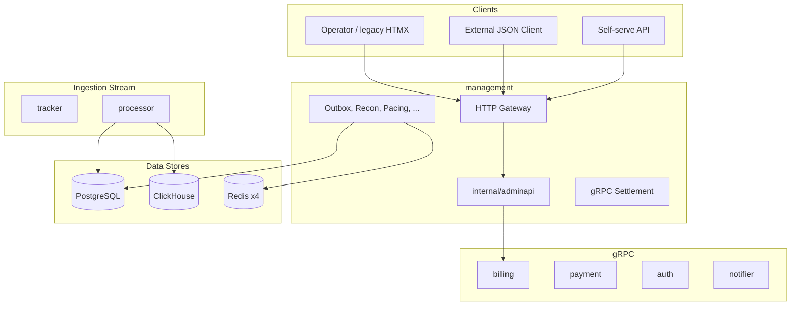

# eSPX — Management & Control-Plane Architecture

Unified reference document for cold-path operations (management service, billing, admin API, analytics reporting, role-based DTO layouts, operational backlog, multi-region architecture). Hot-path execution (`/track`, packet filtering, Redis Lua) is excluded. External administration UI is served via a JSON REST API client; legacy HTMX endpoints remain supported; OpenAPI generation is out of scope.

**See also:** [DATABASE.md](./DATABASE.md), [MULTI_REGION.md](./MULTI_REGION.md), [SUBSCRIPTIONS.md](./SUBSCRIPTIONS.md), [LICENSING.md](./LICENSING.md), [ARCHITECTURE.md](./ARCHITECTURE.md), `GUIDE_STYLE_CODE.md`.

---

## 1. Architecture

The control plane sits above PostgreSQL (the financial and configuration system of record) and derived data stores. Administrative queries and tenant automation workflows are strictly isolated from the `/track` ingestion path and do not affect tracker p99 SLA metrics.



### 1.1 Services

| Binary | Role |
| :--- | :--- |
| **management** | HTTP gateway, RBAC, background workers, settlement gRPC server, proxy for billing/payment/auth/notifier |
| **billing** | gRPC service: invoice generation, tax profiles, PDF rendering, monthly billing cron |
| **payment** | Payment intents, Stripe webhooks, settlement outbox queue |
| **auth** | PASETO token issuing, session management, API key storage |
| **notifier** | Email/Telegram alerts, invoice delivery, ops notifications |
| **processor** | Redis stream ingestion → PostgreSQL events + `balance_ledger` + ClickHouse batching |
| **ivt-detector**, **fraud-scorer** | ClickHouse batch scans / ML scoring → outbox → Redis blacklists |

### 1.2 Route Prefixes

| Prefix | Purpose |
| :--- | :--- |
| `/admin/*` | Legacy administration endpoints (mirrored under `/api/v1`) |
| `/api/v1/*` | Target REST API contract for reporting and automation |
| `/api/v1/selfserve/*` | Tenant self-serve: campaigns, payments, API keys |
| `/api/v1/billing/*`, `/api/v1/ops/*` | Admin API endpoints (M2.8) |

### 1.3 Mutation Invariants

- Hot-path configuration updates (campaign pause, blacklists, pacing, budget changes) MUST occur in **a single PostgreSQL transaction** combined with an `outbox_events` record. Direct HTTP writes to Redis are prohibited.
- Financial truth resides exclusively in `balance_ledger`. Reporting queries perform read-only aggregations over the ledger. Balances are never recalculated outside the ledger.
- API Contracts are documented via godoc comments on handler functions and DTO structs (R9), not via OpenAPI schemas.

---

## 2. Implemented Capabilities

### 2.1 Reporting (`/api/v1`)

| ID | Route | Source |
| :--- | :--- | :--- |
| RPT-01 | `GET /campaigns/{id}/stats` | PG `campaign_stats` + CH hourly MVs; returns `stale=true` when CH lag > 5 min |
| RPT-02 | `GET /customers/{id}/balance` | PG `balance_ledger` sum |
| RPT-03 | `GET /customers/{id}/balance/export` | Streaming CSV ledger, cursor-based, chunk ≤ 10 MB |
| RPT-04 | `GET /recon/runs` | PG `recon_runs` table |
| RPT-05 | `GET /disputes` | Payment gRPC proxy |
| RPT-06 | `POST /forecast/campaign` | ClickHouse 90-day trends + PG budget limits |
| RPT-07 | `POST /consent` | PG storage; retention managed via `ConsentRetentionWorker` |

### 2.2 Self-Serve (`/api/v1/selfserve`)

| ID | Route | Description |
| :--- | :--- | :--- |
| SS-01 | `POST /campaigns` | Campaign creation |
| SS-02 | `POST /campaigns/{id}/pause` | Pause campaign |
| SS-03 | `POST /campaigns/{id}/resume` | Resume campaign |
| SS-04 | `POST /payment-intents` | Create payment session |
| SS-05 | `GET /invoices` | List invoices |
| SS-06 | `POST /api-keys` | Generate API keys |

### 2.3 Background Workers

| Worker | Purpose |
| :--- | :--- |
| `OutboxWorker` (20 ms) | Polling `outbox_events` → Redis/registry sync, 20+ event types, priority lanes |
| `CampaignDrainWorker` | Finalizes campaign cancellations |
| `ReconWorker` | Reconciles PG spend ↔ Redis budgets ↔ CH hourly materialized views |
| `PacingControllerWorker` | Computes dayparting and spend pacing profiles |
| `QuotaManager` | Manages regional quota allocations (shadow/live modes) |
| `SyncWorker` ×4 | Flushes PG spend deltas → Redis budget keys |
| `ScheduleWorker` | Schedule-based campaign activation / pausing |
| `InvoiceWorker` | Monthly invoice generation (billing binary) |
| `LedgerInvariantWorker` | Scans for ledger drift and balance invariant violations |

---

## 3. Core Data Patterns

| Pattern | Description |
| :--- | :--- |
| **CQRS-Lite** | PostgreSQL stores financial and configuration state; Redis holds hot ephemeral state; ClickHouse stores derived analytics. |
| **Transactional Outbox** | PostgreSQL writes use `SELECT FOR UPDATE SKIP LOCKED` outbox workers to push changes to Redis at-least-once. |
| **Immutable Ledger** | All balance operations are stored as immutable `BIGINT` micro-unit rows in `balance_ledger`. `SUM(balance_ledger)` computes current balance. |
| **Composite Read** | `CompositeReadService` executes single-roundtrip joins between PG and CH for statements, wallet balances, and forecasts. |
| **Fan-Out Aggregation** | Queries merge results across 4 Redis shards with `partial: true` error handling and cursor pagination. |

---

## 4. Multi-Region Operations

Target Model ([MULTI_REGION.md](./MULTI_REGION.md)):

1. Hot path is isolated inside regional cells (tracker, Redis x4, processor).
2. Global PostgreSQL acts as the single source of truth for finance and configuration.
3. Region delivery uses an asynchronous outbox relay (`outbox_region_delivery`, at-least-once).
4. Direct cross-region Redis replication is prohibited.

---

## 5. Two-Layer Entitlement Architecture

Commercial monetization enforces **two independent entitlement layers** merged into a unified runtime `Entitlements` object in `internal/licensing/`:

| Layer | Primary Key | Issued By | Scope |
| :--- | :--- | :--- | :--- |
| **Product License** | `deployment_id` | Vendor License Server (JWT) | System deployment rights and instance ceilings |
| **Tenant Subscription** | `customer_id` | Instance Operator (PostgreSQL) | Feature flags and volume quotas for specific tenants |

```text
effective_limit = min(license.limits[X], subscription.limits[X])
effective_feature = license.features[X] AND subscription.features[X]
```

---

## 6. Daily Ingress Quotas (RPD)

In addition to **RPS** (short-term throughput, UDP epoch) and **events/month** (billing overage), eSPX enforces **requests per day (RPD)** as a third independent axis:

| Axis | Window | Enforcement Point |
| :--- | :--- | :--- |
| **RPS** | UDP epoch (~1–10 s) | Ingress rate limiters in tracker (`ingress_quota` + UDP `:8191`) |
| **RPD** | Calendar day | Redis key `ingress:day:{customer_id}:{YYYYMMDD}` → returns HTTP 429 when exhausted |
| **Events/Month** | Calendar month | Background `usage_meters` → monthly overage invoices |

When an RPD quota is exceeded, the tracker returns HTTP **429 Too Many Requests** with standard rate-limit headers (`X-RateLimit-Limit-Day`, `X-RateLimit-Remaining-Day`, `X-RateLimit-Reset-Day`).
