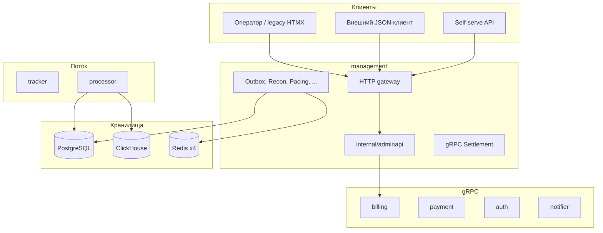
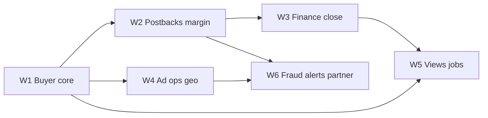
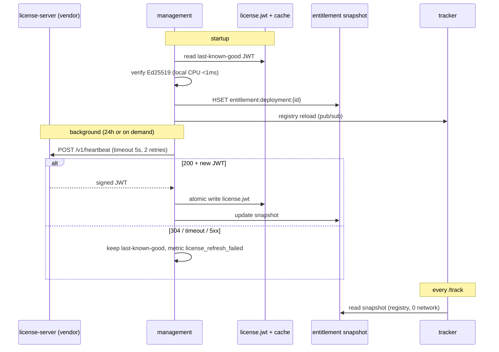

# Административный комплекс eSPX

Единый документ: cold-path (management, billing, admin API, отчёты, UX по ролям, backlog, мультирегион). Hot path (`/track`, фильтры, Redis Lua) не входит. Внешняя admin-панель — JSON API client; HTMX legacy, OpenAPI вне scope.

**См. также:** [DATABASE.md](./DATABASE.md), [MULTI_REGION.md](./MULTI_REGION.md), [SUBSCRIPTIONS.md](./SUBSCRIPTIONS.md), [LICENSING.md](./LICENSING.md), [MILESTONE.md](./MILESTONE.md) (M2.8, M3, M6), `GUIDE_STYLE_CODE.md`.

---

## 1. Архитектура

Control plane поверх Postgres (source of truth) и производных хранилищ. Запросы операторов и tenant-автоматизации не участвуют в каждом `/track` и не влияют на p99 трекера.



### 1.1 Сервисы

| Бинарник | Роль |
| :--- | :--- |
| **management** | HTTP-шлюз, RBAC, workers, settlement gRPC, прокси billing/payment/auth/notifier |
| **billing** | gRPC: инвойсы, налоги, PDF, monthly cron |
| **payment** | Intents, webhooks, outbox → settlement |
| **auth** | PASETO, API keys |
| **notifier** | Email/Telegram, доставка инвойсов и алертов |
| **processor** | Stream → PG events + `balance_ledger` + CH batch |
| **ivt-detector**, **fraud-scorer** | CH/ML → outbox → Redis |

**M2.8:** JSON billing/ops в `internal/adminapi/`; management — HTMX, workers, settlement.

### 1.2 Префиксы маршрутов

| Префикс | Назначение |
| :--- | :--- |
| `/admin/*` | Legacy оператор; дублируется под `/api/v1` |
| `/api/v1/*` | Целевой контракт отчётов и automation |
| `/api/v1/selfserve/*` | Tenant: кампании, платежи, API keys |
| `/api/v1/billing/*`, `/api/v1/ops/*` | Admin API (M2.8) |

### 1.3 Правила мутаций

- Изменения hot path (pause, blacklist, pacing, budget) — **одна PG-транзакция** + `outbox_events`. Прямые записи в Redis из HTTP запрещены.
- Финансовая истина — `balance_ledger`. Отчёты JOIN ledger read-only, баланс не пересчитывается вне ledger.
- Контракт — godoc на handlers и DTO (R9), не OpenAPI.

---

## 2. Реализовано

### 2.1 Reporting (`/api/v1`)

| ID | Route | Источник |
| :--- | :--- | :--- |
| RPT-01 | `GET /campaigns/{id}/stats` | PG `campaign_stats` + CH hourly MVs; `stale` при CH lag > 5 min |
| RPT-02 | `GET /customers/{id}/balance` | PG ledger + customer |
| RPT-03 | `GET /customers/{id}/balance/export` | Streaming CSV ledger, cursor, chunk ≤ 10 MB |
| RPT-04 | `GET /recon/runs` | PG `recon_runs` |
| RPT-05 | `GET /disputes` | Payment gRPC proxy |
| RPT-06 | `POST /forecast/campaign` | CH 90d + PG budget |
| RPT-07 | `POST /consent` | PG; retention — `ConsentRetentionWorker` |

### 2.2 Self-serve (`/api/v1/selfserve`)

| ID | Route |
| :--- | :--- |
| SS-01 | `POST /campaigns` |
| SS-02 | `POST /campaigns/{id}/pause` |
| SS-03 | `POST /campaigns/{id}/resume` |
| SS-04 | `POST /payment-intents` |
| SS-05 | `GET /invoices` |
| SS-06 | `POST /api-keys` |
| — | `GET /billing/statement` (JOIN-06 via adminapi) |

### 2.3 Admin API billing (`/api/v1/billing`)

| ID | Route |
| :--- | :--- |
| FIN-01 | `GET /billing/invoices` |
| FIN-02 | `GET /billing/invoices/{id}` |
| — | `GET /billing/invoices/{id}/pdf` |
| — | `GET /billing/invoices/{id}/ledger-lines` |
| INT-03 | `GET/POST .../deliveries`, `.../retry` |
| — | `POST /billing/invoices/preview`, `POST .../void` |
| FIN-07 | `GET /billing/invariant` |
| — | `GET /billing/summary` |
| JOIN-06 | `GET /customers/{id}/billing/statement` |
| XFM-01 | `GET /customers/{id}/wallet` |
| — | `GET/PUT /customers/{id}/tax-profile` |
| — | `GET /customers/{id}/billing/forecast` |
| EXP-02 | `POST /billing/exports` |
| EXP-03 | `GET /billing/exports/{id}[/download]` |

### 2.4 Admin API ops (`/api/v1/ops`)

| ID | Route | Паттерн |
| :--- | :--- | :--- |
| OPS-01 | `GET /ops/incidents` | Fan-out merge |
| OPS-02 | `GET /ops/outbox` | PG paginated |
| OPS-03 | `GET /ops/shards` | Redis ping ×4 |
| OPS-04 | `GET /ops/dlq` | Fan-out DLQ |
| OPS-05 | `POST /ops/dlq/{id}/retry` | outbox `DLQ_RETRY` |
| CMP-01 | `GET /audit/export` | Streaming CSV |
| FIN-04 | `GET /customers/{id}/payments` | Payment gRPC |

### 2.5 `/admin/*` (legacy)

Клиенты, кампании, brands, fcap, pacing, blacklist, audit, emergency breaker, privacy erasure, webhook replay; registrars: delivery, fraud, slot-map, supply, RTB, ops shards. RBAC `Perm*`, rate limit.

### 2.6 Workers

| Worker | Назначение |
| :--- | :--- |
| `OutboxWorker` (20 ms) | `outbox_events` → Redis/registry, 20+ типов, priority `BUDGET_FREEZE` |
| `CampaignDrainWorker` | Финализация cancel |
| `ReconWorker` | PG ↔ Redis budget ↔ CH hourly; quota recon |
| `DeliveryOptimizerWorker` / `PacingController` + `AutoscaleBudgetWorker` | Pacing, MAB, bid floors |
| `QuotaManager` | Regional quota shadow/live |
| `SyncWorker` ×4 | PG spend → Redis budget |
| `ScheduleWorker`, `CreditScoringWorker` | Daypart; overdraft |
| `InvoiceWorker` (billing) | Monthly cron, advisory lock |
| `LedgerInvariantWorker`, `LowBalanceWorker` | Drift scan; balance alerts |
| `AuditExportWorker`, `ErasureWorker`, `ConsentRetentionWorker`, `BlacklistJanitor`, `NginxConfigWorker` | Compliance, edge |
| `SlotMigrationOrchestrator` | Optional slot→shard |

### 2.7 Биллинг

Схема `billing.*`: `invoices` (UNIQUE `customer_id, billing_month`), `invoice_lines`, `customer_tax_profiles`.

`GenerateInvoice`: invariant check → idempotent lookup → txn (ledger agg + tax) → optional `DeliverInvoice` (notifier, `DedupKey: invoice:{id}`, PDF URL).

Payment provider в billing — placeholder; Stripe — в payment.

### 2.8 Аналитика и документы

```
/track → Stream → processor → PG events + balance_ledger + CH batch (20k / 5s) → mv_campaign_hourly_*
```

| Формат | Генератор |
| :--- | :--- |
| PDF инвойс | `billing.RenderInvoicePDF` (PDF 1.4, stdlib) |
| CSV balance / audit | Streaming handlers |
| CSV/NDJSON billing | `export.JobRunner` (async, disk) |
| Daily audit | `AuditExportWorker` |

### 2.9 Auth

PASETO (auth gRPC), `X-Admin-API-Key`, RBAC, `ensureCustomerAccess`, CSRF, rate limit. gRPC: `x-internal-token` / settlement token.

---

## 3. Паттерны данных

| Паттерн | Суть |
| :--- | :--- |
| **CQRS-lite** | PG — finance/config; Redis — hot ephemeral (outbox); CH — derived analytics |
| **Transactional outbox** | `SKIP LOCKED`, lease, priority lane, at-least-once → идемпотентные handlers |
| **Idempotency** | Admin: `SHA256(customer_id+body)`; payment: client key; invoice: `invoice:{id}`; stream: `(click_id, date)` PK |
| **Immutable ledger** | micro-units; `SUM(balance_ledger)`; invariant ±1 micro-unit |
| **Composite read** | `CompositeReadService`: один roundtrip PG±CH (statement, wallet, forecast) |
| **Fan-out merge** | 4 Redis shards; `partial: true`; DLQ cursor `(shard, group, id)` |
| **Async export** | In-memory jobs + disk; нет PG queue (ограничение) |
| **gRPC boundary** | Расчёт в billing; JSON/PDF в adminapi |
| **Recon loop** | PG spend / Redis keys / CH MVs → `recon_runs` |
| **Distributed quota** | PG reserve → regional `budget:quota`; modes shadow/live |

---

## 4. Мультирегион

Целевая модель ([MULTI_REGION.md](./MULTI_REGION.md)):

1. Hot path изолирован в regional cell (tracker, Redis×4, processor).
2. Global PG — finance и config.
3. Доставка в регионы — async outbox relay (at-least-once).
4. Cross-region Redis sync запрещён.

### 4.1 Риски (EU / US / Asia)

| Область | Риск | Митигация | Остаток |
| :--- | :--- | :--- | :--- |
| PG | Admin latency, write contention, DR | Sync standby, PITR, DR replica, read replica для reporting | GDPR single-DB; pool exhaustion |
| Outbox relay | Pause delay, duplicates, partial apply | Priority outbox, idempotency, `outbox_region_delivery` | REG-02 не завершён |
| Quota | Cross-region overspend, false exhaustion | QuotaManager + recon | Race на refill |
| CH | GDPR, lag, regional isolation | `stale` flag, rebuild из PG | Federated query для cross-region |
| Billing | Single cron pod, tax geo, in-memory exports | advisory lock, tax profile | Job loss на restart |
| Ops fan-out | Partial incidents | `partial: true` | Неполная картина |
| Entitlements (M6) | Stale Redis plan | outbox `UPDATE_ENTITLEMENTS` | Не подключено |

### 4.2 Готовность

| Компонент | Single-region | Multi-region | Блокер |
| :--- | :---: | :---: | :--- |
| Outbox → Redis | да | частично | RegionOutboxRelay |
| QuotaManager | да | частично | live + recon |
| Billing | да | да | global PG |
| CH analytics | да | нет | regional CH / policy |
| Subscriptions | нет | нет | M6 |

### 4.3 Порядок внедрения (зависимости, не сроки)

1. Single-region HA: PG standby, CH replicated, quota shadow → live, мониторинг outbox/recon/invariant/CH lag.
2. Multi-region hot path: `outbox_region_delivery`, relay, idempotency per region, REG-01..03.
3. Global admin: PG read replica, CH residency decision, PG-persisted export jobs, M6 entitlements до RTB live multi-region.

---

## 5. Package layout (package-driven Go)

По `GUIDE_STYLE_CODE.md`: flat packages, file roles, без `entity/` / `usecase/` / `ports/`.

```text
internal/adminapi/
  register.go
  errs/
  billing/          # exists
  ops/              # exists
  export/           # exists
  licensing/        # exists (M3)
  reports/          # exists (M4 scaffold; queries in M6)
    handlers.go, metrics.go, period.go, types.go
  dashboards/       # exists (M4 scaffold)
    handlers.go, types.go
  views/            # exists (M4 scaffold)
    handlers.go, service.go, types.go

internal/management/
  postback_handler.go, postback_matcher_worker.go
  margin_guard_worker.go, recommendation_worker.go
  service_recommendations.go, alert_rules_worker.go
  migrations/       # postbacks, payout_rules, views, recommendations, alert_rules
```

Правила: DTO с JSON tags; map PG/CH → DTO в файле запроса; мутации hot path — txn + outbox; CH-ответы — `freshness`.

---

## 6. Метрики (XFM)

Централизовать в `adminapi/reports/metrics.go`:

| ID | Формула |
| :--- | :--- |
| `spend_micro` | SUM ledger debits или CH cost |
| `revenue_micro` | postback payout |
| `profit_micro` | revenue − spend |
| `roi_pct` | profit / spend × 100 |
| `cpa_micro` | spend / conversions |
| `cpc_micro`, `cpm_micro`, `ctr`, `epc_micro` | стандартные |
| `ivt_rate` | ivt / clicks |
| `utilization_pct` | current_spend / budget_limit (XFM-02) |
| `available_micro` | balance + overdraft − reserved (XFM-01) |
| `pacing_drift_pct` | (actual − planned) / planned |

API: деньги в `*_micro` (int64); опционально `display_unit=dollars` (XFM-05).

---

## 7. Shared DTO (примитивы)

```go
type PeriodDTO struct {
    From, To, Timezone string
}
type DataFreshnessDTO struct {
    AsOf, Consistency string // strong | eventual
    Stale bool
    CHLagSeconds int
}
type ActionDTO struct {
    ID, Label string
    RequiresConfirm bool
    ImpactMicro int64
}
type MetricsBlockDTO struct {
    SpendMicro, RevenueMicro, ProfitMicro, Conversions, CPAMicro int64
    ROIPct float64
    Freshness DataFreshnessDTO
}
type TableDTO struct {
    Columns []ColumnDTO
    Rows []map[string]any
    Totals map[string]any
    Freshness DataFreshnessDTO
    NextCursor string
}
```

---

## 8. Persona dashboards (макеты)

| Route | DTO | Роли |
| :--- | :--- | :--- |
| `GET /api/v1/dashboards/buyer` | `BuyerDashboardDTO` | Медиа-байер |
| `GET /api/v1/dashboards/adops` | `AdOpsHealthDTO` | Ad ops |
| `GET /api/v1/dashboards/accountant` | `AccountantCloseDTO` | Бухгалтер |
| `GET /api/v1/dashboards/cfo` | `CFOSummaryDTO` | Финдир |
| `GET /api/v1/dashboards/fraud` | `FraudOverviewDTO` | Fraud analyst |
| `GET /api/v1/dashboards/operator` | `OperatorDashboardDTO` | Админ платформы |

### 8.1 BuyerDashboardDTO

```go
type BuyerDashboardDTO struct {
    CustomerID string
    Period PeriodDTO
    KPIs MetricsBlockDTO
    Campaigns []BuyerCampaignRowDTO  // id, name, status, spend, budget, utilization, roi, pacing, overspend_risk, actions
    TopSources, WorstSources []SourceRowDTO
    Alerts []AlertCardDTO
    Recommendations []RecommendationCardDTO
}
```

### 8.2 SourceRowDTO (SubID table)

```go
type SourceRowDTO struct {
    CampaignID, Sub1, Sub2, Country string
    Impressions, Clicks, Conversions int64
    SpendMicro, RevenueMicro, ProfitMicro, CPAMicro int64
    ROIPct, CTR, IVTRate, QualityScore float64
    Actions []ActionDTO
}
```

`GET /api/v1/reports/traffic-sources` — params: `customer_id`, `campaign_id?`, `from`, `to`, `group_by`, `sort`, `cursor`.

### 8.3 AccountantCloseDTO

```go
type AccountantCloseDTO struct {
    CustomerID, BillingMonth string
    InvariantOK bool
    InvariantDeltaMicro int64
    Statement StatementSummaryDTO  // opening, closing, delta (JOIN-06 subset)
    Invoices []InvoiceCloseRowDTO
    UnreconciledPostbacks int
    Steps []CloseStepDTO  // invariant, recon, invoice_preview, deliver
}
```

### 8.4 CFOSummaryDTO

```go
type CFOSummaryDTO struct {
    CustomerID string
    Period PeriodDTO
    Wallet WalletSummaryDTO       // balance, overdraft, available, reserved, runway_days
    UnitEconomics MetricsBlockDTO
    SpendVelocity SpendVelocityDTO
    BuySellSpread BuySellSpreadDTO
    ReconSummary ReconSummaryDTO
    ForecastMonthEnd ForecastSnapshotDTO
    TopMarginSources []SourceRowDTO
    AtRiskCampaigns []BuyerCampaignRowDTO
}
```

### 8.5 AdOpsHealthDTO, FraudOverviewDTO, OperatorDashboardDTO

- **AdOps:** campaigns[] — pacing_drift, budget_remaining, creative_fatigue, rtb_win_rate, outbox_pending_age, actions.
- **Fraud:** ghost_ivt_spend_pct, ivt_rate, top_ivt_sources, entropy_alerts, campaigns[].
- **Operator:** incidents (OPS-01), shards (OPS-03), outbox_backlog (JOIN-04), top_customers (JOIN-02), emergency_breaker.

### 8.6 RecommendationCardDTO

```go
type RecommendationCardDTO struct {
    ID, Type, CampaignID, Title, Detail string  // type: pause_geo, cap_subid, shift_budget, raise_floor
    Confidence float64
    ImpactMicro int64
    CreatedAt, ExpiresAt string
    Actions []ActionDTO
}
```

`POST /api/v1/recommendations/{id}/apply` → outbox + Idempotency-Key (ADT-91).

---

## 9. Report endpoints (таблицы)

| Route | DTO | ID |
| :--- | :--- | :--- |
| `GET /reports/campaign-unit-economics` | `UnitEconomicsRowDTO[]` | ADT-01 |
| `GET /reports/source-margin` | `TableDTO` | ADT-03 |
| `GET /reports/traffic-sources` | `SourceRowDTO[]` | ADT-10 |
| `GET /reports/source-quality` | `TableDTO` | ADT-12 |
| `GET /reports/spend-velocity` | `SpendVelocityTableDTO` | ADT-06 |
| `GET /reports/campaign-geo-device` | `PivotTableDTO` | ADT-60 |
| `GET /reports/geo-roi` | `TableDTO` | ADT-61 |
| `GET /reports/daypart-heatmap` | `HeatmapDTO` | ADT-63 |
| `GET /reports/pacing-drift` | `PacingDriftTableDTO` | ADT-32 |
| `GET /reports/postback-reconciliation` | `PostbackReconRowDTO[]` | ADT-23 |
| `GET /reports/ivt-by-source` | `TableDTO` | ADT-71 |
| `GET /reports/discrepancy-buy-sell` | `BuySellSpreadDTO` | ADT-84 |
| `GET /reports/campaign-overview` | `CampaignOverviewRowDTO[]` | JOIN-01 |
| `GET /reports/customer-portfolio` | `CustomerPortfolioRowDTO[]` | JOIN-02 |

**UnitEconomicsRowDTO:** campaign_id, spend/revenue/profit_micro, conversions, cpa/cpc/cpm_micro, roi_pct, epc_micro.

**PivotTableDTO:** row_dim, col_dim, rows[], cols[], cells[][]{imps, spend_micro, roi_pct}.

**PostbackReconRowDTO:** click_id, campaign_id, expected/recorded/delta payout_micro, attribution_lag_sec, status.

CH: parameterized queries в `ch_queries.go`; whitelist dimensions; `EXPLAIN` в `scripts/sql-explain/`.

---

## 10. Views, jobs, alerts

### 10.1 Saved views

`saved_report_views` (PG): owner_id, customer_id, name, report_key, spec_json, is_shared.

`GET/POST /api/v1/views`, `GET/PUT/DELETE /api/v1/views/{id}`.

### 10.2 Report jobs (ROL-04)

`POST /api/v1/reports/jobs` — `ReportJobSpec{report_key, customer_id, period, compare?, group_by, filters, format}`; branch в `export.JobRunner`.

### 10.3 Alert rules (INT-02)

`alert_rules` (PG): type (low_balance, margin_breach, ivt_spike, pacing_drift, recon_fail), threshold_json, channel, quiet_hours.

Worker: `alert_rules_worker.go`; dedup per rule per day.

---

## 11. Persistence (новые таблицы)

```sql
CREATE TABLE postbacks (
    id UUID PRIMARY KEY,
    click_id TEXT NOT NULL,
    event_type TEXT NOT NULL,
    campaign_id UUID NOT NULL,
    customer_id UUID NOT NULL,
    payout_micro BIGINT NOT NULL,
    received_at TIMESTAMPTZ NOT NULL DEFAULT now(),
    UNIQUE (click_id, event_type)
);

CREATE TABLE campaign_payout_rules (
    campaign_id UUID PRIMARY KEY,
    rules_json JSONB NOT NULL,
    updated_at TIMESTAMPTZ NOT NULL DEFAULT now()
);

CREATE TABLE saved_report_views ( ... );
CREATE TABLE recommendations ( ... );  -- TTL, status open|applied|expired
CREATE TABLE alert_rules ( ... );
```

---

## 12. Backlog (каталог)

### 12.1 Ops / finance / compliance

| ID | Route / worker | Статус |
| :--- | :--- | :--- |
| OPS-01..05 | incidents, outbox, shards, dlq, retry | реализовано |
| FIN-01..07, FIN-08 | invoices, invariant, low balance worker | 01-07 да; 08 notifier на drift |
| CMP-02 | structured audit export → S3 | backlog |
| CMP-03..05 | webhook replay /api/v1, privacy erasure/export | частично |
| INT-01..04 | tenant webhooks, outbound events, notifier retry, Alertmanager | backlog |

### 12.2 Tenant / analytics

| ID | Route | Статус |
| :--- | :--- | :--- |
| TEN-01..06 | warm-budget, bulk-pause, fraud-config, rtb deals, recon drill-down | backlog |
| TEN-07..10 | usage, ledger export, subscription, license | M6 |
| AN-01..06 | stats export, creative perf, pacing forecast, slot-map, supply files | backlog |
| REG-01..03 | campaign regions, region-relay, quota reservations | backlog / M3 |

### 12.3 JOIN / CHJ / FAN / EXP

| ID | Суть | Статус |
| :--- | :--- | :--- |
| JOIN-01 | campaign + customer + today stats | backlog |
| JOIN-02 | customer portfolio MTD | backlog |
| JOIN-03 | ledger + campaign name + click_id | backlog |
| JOIN-04 | pending outbox + age | backlog |
| JOIN-05 | campaign + fraud config | backlog |
| JOIN-06 | billing statement | **да** |
| JOIN-07 | subscription + usage | M6 |
| CHJ-01..05 | geo, hourly, fraud, RTB, recon CH-PG | backlog |
| FAN-01..03 | incidents, dlq, shard-campaign-map | 01-02 да |
| EXP-01..04 | stream CSV, async job, download, NDJSON | 02-03 да |

### 12.4 XFM / SRT / ROL

| Группа | Примеры |
| :--- | :--- |
| XFM-01..07 | available_micro, utilization, cpc/cpm/ctr, recon severity, dollars display, fan-out sort unhealthy first, gap fill |
| SRT-01..06 | server-side sort customers, campaigns, top-N, recon, audit, dlq |
| ROL-01..04 | rollup by day/week/month; async report job |

### 12.5 AdTech / arbitrage (ADT)

| Блок | ID | Суть |
| :--- | :--- | :--- |
| Unit economics | ADT-01..06 | economics report, margin rules, source margin, offer perf, MarginGuard worker, spend velocity |
| Sources / subID | ADT-10..15 | traffic sources, caps, quality, block/whitelist, dedup audit |
| Postbacks | ADT-20..25 | ingest, attribution lag, unattributed, recon, matcher worker, payout rules |
| Pacing / budget | ADT-30..36 | pacing API, status, drift, rebalance, exhaustion forecast, daily cap |
| Creatives / brand | ADT-40..45 | fcap API, status, MAB rank, weight override, fatigue, auto-pause |
| RTB / supply | ADT-50..55 | deals CRUD, win-loss, bid floor, floor effectiveness, shadow-diff, supply deals |
| Geo / schedule | ADT-60..65 | geo×device pivot, geo ROI, bid adjust, daypart heatmap, schedule coverage, target countries |
| Fraud | ADT-70..75 | fraud-config API, ivt by source, rules registry, click entropy, feedback loop, ghost ivt impact |
| Partner | ADT-80..84 | partner statement, rate card, fill rate, allocate, buy-sell discrepancy |
| Recommendations | ADT-90..93 | campaign/customer recs, apply, worker |

**Ограничения ADT:** postback ingest — отдельный rate limit; margin rules — `as_of` обязателен; auto-pause уважает priority outbox; sub_id/placement — RBAC на export; RTB live/geo adjust — M6 feature flag.

### 12.6 Прочий backlog

| Область | Статус |
| :--- | :--- |
| Subscriptions, entitlements Redis | схема/docs; runtime M6 |
| `/admin/*` → `/api/v1` унификация | частично |
| `outbox_region_delivery`, RegionOutboxRelay | документировано |
| Stripe в billing | placeholder |
| HTMX | legacy |

---

## 13. Roadmap (волны, зависимости)



| Волна | Содержание | DoD |
| :--- | :--- | :--- |
| **W1 Buyer core** | `reports/metrics`, traffic-sources, unit-economics, `dashboards/buyer`, pacing-status (ADT-31) | sort+cursor; freshness; RBAC; EXPLAIN CH |
| **W2 Postbacks margin** | postback ingest (ADT-20), matcher (24), payout rules (25), postback recon, MarginGuard (05), margin rules (02), accountant dashboard skeleton | idempotent postback; margin pause via priority outbox |
| **W3 Finance close** | JOIN-01/02, dashboards cfo/operator, accountant close steps, buy-sell (84), scheduled export | close steps green on happy path |
| **W4 Ad ops geo** | dashboards/adops, geo pivot + heatmap (60/63), pacing drift (32), creative fatigue (44), RTB win-loss (51) | — |
| **W5 Views jobs** | saved views CRUD, period compare, ReportJobSpec in export, recommendations (90-93) | — |
| **W6 Fraud alerts partner** | fraud dashboard + reports (71/73/75), alert_rules worker, partner statement (80), M6 gates | — |

**Жёсткая зависимость:** W2 до buy/sell spread и unit economics с revenue.

**Параллельно:** W4 после W1; W6 после W2+W4.

**Milestone:** W1–W3 → M2.8; W2 → M4 adjacency; W6 → M6; quota в CFO → M3.

---

## 14. API conventions

1. Деньги: `*_micro` int64.
2. CH-backed responses: `freshness` {as_of, stale, consistency, ch_lag_seconds}.
3. Pagination: keyset `cursor` на больших таблицах.
4. Sort: whitelist per endpoint.
5. Mutations: Idempotency-Key; reports read-only.
6. Сравнение периодов: `compare` query или `ComparePeriodDTO` в jobs.
7. Действия в строках: `actions[]` с `impact_micro` где применимо.

---

## 15. Ожидания ниши (AdTech / arbitrage, web 2026)

Контракт API должен закрывать (без интеграции внешних ad network API):

- Единый экран spend + revenue + margin (не Excel).
- SubID drill-down (sub1–sub5, geo, placement).
- Near-real-time отчёты с явным `stale`.
- Автоправила CPA/ROI → pause/scale (outbox).
- Postback reconciliation и buy/sell spread.
- Finance loop: delivered → billed → paid (closing cockpit).
- Role-based dashboards (§8).
- Saved views и scheduled export.
- Actionable recommendations с explicit Apply.
- Anomaly alerts (spend, IVT, pacing, recon).

**Вне scope:** произвольный SQL от клиента; sync Meta/Google/TikTok; hot-path subscription HTTP.

---

## 16. Ключевые файлы

| Область | Путь |
| :--- | :--- |
| Entry | `cmd/management/main.go`, `cmd/billing/main.go` |
| Handlers | `internal/management/handler*.go` |
| Admin wire | `internal/management/adminapi_wire.go` |
| Admin routes | `internal/adminapi/register.go` |
| Billing | `internal/billing/service.go`, `invoice_worker.go`, `pdf_render.go` |
| Composite reads | `internal/adminapi/billing/analytics.go`, `forecast.go` |
| Outbox / recon / quota | `outbox_worker.go`, `recon_worker.go`, `quota_manager.go` |
| Fan-out | `internal/adminapi/ops/fanout.go` |
| Export | `internal/adminapi/export/service.go` |
| CH ingest | `internal/ingestion/clickhouse_store.go` |

---

## 17. Итог

Single-region admin **операционен**: gateway + adminapi billing/ops, инвойсы/PDF/notifier, statement/wallet/invariant, PG+CH analytics, recon, export jobs, outbox/fan-out/quota patterns.

Расширение — persona dashboards (§8), report tables (§9), postbacks/margin (W2), closing cockpit (W3), views/jobs/recommendations (W5). Multi-region требует RegionOutboxRelay, quota live, data residency decision, PG-persisted jobs, M6 entitlements.

---

## 18. Два слоя entitlements

Коммерческая модель eSPX — **два независимых слоя**, один runtime-тип `Entitlements` в `internal/licensing/`.

| Слой | Ключ | Кто выдаёт | Вопрос |
| :--- | :--- | :--- | :--- |
| **Product license** | `deployment_id` | Vendor license server (JWT) | Имеет ли покупатель право **эксплуатировать** инсталляцию eSPX |
| **Tenant subscription** | `customer_id` | Оператор инсталляции (PG) | Что **внутри** инсталляции может конкретный арбитражник/сеть |

```text
effective_limit = min(license.limits[X], subscription.limits[X])
effective_feature = license.features[X] AND subscription.features[X]
```

Пример: license `growth` даёт `max_rps=100k` на весь кластер; tenant на `pro` — `50k`; tenant получает 50k. Tenant `enterprise` при license `starter` (`max_regions=1`) не получит multi-region, даже если в подписке флаг включён.

**Деньги:** три непересекающихся потока в `balance_ledger`:

| `reference_type` | Смысл |
| :--- | :--- |
| `spend` | Ad spend (клики/показы) |
| `subscription` | Абонплата tenant (basic/pro/enterprise) |
| `topup` / `payment` | Пополнение кошелька |

Vendor license fee — **вне** customer PG (биллинг вендора → `license-server` renew).

Полные спецификации: [LICENSING.md](./LICENSING.md), [SUBSCRIPTIONS.md](./SUBSCRIPTIONS.md).

---

## 19. License server (неблокирующий)

License server — **отдельный vendor-side сервис** (`cmd/license-server`), не входит в customer compose. Принцип: **ни один customer binary не ждёт сеть вендора на hot path и не блокирует cold path надолго**.

### 19.1 Что запрещено

| Антипаттерн | Почему |
| :--- | :--- |
| HTTP к license server на `/track` | Ломает p95/p99 SLA |
| Sync verify JWT в HTTP handler admin | Блокирует goroutine пула |
| Inbound connection vendor → customer DC | Security, firewall |
| Private key вендора у покупателя | Подделка срока |

### 19.2 Неблокирующая архитектура



**Компоненты на стороне покупателя:**

| Компонент | Файл (целевой) | Поведение |
| :--- | :--- | :--- |
| `LicenseVerifier` | `internal/licensing/verify.go` | Только crypto + expiry; без I/O |
| `LicenseWatcher` | `internal/management/license_watcher.go` | Goroutine: file mtime / cron heartbeat |
| `LicenseCache` | disk `license.jwt` + optional `license.jwt.bak` | Last-known-good при offline |
| `LicenseStateMachine` | `internal/licensing/state.go` | ACTIVE → GRACE → EXPIRED / REVOKED |
| `EntitlementWriter` | outbox `UPDATE_DEPLOYMENT_ENTITLEMENTS` или direct HSET | Snapshot в Redis |
| `RegistryHook` | tracker registry sync | Atomic swap snapshot |

**Cold path:** handlers читают `license_status` из PG или in-memory atomic pointer, обновляемый watcher'ом — **не** вызывают verify+network per request.

**SLA watcher'а:** refresh не удлиняет p99 admin HTTP > 500 ms; verify в фоне, swap pointer после готовности.

### 19.3 Режимы доставки

| Режим | Env | Сеть к вендору | Offline |
| :--- | :--- | :--- | :--- |
| **file** | `ESPX_LICENSE_MODE=file` | Нет (ручной файл) | Полный air-gap |
| **online** | `ESPX_LICENSE_MODE=online` | Heartbeat по расписанию | Last-known-good JWT до конца grace |

```text
ESPX_LICENSE_MODE=file|online
ESPX_LICENSE_PATH=/etc/espx/license.jwt
ESPX_LICENSE_SERVER=https://license.example.com
ESPX_LICENSE_KEY=...
ESPX_LICENSE_REFRESH_INTERVAL=24h
ESPX_LICENSE_HEARTBEAT_TIMEOUT=5s
ESPX_LICENSE_TELEMETRY=0|1
```

### 19.4 License server API (vendor)

| Endpoint | Auth | Назначение |
| :--- | :--- | :--- |
| `POST /v1/licenses/issue` | vendor admin | Новый контракт → `license_key` |
| `POST /v1/licenses/renew` | vendor admin / payment webhook | Продление `valid_until` |
| `POST /v1/licenses/revoke` | vendor admin | CRL entry |
| `POST /v1/activate` | `license_key` | `deployment_id` + fingerprint → JWT |
| `POST /v1/heartbeat` | JWT bearer | Metadata → новый JWT или **304 Not Modified** |
| `GET /v1/revocations` | public (signed list) | CRL cache для management, TTL 1h |

**Vendor DB** (отдельный Postgres): `licenses`, `deployments`, `renewal_events`, `revocations`. Без click_id, IP, ledger.

### 19.5 JWT claims (product license)

```json
{
  "iss": "espx-license",
  "sub": "license_uuid",
  "kid": "2026-01",
  "deployment_id": "uuid",
  "plan": "growth",
  "valid_from": "2026-04-01T00:00:00Z",
  "valid_until": "2026-05-01T00:00:00Z",
  "grace_days": 7,
  "limits": {
    "max_rps": 100000,
    "max_active_campaigns": 2000,
    "max_regions": 2,
    "max_tenants": 50
  },
  "features": {
    "rtb_live": true,
    "ml_fraud_boost": true,
    "multi_region": true,
    "slot_migration": false
  },
  "bind": { "mode": "soft", "fingerprint": "" },
  "support_tier": "standard"
}
```

`plan` license — **потолок инсталляции** (`starter` | `growth` | `enterprise`), не путать с tenant `basic` | `pro` | `enterprise`.

### 19.6 Состояния license (deployment)

| State | Условие | Hot path | Cold path |
| :--- | :--- | :--- | :--- |
| `ACTIVE` | подпись OK, `now < valid_until` | Полный функционал в рамках plan | — |
| `GRACE` | `valid_until ≤ now < valid_until + grace_days` | Ingest **работает** | Admin: header `X-License-State: grace`; metric `ad_license_state=grace` |
| `EXPIRED` | grace истёк | `filterRejectLicenseExpired` (fail-closed) | Новые кампании 403 |
| `REVOKED` | CRL / heartbeat 403 | Блок на следующем snapshot refresh | Алерт ops |

**При недоступности license server (online):** watcher не меняет snapshot; работает last-known-good до EXPIRED. Ingest не прерывается в GRACE.

### 19.7 Heartbeat privacy

Разрешено: `license_id`, `deployment_id`, `version`, `uptime_seconds`, опционально `events_24h` при `TELEMETRY=1`.

Запрещено: click_id, campaign payload, IP пользователей, DSN, содержимое ledger.

### 19.8 DTO `GET /api/v1/license/status`

```go
type LicenseStatusDTO struct {
    DeploymentID   string            `json:"deployment_id"`
    LicenseID      string            `json:"license_id"`
    Plan           string            `json:"plan"`           // starter|growth|enterprise
    State          string            `json:"state"`          // ACTIVE|GRACE|EXPIRED|REVOKED
    ValidUntil     string            `json:"valid_until"`
    GraceEndsAt    string            `json:"grace_ends_at,omitempty"`
    Limits         LimitsDTO         `json:"limits"`
    Features       FeatureSetDTO     `json:"features"`
    LastVerifiedAt string            `json:"last_verified_at"`
    RefreshMode    string            `json:"refresh_mode"`   // file|online
    LastRefreshErr string            `json:"last_refresh_error,omitempty"`
}
```

### 19.9 Package layout (licensing)

```text
internal/licensing/
  entitlements.go    # Entitlements, Limits, FeatureSet, Effective()
  verify.go          # Ed25519 / PASETO public verify
  state.go           # ACTIVE/GRACE/EXPIRED/REVOKED
  jwt_claims.go      # parse claims -> Entitlements
  effective.go       # min(license, subscription) merge

internal/management/
  license_watcher.go
  license_client.go    # HTTP heartbeat client, circuit breaker
  service_entitlements.go  # RequireFeature, RequireUnderLimit

cmd/license-server/
  main.go
  handler_issue.go, handler_activate.go, handler_heartbeat.go
```

---

## 20. Градация подписок tenant (Basic → Pro → Enterprise)

Подписка — **внутри** развёрнутой инсталляции. Оператор (владелец license) назначает план каждому `customer_id`. Hosted SaaS: PG source of truth; on-prem: планы в PG, потолок — license JWT.

### 20.1 Сводная матрица планов

| Параметр | **Basic** | **Pro** | **Enterprise** |
| :--- | :--- | :--- | :--- |
| Целевая аудитория | Старт, один байер, тест | Средняя сеть, single region | Крупная сеть, multi-region, RTB live |
| Регионы | 1 | 1 | по контракту (2+) |
| Active campaigns | до 50 | до 500 | по контракту / без жёсткого cap |
| RPS (ingress) | до 10,000 | до 50,000 | 200,000+ |
| **Requests / day (RPD)** | 500,000 | 10,000,000 | по контракту |
| Events / month | до 5M | до 50M | committed + overage |
| API keys | 2 | 5 | по контракту |
| Self-serve API | read-only ledger | полный self-serve | полный + fan-out ops |
| Overdraft | жёсткий cap, низкий | CreditScoring cap | custom overrides |

### 20.2 Feature flags

| Feature | Basic | Pro | Enterprise |
| :--- | :---: | :---: | :---: |
| Dashboard buyer (§8) | + | + | + |
| SubID reports | ограниченный export | + | + |
| RTB shadow | - | + | + |
| RTB live | - | - | + |
| ML fraud boost | - | - | + |
| IVT detector (basic) | + | + | + |
| IVT custom rules | - | - | + |
| Ghost IVT | - | - | + |
| Multi-region | - | - | + |
| Slot migration | - | - | + |
| Priority outbox | - | - | + |
| Fan-out ops API | - | - | + |
| MarginGuard / auto-pause rules | - | + | + |
| Postback ingest API | - | + | + |
| White-label export / scheduled reports | - | - | + |
| Recommendations inbox (ADT-90) | - | + | + |

### 20.3 License plan (deployment) vs tenant plan

| License plan (потолок) | Типичный сценарий | max_tenants | max_rps | max_regions |
| :--- | :--- | :--- | :--- | :--- |
| **starter** | Один арбитражник, on-prem mini | 5 | 25,000 | 1 |
| **growth** | Агентство / white-label hub | 50 | 100,000 | 2 |
| **enterprise** | Крупный холдинг | unlimited | 500,000+ | по контракту |

На license `starter` нельзя выдать tenant `enterprise` с лимитами выше потолка — `POST /admin/customers/{id}/subscription` возвращает 403 `license_limit_exceeded`.

### 20.4 Billing по планам

| | Basic | Pro | Enterprise |
| :--- | :--- | :--- | :--- |
| Base fee / month | низкий фикс | средний фикс | annual / custom |
| Usage overage | events сверх лимита | events сверх 50M | committed + overage |
| Ad spend | `balance_ledger` spend | то же | то же |
| Invoice lines | `subscription` + `spend` раздельно | то же | то же |

Overage: `(events - plan.max_events_per_month) * unit_price_micro` — отдельная строка инвойса, не смешивается со spend.

### 20.5 Data model (billing schema)

```sql
INSERT INTO subscription_plans (code, display_name, limits_json, features_json, base_fee_micro) VALUES
  ('basic',      'Basic',      '{"max_active_campaigns":50,...}',   '{"rtb_live":false,...}',  0),
  ('pro',        'Pro',        '{"max_active_campaigns":500,...}',  '{"rtb_live":false,...}',  0),
  ('enterprise', 'Enterprise', '{"max_active_campaigns":100000,...}', '{"rtb_live":true,...}', 0);
```

Таблицы: `subscription_plans`, `customer_subscriptions`, `usage_meters` — см. [SUBSCRIPTIONS.md](./SUBSCRIPTIONS.md).

### 20.6 Runtime: snapshot tenant

После смены плана — PG txn + outbox `UPDATE_ENTITLEMENTS` → Redis:

```text
entitlement:customer:{customer_id}   HASH
  plan=basic|pro|enterprise
  max_rps=10000
  max_active_campaigns=50
  rtb_live=0
  ml_fraud_boost=0
  multi_region=0
  ...
```

**Cold path:**

```go
RequireFeature(customerID, "rtb_live")       // 403 plan_feature_required
RequireUnderLimit(customerID, "active_campaigns", +1)
RequireLicenseFeature("multi_region")        // deployment ceiling
```

**Hot path (tracker):** registry при sync кампании загружает **effective** entitlements (`Effective(deployment, customer)`). Без HTTP к billing/license.

| Проверка | Где |
| :--- | :--- |
| `rtb_live=0` | блок `RtbMode=live` |
| `ml_fraud_boost=0` | не читать `ml:score:boost:*` |
| RPS cap | UDP quota snapshot (краткосрочный) |
| Daily request cap (RPD) | Redis `ingress:day:*` + entitlement snapshot |
| EXPIRED license | `filterRejectLicenseExpired` до tenant checks |

### 20.7 Metering

```text
/track → stream → processor → usage_meters++ (per customer_id, meter=events, period=month)
                                      ↓
                            InvoiceWorker: base_fee + overage line
```

Idempotency: `(customer_id, meter, period)` PK; duplicate stream delivery не дублирует meter.

### 20.8 API подписок

| Method | Route | RBAC |
| :--- | :--- | :--- |
| GET | `/api/v1/customers/{id}/subscription` | tenant / operator |
| GET | `/api/v1/customers/{id}/usage` | tenant / operator |
| POST | `/admin/customers/{id}/subscription` | operator only |
| GET | `/api/v1/license/status` | operator (deployment) |
| GET | `/api/v1/selfserve/usage` | self-serve (Pro+) |

```go
type SubscriptionDTO struct {
    CustomerID   string       `json:"customer_id"`
    PlanCode     string       `json:"plan_code"`     // basic|pro|enterprise
    Status       string       `json:"status"`        // active|past_due|cancelled|suspended
    PeriodStart  string       `json:"period_start"`
    PeriodEnd    string       `json:"period_end,omitempty"`
    Limits       LimitsDTO    `json:"limits"`
    Features     FeatureSetDTO `json:"features"`
    Effective    LimitsDTO    `json:"effective_limits"`  // after license merge
    Usage        []UsageMeterDTO `json:"usage"`
}

type UsageMeterDTO struct {
    Meter   string `json:"meter"`   // events, api_calls
    Period  string `json:"period"`
    Value   int64  `json:"value"`
    Limit   int64  `json:"limit"`
    Remaining int64 `json:"remaining"`
}
```

### 20.9 Entitlement relay (единый пайплайн)

```text
source A: license JWT (LicenseWatcher)
source B: customer_subscriptions (handler + outbox)
        ↓
  Effective(deploymentEnt, customerEnt)
        ↓
  Redis HSET + registry.SyncEntitlements()
        ↓
  tracker FilterEngine / RTB catalog (snapshot only)
```

Смена Pro → Enterprise: outbox → snapshot < 60s без рестарта tracker (atomic registry swap).

### 20.10 Ошибки API

| Code | HTTP | Когда |
| :--- | :--- | :--- |
| `plan_feature_required` | 403 | feature выключен в tenant plan |
| `plan_limit_exceeded` | 403 | лимит tenant (campaigns, RPS, events) |
| `license_limit_exceeded` | 403 | tenant plan выше deployment license |
| `license_expired` | 403 | EXPIRED/REVOKED на cold path mutations |
| `license_grace` | 200 + header | GRACE: warning, не блок |

### 20.11 Статус реализации (M6)

| Компонент | Статус |
| :--- | :--- |
| `internal/licensing` + verify | backlog |
| `LicenseWatcher` + file/online | backlog |
| `cmd/license-server` | backlog |
| `subscription_plans` seed basic/pro/enterprise | backlog |
| `UPDATE_ENTITLEMENTS` outbox | backlog |
| `RequireFeature` / hot path gates | backlog |
| `GET /license/status`, `/subscription`, `/usage` | backlog |

См. [MILESTONE.md](./MILESTONE.md) §6 (SUB-*, LIC-*).

### 20.12 Опциональные proposal (не M6 DoD)

| ID | Документ | Суть |
| :--- | :--- | :--- |
| **ESPX-LP-2026-V1** | [proposals/ESPX-LP-2026-V1.md](./proposals/ESPX-LP-2026-V1.md) | Prepaid billable volume, billable weights, **PU pricing matrix** (§13) |

До принятия proposal действует канон: RPS + RPD + `max_events_per_month`, calendar EXPIRED → fail-closed ([LICENSING.md](./LICENSING.md)).

---

## 21. Дневные квоты ingress (модель LLM-дистрибьюторов)

Помимо **RPS** (краткосрочный throughput, UDP epoch) и **events/month** (биллинг), вводится ось **requests per day (RPD)** — как у OpenAI / Google / Anthropic: жёсткий дневной бюджет запросов на tenant с reset в полночь.

### 21.1 Три оси лимитирования

| Ось | Аналог LLM API | Окно | Назначение | Где enforced |
| :--- | :--- | :--- | :--- | :--- |
| **RPS** | RPM / TPM (burst) | ~1–10 s (UDP epoch) | Защита инфраструктуры от spike; fair share по shard | Tracker `ingress_quota` + UDP `:8190→:8191` |
| **RPD** | RPD (requests per day) | Календарный день | Коммерческий потолок «сколько трафика в сутки» | Tracker Redis + entitlement snapshot |
| **Events/month** | monthly usage tier | Календарный месяц | Абонплата + overage в инвойсе | `usage_meters` (cold, async) |

RPS **не заменяет** дневную квоту: tenant с 50k RPS и 1M RPD исчерпает день за ~20 s полного burst, далее 429 до reset. Tenant с 10k RPS и 10M RPD равномерно распределяет нагрузку.

```text
/track request
    ├─ 1. license snapshot (EXPIRED → reject)
    ├─ 2. UDP ingress RPS (per shard/worker epoch → 503 throttle)
    ├─ 3. daily RPD (per customer_id → 429 daily_quota_exceeded)
    ├─ 4. filters + budget Lua
    └─ 5. async: stream → usage_meters (month) + usage_daily flush
```

### 21.2 Определения

| Термин | Считается |
| :--- | :--- |
| **Request** | Принятый ingress `/track` (HTTP 202 после parse+filter gate), до settlement |
| **Event** | Billable impression / click / conversion в processor (может быть >1 event на request при batch — по умолчанию 1:1) |
| **Reset** | `00:00:00` в timezone квоты (default UTC; Enterprise — `customers.quota_timezone`) |

`max_requests_per_day` и `max_events_per_month` — **независимые** лимиты. Overage в инвойсе считается по **events/month**, не по RPD.

### 21.3 Лимиты по планам (guideline)

| План | max_rps | max_requests_per_day (RPD) | max_events_per_month |
| :--- | :--- | :--- | :--- |
| **Basic** | 10,000 | 500,000 | 5M |
| **Pro** | 50,000 | 10,000,000 | 50M |
| **Enterprise** | contract | contract | committed + overage |

License deployment ceiling: `max_requests_per_day_total` — суммарный RPD всех tenants (опционально на `growth`/`enterprise` license).

`limits_json` пример:

```json
{
  "max_rps": 50000,
  "max_requests_per_day": 10000000,
  "max_events_per_month": 50000000,
  "quota_reset_timezone": "UTC"
}
```

Effective: `min(license, subscription)` по каждому полю.

### 21.4 Hot path (неблокирующий)

Лимит и текущий счётчик **не читаются из Postgres** на `/track`.

```text
entitlement snapshot (registry):
  max_requests_per_day=N   (0 = unlimited)

Redis (shard by customer_id, same slot as budget keys):
  ingress:day:{customer_id}:{YYYYMMDD}   STRING counter
  TTL = 48h (пережить timezone edge + flush lag)
```

**Проверка** (после resolve `customer_id`, до тяжёлого Lua):

1. Load `max_requests_per_day` из registry entitlement (0 → skip).
2. `INCR` key (или atomic Lua: INCR + compare) на shard customer.
3. Если `count > limit` → `DECR` rollback → HTTP **429** `daily_quota_exceeded`.
4. Метрика `ad_ingress_daily_quota_rejects_total{customer_id=...}` (low-cardinality: plan tier label only).

Сеть к management/billing/license — **0**.

Согласованность: at-most-one extra request при race на границе лимита (как у LLM провайдеров); recon cold path допускает ±1.

### 21.5 UDP RPS vs RPD

| | RPS (существует) | RPD (новое) |
| :--- | :--- | :--- |
| Granularity | per shard × worker × epoch | per customer × day |
| Transport | UDP datagram от management | Redis local |
| Reset | каждый epoch (`UDPSyncIntervalMs`) | полночь quota_timezone |
| Ответ | 503 / throttle | 429 + RateLimit headers |
| Настройка | `UDP_DEFAULT_SHARD_RPS` + entitlement `max_rps` в epoch payload | entitlement `max_requests_per_day` |

`UDPControlServer.buildLimits()` расширяется: per-epoch `max_rps` из effective entitlement (weighted по shard), не только global default.

### 21.6 Cold path: учёт и API

**PG** (mirror для admin/биллинга):

```sql
CREATE TABLE usage_daily (
    customer_id   UUID NOT NULL,
    usage_date    DATE NOT NULL,
    meter         TEXT NOT NULL,   -- requests, events
    value         BIGINT NOT NULL DEFAULT 0,
    PRIMARY KEY (customer_id, usage_date, meter)
);
```

**Workers:**

| Worker | Файл | Роль |
| :--- | :--- | :--- |
| `DailyQuotaFlushWorker` | `management/daily_quota_flush_worker.go` | Redis SCAN/known keys → UPSERT `usage_daily` каждые 5 min |
| `DailyQuotaResetAlerter` | optional | 80%/95% RPD → notifier (dedup 1/день) |

**API:**

| Route | DTO поля |
| :--- | :--- |
| `GET /api/v1/customers/{id}/usage` | `daily[]` с `requests_today`, `requests_limit`, `resets_at` |
| `GET /api/v1/customers/{id}/usage/daily` | history по `from`/`to` |
| `GET /api/v1/selfserve/usage` | то же для Pro+ |

```go
type DailyUsageDTO struct {
    Date           string `json:"date"`            // YYYY-MM-DD quota TZ
    Requests       int64  `json:"requests"`
    RequestsLimit  int64  `json:"requests_limit"`
    RequestsRemaining int64 `json:"requests_remaining"`
    ResetsAt       string `json:"resets_at"`       // RFC3339 next midnight
    Events         int64  `json:"events,omitempty"`
}
```

**HTTP headers** (на `/track`, по аналогии с OpenAI):

```text
X-RateLimit-Limit-RPS: 50000
X-RateLimit-Limit-Day: 10000000
X-RateLimit-Remaining-Day: 9845123
X-RateLimit-Reset-Day: 1743465600
```

При 429:

```json
{
  "code": "daily_quota_exceeded",
  "message": "Daily request quota exhausted",
  "resets_at": "2026-04-01T00:00:00Z"
}
```

### 21.7 Admin: ручной bump (как credits у LLM)

| Route | Назначение |
| :--- | :--- |
| `POST /admin/customers/{id}/quota-bump` | operator: +N requests на сегодня (`overrides_json.daily_request_bonus`) |
| `GET /api/v1/customers/{id}/quota-status` | RPS + RPD + month events в одном DTO |

Bump пишется в PG → outbox `UPDATE_ENTITLEMENTS` → registry пересчитывает effective limit = plan + bonus.

### 21.8 Package layout

```text
internal/licensing/limits.go       # MaxRequestsPerDay, QuotaTimezone в Limits struct
internal/ingestion/daily_ingress_quota.go  # Redis INCR gate (hot path)
internal/management/daily_quota_flush_worker.go
internal/management/service_daily_usage.go
internal/adminapi/billing/usage_daily.go   # GET handlers
```

### 21.9 Ошибки

| Code | HTTP | Ось |
| :--- | :--- | :--- |
| `ingress_rps_exceeded` | 503 | RPS epoch |
| `daily_quota_exceeded` | 429 | RPD |
| `monthly_events_exceeded` | 403 | cold path only (create campaign / warn); overage billing не блокирует ingest по умолчанию |

Enterprise опция `hard_cap_events_month=true` — блок ingest при превышении month meter (как strict mode).

### 21.10 Статус

| Компонент | Статус |
| :--- | :--- |
| UDP RPS ingress | реализовано (`UDP_CONTROL_ENABLED`) |
| `max_requests_per_day` в plans | backlog (M6) |
| Redis daily counter hot path | backlog |
| `usage_daily` + flush worker | backlog |
| RateLimit headers | backlog |
| SUB-DAILY в MILESTONE | backlog |

См. [SUBSCRIPTIONS.md](./SUBSCRIPTIONS.md) §5.3, [MILESTONE.md](./MILESTONE.md) §6.2.


