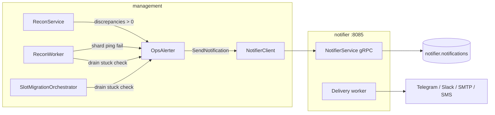

# Management → Notifier Ops Alerts — Technical Report

Date: 2026-07-04  
Status: Implemented

## Executive summary

Management now dials the standalone `notifier` gRPC service and enqueues operator alerts for three control-plane incidents: ledger/Redis recon discrepancies, Redis shard health failures, and slot-migration drain jobs stuck in `draining` or `failed` state. Alerts are fire-and-forget, deduplicated per incident key with a configurable cooldown, and disabled by default until `OPS_ALERTS_ENABLED=true`.

## Motivation

`cmd/notifier` exposed `SendNotification` / `GetNotification` but had no production callers. Operators relied on log scraping and Prometheus for recon drift, shard outages, and migration drain stalls. Payment and billing gRPC clients already live in management; notifier integration closes the same gap for operational incidents.

## Architecture



### Components

| File | Role |
| :--- | :--- |
| `internal/management/notifier_client.go` | gRPC dial to `NOTIFIER_SERVER_HOST:NOTIFIER_PORT`; mirrors payment/billing client pattern |
| `internal/management/ops_alerter.go` | Resolves provider/recipient from config; cooldown dedup; async enqueue |
| `internal/management/drain_stuck_alerts.go` | Queries `redis_slot_migration` for jobs older than threshold |
| `internal/config/env.go` | `OpsAlertsEnabled()`, `NOTIFIER_SERVER_HOST`, cooldown/threshold env vars |

### Alert triggers

| Event | Source | Dedup key | Default cooldown |
| :--- | :--- | :--- | :--- |
| Recon discrepancy | `ReconService.ReconcileWindow` after `discrepancies > 0` | `recon:run:{id}` | 300s |
| Redis shard unhealthy | `ReconWorker.ReconcileQuotas` on ping failure | `redis:shard:{idx}` | 300s |
| Drain stuck | `CheckStuckDrainJobs` (recon worker every 60s + slot orchestrator tick) | `drain:{ver}:{slot}:{state}` | 300s |
| Slot map migration started | `MarkSlotMapMigrating` after successful commit | `migration:mark:{ver}:{shard}:{slots}` | 300s |

Drain stuck threshold defaults to 900s (`OPS_ALERT_DRAIN_STUCK_SEC`). Jobs in `draining` or `failed` with `updated_at` older than the threshold trigger an alert.

## Configuration

| Variable | Default | Purpose |
| :--- | :--- | :--- |
| `OPS_ALERTS_ENABLED` | `false` | Opt-in gate (management boots without notifier) |
| `NOTIFIER_SERVER_HOST` | `127.0.0.1` | Notifier gRPC target from management |
| `NOTIFIER_PORT` | `8085` | Notifier gRPC port |
| `TELEGRAM_CHAT_ID` | — | Primary recipient when set (Telegram provider) |
| `OPS_ALERT_COOLDOWN_SEC` | `300` | Per-key alert suppression window |
| `OPS_ALERT_DRAIN_STUCK_SEC` | `900` | Age before drain job is considered stuck |

Provider resolution order: Telegram chat ID → Slack webhook URL → SMS default recipient → SMTP sender.

Requires `cmd/notifier` running with matching delivery credentials (`TELEGRAM_BOT_TOKEN`, etc.).

### Enable in compose / production

```bash
OPS_ALERTS_ENABLED=true
TELEGRAM_BOT_TOKEN=...
TELEGRAM_CHAT_ID=...
NOTIFIER_SERVER_HOST=127.0.0.1
NOTIFIER_PORT=8085
```

`docker-compose.yml` management service now sets `NOTIFIER_SERVER_HOST` and `NOTIFIER_PORT`.

## Additional wiring

`SlotMigrationOrchestrator` is started from `cmd/management/main.go` when `SLOT_MIGRATION_ENABLED=true` (default). Previously implemented but not wired; drain ticks and stuck-drain checks now run in production without manual admin API polling.

## Failure modes

| Scenario | Behavior |
| :--- | :--- |
| Notifier down at startup | Management exits (dial error when alerts enabled) |
| Notifier down at runtime | `slog.Warn("ops alert enqueue failed")`; no retry from management |
| Cooldown active | Duplicate incident suppressed; notifier queue not spammed |
| `OPS_ALERTS_ENABLED=false` | Nil client/alerter; zero overhead on hot paths |

Alert delivery retries remain notifier worker responsibility (existing circuit breaker + provider fallback chain).

## Tests

```
go test ./internal/management/ -run 'TestResolveOpsAlertTarget|TestOpsAlerter|TestNewNotifierClient'
```

Covers provider resolution, cooldown dedup, and disabled-by-default client construction.

## Out of scope (future backlog items)

- Quota drift alerts (`QUOTA DRIFT DETECTED` log today, no notifier call)
- Per-shard health dashboard (`/admin/ops/shards`, guide item #9)
