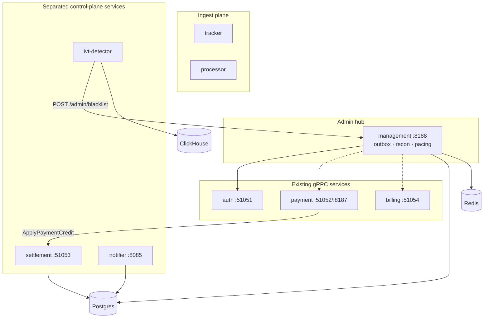

# Management Service Separation — Technical Report

Date: 2026-07-04  
Status: Partially implemented (settlement reverted into management, 2026-07-04)

> **Update:** `internal/settlement` and `cmd/settlement` were removed. Settlement gRPC (`ApplyPaymentCredit`) runs again inside `cmd/management` on `SETTLEMENT_SERVER_PORT`. Notifier and IVT detector remain separate binaries.

## Executive summary

The overloaded `cmd/management` process was split into four focused deploy units. Management now owns **admin HTTP + Redis propagation workers only**. Settlement, notifier, and IVT detection run as separate binaries with clear ingress and scaling profiles.

## Motivation

Before separation, one management container hosted:

| Surface | Port | Risk when colocated |
| :--- | :--- | :--- |
| Admin REST / HTMX | 8188 | Baseline |
| Settlement gRPC | 51053 | Payment outbox poll contends with HTTP |
| Notifier gRPC + worker | 8085 | Provider retry storms affect admin |
| IVT detector | — | ClickHouse scans + 1G memory limit |

Failure or load on any satellite surface affected the entire control-plane hub. Payment `depends_on` management solely for settlement created an unnecessary coupling between webhook processing and admin UI availability.

## Target topology



## Changes by component

### `cmd/management` (slimmed)

**Retains:**

- Admin REST / HTMX gateway (`:8188`)
- Auth cookie gateway (client to `auth` gRPC)
- Payment / billing gRPC clients for admin proxies
- Background workers: outbox, drain, schedule, recon, pacing, credit scoring, audit cleaner, optional nginx deny export
- Budget `SyncWorker` per Redis shard

**Removed:**

- Settlement gRPC server
- Notifier gRPC + delivery worker
- IVT ClickHouse scan loop

**Compose:** memory limit reduced `1G → 768M`; no `CH_DSN` / `NOTIFIER_PORT` / `SETTLEMENT_SERVER_PORT`.

### `cmd/settlement` (new)

**Package:** `internal/settlement`

- `Service.ApplyPaymentCredit` — ledger credit + audit log (extracted from `management.Service`)
- gRPC `SettlementService` on `SETTLEMENT_SERVER_PORT` (default 51053)
- Postgres only; no Redis

**Caller:** `payment` outbox worker via `SETTLEMENT_SERVER_HOST:SETTLEMENT_SERVER_PORT` and `x-internal-token`.

### `cmd/notifier` (restored)

- gRPC `:8085` + async delivery worker
- `notifier` Postgres schema unchanged
- Starts when channel credentials are configured (`NotifierConfigured()`)

### `cmd/ivt-detector` (restored)

- ClickHouse analytics batch job
- Enqueues fraud blacklist via `POST /admin/blacklist` (management HTTP)
- Uses `sync_idempotency` + outbox backpressure reads on shared Postgres
- `depends_on: management, clickhouse, db`

## Code layout

| Path | Role |
| :--- | :--- |
| `internal/management/` | Admin domain, outbox, Redis sync |
| `internal/settlement/` | Ledger settlement gRPC |
| `internal/notifier/` | Notification queue + providers |
| `internal/ivtdetector/` | CH anomaly rules + blacklist client |
| `internal/management/pb/` | Settlement protobuf (unchanged import path) |

Deleted: `management/settlement_handler.go`, `management/ivt_worker.go`, `management/notifier_runtime.go`.

## Deployment matrix

| Service | Binary | Default ports | Postgres | Redis | ClickHouse |
| :--- | :--- | :--- | :---: | :---: | :---: |
| management | `/management` | 8188 | ✓ | all shards | — |
| settlement | `/settlement` | 51053 | ✓ | — | — |
| notifier | `/notifier` | 8085 | ✓ | — | — |
| ivt-detector | `/ivt-detector` | — | ✓ | — | ✓ |
| payment | `/payment` | 51052, 8187 | ✓ | — | — |
| auth | `/auth` | 51051 | ✓ | shard 0 | — |
| billing | `/billing` | 51054 | ✓ | — | — |

## Configuration

| Variable | Service | Notes |
| :--- | :--- | :--- |
| `SETTLEMENT_SERVER_HOST` | payment | Default `127.0.0.1`; now honored by outbox worker |
| `SETTLEMENT_SERVER_PORT` | settlement, payment | Default `51053` |
| `SETTLEMENT_INTERNAL_TOKEN` | settlement, payment | Required for gRPC auth |
| `NOTIFIER_PORT` | notifier | Default `8085` |
| `IVT_DETECTOR_ENABLED` | ivt-detector | Requires `CH_DSN` |
| `MANAGEMENT_URL` | ivt-detector | Blacklist enqueue target |
| `ADMIN_API_KEY` | ivt-detector | Required for blacklist API |

## Dependency graph (compose)

```
payment → settlement, management (management for optional admin paths only at runtime)
ivt-detector → management, clickhouse, db
management → auth, db, redis-0
notifier → db
settlement → db
```

Payment no longer requires management to be up for settlement; it requires **settlement**.

## Operational notes

1. **Rebuild stack:** `docker compose up -d --build management settlement notifier ivt-detector payment`
2. **Minimal ingest stack:** omit `notifier`, `ivt-detector`, `settlement` only if payment disabled
3. **Settlement outage:** webhooks succeed but outbox retries; admin UI stays available
4. **IVT outage:** admin and settlement unaffected; fraud blacklist automation pauses

## Testing

- `go test ./internal/management/... ./internal/settlement/... ./internal/payment/... -short`
- Payment integration/chaos tests updated to use `settlement.NewHandler` instead of `management.NewSettlementHandler`

## Future options

- Move `api/settlement.proto` `go_package` to `internal/settlement/pb` (cosmetic)
- Optional in-process IVT blocker interface if latency to HTTP blacklist becomes an issue
- PgBouncer per-service pool budgets as connection count grows

## Related documents

- `GUIDE_IDEAS_MICROSERVICES.md` — decision criteria
- `docs/architecture.md` — system topology
