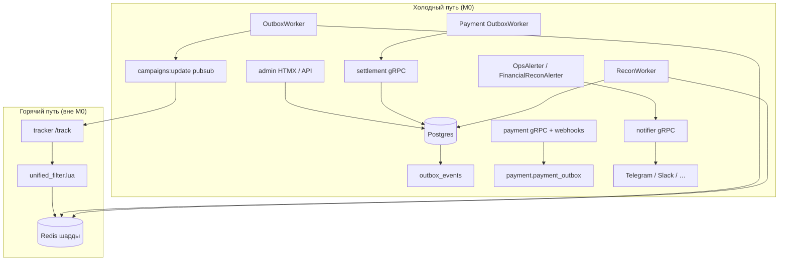
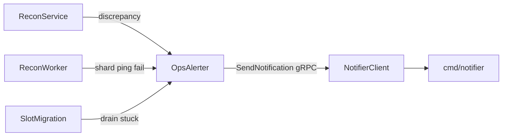

# Фаза M0 — отчёт о реализации (control plane)

**Дата:** 2026-07-05  
**Статус:** фаза M0 реализована  
**Источник требований:** [MILESTONE.md](../MILESTONE.md), фаза M0  
**Связанные отчёты:** [CHAOS_M0.md](./CHAOS_M0.md), [QUOTA_MANAGER.md](./QUOTA_MANAGER.md), [AUTOSCALE_BUDGETS.md](./AUTOSCALE_BUDGETS.md), [PAYMENT_FINANCIAL_RECON.md](./PAYMENT_FINANCIAL_RECON.md), [MANAGEMENT_OPS_ALERTS.md](./MANAGEMENT_OPS_ALERTS.md)

---

## Зачем нужна фаза M0

Milestone eSPX делится на фазы. **M0 — это операционная готовность холодного пути (control plane):** управление кампаниями, деньги, сверки, уведомления операторам и наблюдаемость. Горячий путь (`/track`, gnet, Lua-фильтры) в M0 не трогали — менялись только сервисы `management`, `payment`, `notifier` и их воркеры.

Цель M0: система должна **сама обнаруживать расхождения**, **не терять деньги при сбоях Redis**, **не дублировать финансовые операции** при гонках и **доставлять критичные события операторам** без спама.

---

## Архитектура простыми словами

eSPX разделён на два контура.

**Горячий путь** обрабатывает миллионы показов в секунду: трекер читает бюджет из Redis и списывает его в Lua за микросекунды. Здесь важна скорость, а не полная согласованность с Postgres в каждом запросе.

**Холодный путь (control plane)** — всё, что меняет настройки, деньги и состояние кампаний «медленно, но правильно». Любое изменение сначала фиксируется в **Postgres**, затем попадает в **outbox** (очередь побочных эффектов), воркер применяет изменения в **Redis** и рассылает инвалидацию трекерам.

Истина по деньгам — таблица `balance_ledger` в Postgres. Redis `budget:{campaign_id}` — кэш для горячего пути; его периодически подтягивают `SyncWorker` и `ReconWorker`.

**Outbox** — это паттерн «сначала запись в БД, потом побочный эффект». Если воркер упал посередине, событие останется `PENDING` и будет обработано повторно. Обработчики обязаны быть идемпотентными.

**Redis** — несколько независимых мастеров (не Cluster). Шард выбирается по `campaign_id` через `StaticSlotSharder`. Глобальные настройки и blacklist реплицируются на все шарды через `pkg/cold`.

---

## Что сделано: сводная таблица M0

| Пункт | Название | Суть | Ключевые файлы |
|-------|----------|------|----------------|
| M0.1 | QuotaManager | Пополнение бюджетных квот из Postgres в Redis по сигналу Lua | `quota_manager.go`, `cmd/management/main.go` |
| M0.2 | AutoscaleBudgets | Перераспределение лимита между кампаниями одного клиента по CTR | `service_autoscaling.go`, `autoscale_budget_worker.go` |
| M0.3 | Payment financial recon → notifier | Сверка payment-схемы с ledger; алерт при WARN+ | `recon_service.go`, `FinancialReconAlerter` |
| M0.4 | Management recon → ops | Алерт по нерешённым расхождениям старше 1 ч | `recon_service.go`, `AlertStaleUnresolvedDiscrepancies` |
| M0.5 | Compose prod | Часовая сверка payment + мониторинг `DEAD_OUTBOX`, `MISSING_LEDGER_TOPUP` | `deploy/docker-compose.prod.yml`, `prometheus.rules.yml` |
| M0.6 | Stripe policy | Документировано: checkout только mock до M4.6 | `docs/development.md`, `provider_stripe.go` |
| M0.7 | Outbox priority lanes | Срочные события (blacklist, pause, cancel) обрабатываются раньше FIFO | `management.sql`, `outbox_priority_chaos_test.go` |
| M0.8 | Settlement failed → notifier | Постоянный сбой settlement в payment outbox → ops-алерт с dedup | `settlement_failed_alerter.go`, `outbox_worker.go` |
| M0.9 | Settlement gRPC metrics | Гистограмма latency и счётчик ошибок settlement RPC | `settlement_grpc_metrics.go`, `prometheus.rules.yml` |
| M0.10 | Notifier rate limit | Token bucket на получателя; backoff при Telegram 429 | `rate_limit.go`, `provider_telegram.go` |
| M0.11 | Shard health endpoint | `GET /admin/ops/shards` — ping, lag, config version | `handler_ops_shards.go`, `service_shard_health.go` |
| Chaos M0 | Пять chaos_proof тестов | Доказательство инвариантов на testcontainers | [CHAOS_M0.md](./CHAOS_M0.md) |

---

## Компоненты подробнее

### M0.1 — QuotaManager

На горячем пути Lua списывает `budget:quota:{campaign_id}`. Когда остаток падает ниже порога, Lua ставит кампанию в множество `budget:refill_needed` на своём шарде.

`QuotaManager` раз в 100 мс обходит шарды, забирает кампании из этого множества и:

1. Резервирует чанк в Postgres (`campaign_quotas.reserved_amount`) через `QuotaRepo.ReserveChunk`.
2. В режиме **`live`** увеличивает Redis-ключ квоты.
3. В режиме **`shadow`** пишет только в Postgres и логирует — Redis не трогает, чтобы наблюдать дрейф без риска для продакшена.

Если шард Redis недоступен, `ReconWorker.ReconcileQuotas` (каждые 10 с) обнуляет зависший `reserved_amount` на мёртвом шарде.

Переменные: `QUOTA_MODE=off|shadow|live`, `QUOTA_CHUNK_SIZE`, `QUOTA_REFILL_THRESHOLD_PCT`.

### M0.2 — AutoscaleBudgets

Воркер с интервалом `AUTOSCALE_INTERVAL_MS` (0 = выключен) перед каждым тиком вызывает `SyncAll` на всех `SyncWorker`, чтобы Postgres и Redis были ближе друг к другу.

Для каждого клиента с несколькими активными кампаниями алгоритм ищет пару «низкий CTR / высокий CTR» и переносит фиксированную сумму (`AUTOSCALE_SHIFT_AMOUNT`) с донора на получателя:

- в ledger — пары `RELEASE` / `FREEZE` (баланс клиента не меняется);
- в `campaigns.budget_limit` — новые лимиты;
- в outbox — `CREATE_CAMPAIGN` для обновления Redis.

Гонки нескольких воркеров схлопываются через `pg_advisory_xact_lock` и idempotency key `autoscale-transfer:…`.

### M0.3 и M0.4 — сверки и алерты

**Payment recon** (`internal/payment/recon_service.go`) сравнивает изолированную схему `payment.*` (intents, refunds, disputes, outbox) с `balance_ledger`. Результат — строки в `payment.financial_recon_findings`. Находки уровня WARN и выше уходят в notifier через `FinancialReconAlerter` с cooldown по `run_id`.

**Management recon** уже писал расхождения в `recon_discrepancies` и мог автоматически корректировать мелкий дрейф через `RECONCILIATION_ADJUST` в ledger. Добавлено: `AlertStaleUnresolvedDiscrepancies` — если расхождение не закрыто больше часа, `OpsAlerter` шлёт уведомление (ключ `recon:unresolved:{id}`).

Общая схема алертов management:

Алерты **выключены по умолчанию** (`OPS_ALERTS_ENABLED=false`). В prod-профиле включаются явно.

### M0.5 — production compose

Overlay `deploy/docker-compose.prod.yml` задаёт:

- `PAYMENT_FINANCIAL_RECON_INTERVAL_MS=3600000` — сверка раз в час;
- `OPS_ALERTS_ENABLED=true` на payment и management;
- `DB_DSN` у payment для чтения ledger.

В Prometheus добавлены правила на `payment_financial_recon_findings_total` для `MISSING_LEDGER_TOPUP` (critical) и `DEAD_OUTBOX` (warning).

### M0.6 — политика Stripe

Реальный checkout через Stripe **намеренно не включён**. Даже при заданном `STRIPE_SECRET_KEY` функция `createStripeCheckoutSession` возвращает `ErrProviderNotConfigured`. Локальная разработка и chaos-тесты идут через `MockProvider`. Это зафиксировано в `docs/development.md`, чтобы не было ложного ощущения «ключ есть — платежи живые».

### M0.7 — приоритетные полосы outbox

Раньше `GetPendingOutboxEventsForUpdate` брал события строго по `created_at ASC`. При большом бэклоге срочное обновление blacklist могло ждать сотни pacing-событий.

SQL изменён: сначала забираются `UPDATE_BLACKLIST`, `PAUSE_CAMPAIGN`, `CANCEL_CAMPAIGN`, затем остальные — в пределах того же batch limit. Chaos-тест кладёт 500 pacing и один blacklist с более поздним `created_at` и проверяет, что blacklist обработан первым.

### M0.8 — сбой settlement

Payment outbox обрабатывает `SETTLE_BALANCE`: вызов settlement gRPC в management. Если ошибка **неисправима** (например, клиент удалён — gRPC `NotFound`), запись переводится в `DEAD` и `SettlementFailedAlerter` шлёт ops-уведомление. Dedup key: `payment-settlement-failed:{payment_intent_id}`, cooldown — `OPS_ALERT_COOLDOWN_SEC` (300 с по умолчанию).

### M0.9 — метрики settlement gRPC

На сервер settlement в `cmd/management/main.go` повешен unary interceptor:

- `settlement_grpc_request_duration_seconds` — гистограмма;
- `settlement_grpc_errors_total` — счётчик по method/code.

Алерты в `prometheus.rules.yml`: рост ошибок, p99 > 500 ms, внутренние/Unavailable ошибки.

### M0.10 — лимит notifier

`cmd/notifier` ограничивает частоту постановки уведомлений в очередь **на получателя** token bucket (`NOTIFIER_RATE_LIMIT_PER_MINUTE`, `NOTIFIER_TELEGRAM_RATE_LIMIT` по умолчанию 20/мин). При ответе Telegram `429 Too Many Requests` провайдер делает backoff, а не бьёт API в цикле.

### M0.11 — здоровье шардов

`GET /admin/ops/shards` (право `shards:read`) возвращает по каждому Redis-шарду:

- результат `PING`;
- состояние circuit breaker из настроек;
- оценку lag outbox;
- `config:version` на шарде vs последний обработанный outbox event id в Postgres.

Это единая точка для ops/dashboard без ручного захода на каждый Redis.

---

## Деньги и согласованность

| Слой | Роль | Согласованность |
|------|------|-----------------|
| `balance_ledger` | Истина по балансу клиента | Строгая, в TX |
| `campaigns.current_spend` | Учёт трат в PG | Eventual с Redis |
| Redis `budget:*` | Быстрый лимит на трекере | Per-key linearizable |
| Outbox | Гарантия доставки side effect | At-least-once → effectively-once через idempotency |

M0 не вводил двухфазный commit между payment и management. Вместо этого — **outbox relay + идемпотентные ключи** (`ledger_idempotency_key`, `payment_intent_id`, `autoscale-transfer:…`, `quota:{key}`).

---

## Хаос-тесты M0

По [GUIDE_CHAOS_RELIABILITY_RU.md](../GUIDE_CHAOS_RELIABILITY_RU.md) каждый тест: одна гипотеза steady-state, один реальный сбой, один инвариант, строка `chaos_proof fault=…`. Инфраструктура — testcontainers (Postgres 16 + Redis 7), без sqlmock на денежных путях.

| fault | Инвариант | Тип сбоя |
|-------|-----------|----------|
| `quota_dead_shard_release` | `reserved_amount` → 0 | Остановка Redis-контейнера |
| `autoscale_no_double_freeze` | Ровно 1 FREEZE + 1 RELEASE | 24 параллельных тика |
| `outbox_priority_lanes` | Blacklist раньше 500 pacing | Инверсия приоритета в бэклоге |
| `financial_recon_ops_alert` | Notifier получил `MISSING_LEDGER_TOPUP` | Drift: intent без ledger topup |
| `settlement_failed_notifier` | Outbox `DEAD` + dedup алерт | Удаление customer → gRPC NotFound |

Все пять тестов **PASS** (2026-07-05). Детали и команды воспроизведения: [CHAOS_M0.md](./CHAOS_M0.md).

---

## Как включить в окружении

| Переменная | Назначение |
|------------|------------|
| `QUOTA_MODE=shadow\|live` | QuotaManager |
| `AUTOSCALE_INTERVAL_MS` | Период autoscale (>0) |
| `PAYMENT_FINANCIAL_RECON_INTERVAL_MS` | Период payment recon (>0) |
| `OPS_ALERTS_ENABLED=true` | Диал notifier из management/payment |
| `OPS_ALERT_COOLDOWN_SEC` | Dedup алертов (300) |
| `NOTIFIER_TELEGRAM_RATE_LIMIT` | Лимит Telegram enqueue (20/мин) |

Prod-профиль: `docker compose -f docker-compose.yml -f deploy/docker-compose.prod.yml up -d`.

---

## Границы фазы M0

**Сделано:** воркеры, сверки, приоритет outbox, ops-алерты, метрики settlement, endpoint шардов, chaos suite, prod overlay.

**Не входило в M0 (следующие фазы):**

- Read API `/api/v1/*` (фаза M1);
- живой Stripe checkout (M4.6);
- `DeliveryOptimizerWorker` — объединение autoscale/pacing/MAB (M5);
- gRPC вместо HTTP для ivt-detector blacklist (M7.10).

Горячий путь (`processTrack`, gnet, Lua) не менялся; контракт propagation прежний: **PG → outbox → Redis → pubsub → registry в tracker**.

---

## Дальнейшее чтение

| Тема | Документ |
|------|----------|
| QuotaManager, shadow/live | [QUOTA_MANAGER.md](./QUOTA_MANAGER.md) |
| Autoscale, ledger FREEZE/RELEASE | [AUTOSCALE_BUDGETS.md](./AUTOSCALE_BUDGETS.md) |
| Payment financial recon | [PAYMENT_FINANCIAL_RECON.md](./PAYMENT_FINANCIAL_RECON.md) |
| OpsAlerter, триггеры management | [MANAGEMENT_OPS_ALERTS.md](./MANAGEMENT_OPS_ALERTS.md) |
| Chaos M0, `chaos_proof` | [CHAOS_M0.md](./CHAOS_M0.md) |
| Полный roadmap | [MILESTONE.md](../MILESTONE.md) |
