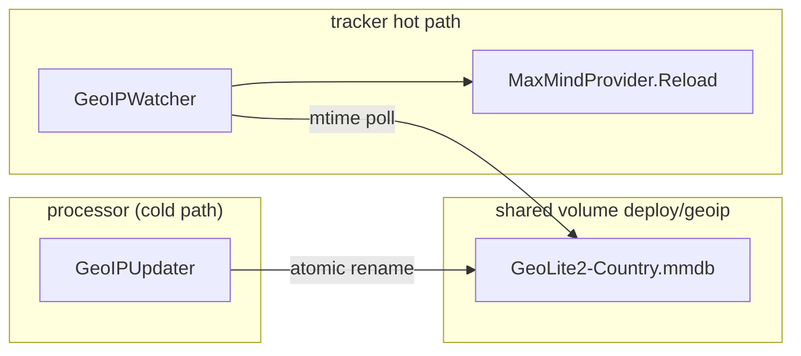

# Monolith Background Workers — Technical Report

Date: 2026-07-04  
Status: Implemented

## Executive summary

Three cold-path modules from `GUIDE_IDEAS_MICROSERVICES_RU.md` (monolith section) are now implemented:

1. **Blacklist TTL Janitor** — management worker that expires temporary `ip_blacklist` rows and propagates unblocks to all Redis shards via the existing outbox path.
2. **Dynamic GeoIP Updater** — processor downloads MaxMind GeoLite2 archives to a shared volume; trackers hot-reload the mmdb without process restart.
3. **Alertmanager Webhook Adapter** — management HTTP endpoint that formats Prometheus alerts and enqueues delivery through the notifier gRPC client, replacing `cmd/telegram` / `cmd/alertmanager-telegram` in the default monitoring stack.

All three are opt-in or safe-by-default background workers with no hot-path impact.

---

## 1. Blacklist TTL Janitor

### Motivation

Temporary blocks (`auto`, `fraud`) accumulated in Postgres and Redis SETs (`blacklist:auto`, `blacklist:fraud`) had no expiry mechanism. IVT and automated enforcement could grow edge blacklist memory without bound.

### Design

| Layer | Change |
| :--- | :--- |
| Postgres | `expires_at TIMESTAMPTZ NULL` on `ip_blacklist` (migration `00030`) |
| API | `POST /admin/blacklist` accepts optional `ttl_seconds`; reason-based defaults apply when omitted |
| Worker | `BlacklistJanitor` scans expired rows every `BLACKLIST_JANITOR_INTERVAL_SEC` (default 60s) |
| Propagation | `UnblockIP` → outbox `UPDATE_BLACKLIST` → `SREM` on every shard (existing path) |

### TTL defaults

| Reason | Default expiry | Override |
| :--- | :--- | :--- |
| `manual` | Permanent (`expires_at = NULL`) | `ttl_seconds` in API body |
| `auto` | 24h (`BLACKLIST_AUTO_TTL_HOURS`) | `ttl_seconds` or env |
| `fraud` | 7d (`BLACKLIST_FRAUD_TTL_HOURS`) | `ttl_seconds` or env |

`ttl_seconds: 0` explicitly marks a block as permanent.

### Files

- `internal/ads/migrations/00030_blacklist_expires_at.sql`
- `internal/management/blacklist_janitor.go`
- `internal/management/blacklist_ttl.go`
- `internal/management/service_system.go` — `BlockIPWithTTL`

### Configuration

```bash
BLACKLIST_JANITOR_ENABLED=true          # default true
BLACKLIST_JANITOR_INTERVAL_SEC=60
BLACKLIST_AUTO_TTL_HOURS=24
BLACKLIST_FRAUD_TTL_HOURS=168
```

---

## 2. Dynamic GeoIP Updater

### Motivation

MaxMind databases age quickly. Restarting trackers for geo refresh is unacceptable on the ingestion hot path. `MaxMindProvider` already used an `RWMutex` around the reader but had no reload or download path.

### Architecture



### Components

| File | Role |
| :--- | :--- |
| `internal/ads/geoip_updater.go` | Downloads MaxMind tar.gz, extracts `.mmdb`, atomic install |
| `internal/ads/geoip_watcher.go` | Polls mtime, calls `MaxMindProvider.Reload` |
| `internal/ads/geo.go` | `Reload(dbPath)` swaps reader under write lock |

Updater runs in **processor** (batch/cron workload). Watcher runs in **tracker** (owns the in-process provider). Shared bind mount `./deploy/geoip` must be **rw** on processor, **ro** on trackers.

### Configuration

```bash
GEOIP_DB_PATH=deploy/geoip/GeoLite2-Country.mmdb
GEOIP_STAGING_PATH=deploy/geoip/GeoLite2-Country.mmdb.staging   # optional
GEOIP_UPDATER_ENABLED=false                                     # opt-in
GEOIP_UPDATE_INTERVAL_HOURS=24
GEOIP_WATCHER_INTERVAL_SEC=60
MAXMIND_LICENSE_KEY=                                              # required for downloads
MAXMIND_EDITION_ID=GeoLite2-Country
```

Without `MAXMIND_LICENSE_KEY`, the updater logs and skips; manual file replacement still triggers hot reload via the watcher.

---

## 3. Alertmanager Webhook Adapter

### Motivation

`cmd/telegram` duplicated alert formatting and called the Telegram Bot API directly, bypassing notifier retry/circuit-breaker logic. Management already had `NotifierClient` for ops alerts.

### Endpoint

```
POST /ops/alertmanager/webhook
```

- Mounted on the ops mux (no CSRF — path is outside `/admin/` and `/api/v1/`).
- Optional auth: `X-Alertmanager-Token: <ALERTMANAGER_WEBHOOK_TOKEN>`.
- Formats each alert as HTML (Telegram-compatible) and calls `NotifierClient.SendNotification`.
- Provider/recipient resolution matches `OpsAlerter` (Telegram → Slack → SMS → SMTP).

### Migration from `cmd/telegram`

`deploy/monitoring/alertmanager.yml` now targets:

```
http://127.0.0.1:8188/ops/alertmanager/webhook
```

The legacy `alertmanager-telegram` compose service remains for backward compatibility but is no longer the default receiver.

### Configuration

```bash
ALERTMANAGER_WEBHOOK_ENABLED=true
ALERTMANAGER_WEBHOOK_TOKEN=optional-shared-secret
TELEGRAM_CHAT_ID=...          # or another notifier recipient
NOTIFIER_SERVER_HOST=127.0.0.1
NOTIFIER_PORT=8085
```

`NotifierClient` dials when **either** `OPS_ALERTS_ENABLED` or `ALERTMANAGER_WEBHOOK_ENABLED` is true and a recipient is configured.

### Files

- `internal/management/alertmanager_webhook.go`
- `internal/config/env.go` — `AlertmanagerWebhookEnabled()`, `NotifierDialEnabled()`

---

## Operational checklist

### Enable full stack locally

```bash
# .env
ALERTMANAGER_WEBHOOK_ENABLED=true
TELEGRAM_CHAT_ID=<chat_id>
OPS_ALERTS_ENABLED=true          # optional: recon/drain alerts
GEOIP_UPDATER_ENABLED=true
MAXMIND_LICENSE_KEY=<key>

docker compose up -d management processor tracker-0 notifier alertmanager
```

Apply migration `00030` via existing goose path on management/processor startup.

### Verify

```bash
# Janitor health: block with short TTL, wait for expiry
curl -X POST http://127.0.0.1:8188/admin/blacklist \
  -H 'X-Admin-API-Key: dev-admin-api-key-change-me' \
  -H 'Content-Type: application/json' \
  -d '{"ip":"203.0.113.50","source":"auto","ttl_seconds":30}'

# Alertmanager adapter (dry-run without notifier credentials in dev)
curl -X POST http://127.0.0.1:8188/ops/alertmanager/webhook \
  -H 'Content-Type: application/json' \
  -d '{"status":"firing","alerts":[{"status":"firing","labels":{"severity":"warning"},"annotations":{"summary":"test"},"startsAt":"2026-07-04T12:00:00Z"}]}'

# GeoIP: touch mmdb after updater cycle; tracker logs "geoip database hot-reloaded"
```

---

## Tests

```bash
go test ./internal/management/ -run 'TestBlacklist|TestFormatAlertmanager|TestResolveBlacklist|TestNewAlertmanager'
go build ./cmd/management/ ./cmd/processor/ ./cmd/tracker/
```

---

## Failure modes

| Scenario | Behavior |
| :--- | :--- |
| Janitor unblock fails mid-batch | Warn log; next cycle retries remaining expired rows |
| MaxMind download fails | Warn log; existing mmdb remains active |
| Hot reload fails | Warn log; previous reader stays in service |
| Notifier down with webhook enabled | Management fails at startup (dial error) |
| Webhook enabled without recipient | Handler not registered; startup continues |

---

## Out of scope

- Per-member Redis SET TTL (Redis SET has no member-level expiry; PG + outbox is authoritative).
- Deprecation/removal of `cmd/telegram` binary (kept for standalone deployments).
- GeoIP updater on management (processor owns batch downloads per workload classification).
