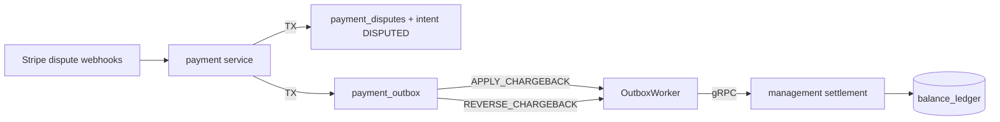

# Payment Chargebacks & Disputes — Technical Report

Date: 2026-07-05  
Status: Implemented

## Executive summary

Stripe dispute webhooks now drive chargeback settlement: when Stripe withdraws disputed funds the platform debits the customer ledger (`PAYMENT_CHARGEBACK`); when funds are reinstated after a win, the ledger is credited back (`PAYMENT_CHARGEBACK_REVERSAL`). The flow mirrors paybacks (`REVERSE_BALANCE`) and top-ups (`SETTLE_BALANCE`).

## Architecture



### Event mapping

| Stripe event | Payment DB | Outbox |
|--------------|------------|--------|
| `charge.dispute.created` | `payment_disputes` OPEN, intent → `DISPUTED` | — |
| `charge.dispute.funds_withdrawn` | `withdrawn_amount_micro` += delta | `APPLY_CHARGEBACK` |
| `charge.dispute.funds_reinstated` | `reinstated_amount_micro` += delta | `REVERSE_CHARGEBACK` |
| `charge.dispute.closed` / `updated` | `WON` / `LOST`; intent → `SUCCEEDED` on win | — |

### Idempotency

| Layer | Key |
|-------|-----|
| Webhook | `evt_*` in `payment.webhook_events` |
| Dispute row | `dp_*` unique on `(provider, provider_dispute_id)` |
| Ledger debit | `chargeback:withdrawn:dp_*` |
| Ledger credit | `chargeback:reinstated:dp_*` |

Management caps: `refunds + net_chargebacks + delta ≤ PAYMENT_TOPUP`; reinstatement cannot exceed net withdrawn.

## Schema

| Migration | Change |
|-----------|--------|
| `internal/payment/migrations/00004_payment_disputes.sql` | `payment_disputes`, intent status `DISPUTED` |
| `internal/ads/migrations/00032_ledger_payment_chargeback.sql` | `PAYMENT_CHARGEBACK`, `PAYMENT_CHARGEBACK_REVERSAL` |

## API

| RPC | Purpose |
|-----|---------|
| `ApplyPaymentChargeback` | Debit customer on `funds_withdrawn` |
| `ApplyPaymentChargebackReversal` | Credit customer on `funds_reinstated` |

`PaymentIntentStatus` adds `DISPUTED` (proto value 9).

## Outbox catalog (updated)

| Event | Settlement RPC |
|-------|----------------|
| `SETTLE_BALANCE` | `ApplyPaymentCredit` |
| `REVERSE_BALANCE` | `ApplyPaymentRefund` |
| `APPLY_CHARGEBACK` | `ApplyPaymentChargeback` |
| `REVERSE_CHARGEBACK` | `ApplyPaymentChargebackReversal` |

## Chaos tests

| Test | `chaos_proof fault=` | Guard |
|------|----------------------|-------|
| `TestChaos_PaymentDisputeConcurrentWebhookSameEventID` | `concurrent_dispute_webhook_dedup` | 20 workers → 1 webhook, 1 outbox |
| `TestChaos_PaymentChargebackDualOutboxWorkerRace` | `chargeback_outbox_worker_race` | 4 workers → 1 chargeback ledger row |
| `TestChaos_PaymentChargebackPostSettlementMarkGap` | `post_chargeback_mark_failed` | no double debit on mark gap |
| `TestChaos_PaymentDisputeWithdrawnThenReinstated` | `dispute_withdrawn_then_reinstated` | full lifecycle, net balance restored |
| `TestChaos_PaymentChargebackExceedsIntentIgnored` | `chargeback_exceeds_intent_ignored` | no outbox when amount > intent |
| `TestChaos_PaymentChargebackWithoutTopupDead` | `chargeback_without_topup_dead` | outbox `DEAD`, ledger untouched |

Unit: `TestProcessStripeDisputeWebhook_noDoubleChargeback`

## Stripe dashboard

Enable:

- `charge.dispute.created`
- `charge.dispute.updated`
- `charge.dispute.closed`
- `charge.dispute.funds_withdrawn`
- `charge.dispute.funds_reinstated`

## Test plan

```bash
go test ./internal/payment/... -run 'Dispute|Chargeback' -count=1 -timeout 15m -v
go test ./internal/payment/... -run Chaos -count=1 -timeout 15m -v | grep chaos_proof
```

## Known limitations

- No notifier/ops alerts on dispute deadlines (future: notifier fanout).
- No campaign spend hold on `DISPUTED` (cold-path policy; hot path unchanged).
- Negative balance still constrained by `chk_allowed_balance` if customer spent funds before chargeback.

## Files

| Path | Role |
|------|------|
| `internal/payment/dispute.go` | outbox payloads, idempotency keys |
| `internal/payment/service_dispute.go` | `ProcessStripeDisputeWebhook` |
| `internal/payment/dispute_chaos_test.go` | chaos suite |
| `internal/payment/dispute_test.go` | unit dedup test |
| `internal/management/service.go` | `ApplyPaymentChargeback*` |
| `internal/management/settlement_handler.go` | gRPC handlers |
