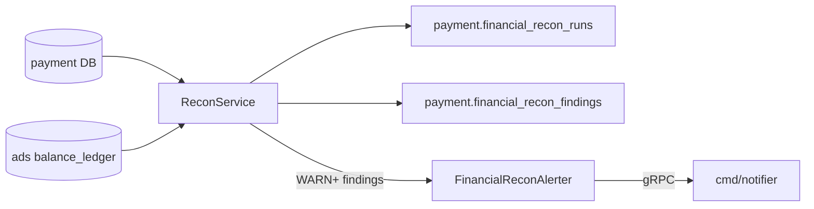

# Payment Financial Reconciliation — Technical Report

Date: 2026-07-05  
Status: Implemented (M0.3 notifier integration complete)

## Executive summary

Periodic financial reconciliation compares the isolated `payment` schema (intents, refunds, disputes, outbox) against `balance_ledger` in the core ads database. Drift is persisted as structured findings for finance/ops review. **WARN+ findings now enqueue operator alerts via the notifier gRPC service** with cooldown deduplication matching `OpsAlerter.shouldSend`.

## Architecture



### Finding kinds and severity

| Kind | Severity | Alert |
|------|----------|-------|
| `MISSING_LEDGER_TOPUP` | CRITICAL | Yes (broadcast) |
| `TOPUP_AMOUNT_MISMATCH` | CRITICAL | Yes (broadcast) |
| `SETTLEMENT_FAILED_INTENT` | CRITICAL | Yes (broadcast) |
| `ORPHAN_LEDGER_TOPUP` | WARN | Yes |
| `REFUND_LEDGER_DRIFT` | WARN | Yes |
| `CHARGEBACK_LEDGER_DRIFT` | WARN | Yes |
| `CHARGEBACK_REVERSAL_DRIFT` | WARN | Yes |
| `DEAD_OUTBOX` | WARN | Yes |

Alerts fire only when severity ≥ WARN. Cooldown key: `payment-financial-recon:run:{run_id}` using `OPS_ALERT_COOLDOWN_SEC` (default 300s).

## Runtime

| Env | Default | Meaning |
|-----|---------|---------|
| `PAYMENT_FINANCIAL_RECON_INTERVAL_MS` | `0` | Disabled; set e.g. `3600000` for hourly runs |
| `OPS_ALERTS_ENABLED` | `false` | Must be `true` for notifier dial |
| `OPS_ALERT_COOLDOWN_SEC` | `300` | Per-run alert dedup window |
| `NOTIFIER_*` / `TELEGRAM_CHAT_ID` | — | Primary alert recipient (same as management ops) |

`cmd/payment` connects `PAYMENT_DB_DSN` for payment state and `DB_DSN` for ledger. When recon interval &gt; 0 and ops alerts enabled, payment dials notifier independently of management.

### Production compose

```bash
docker compose -f docker-compose.yml -f deploy/docker-compose.prod.yml up -d
```

Overlay sets `PAYMENT_FINANCIAL_RECON_INTERVAL_MS=3600000`, `OPS_ALERTS_ENABLED=true`, and wires `DB_DSN` + notifier on the payment service. Prometheus rules `PaymentFinancialReconMissingLedgerTopup` (critical) and `PaymentFinancialReconDeadOutbox` (warning) fire on `payment_financial_recon_findings_total` increases within 65m.

## API surface

`ReconService.Run(ctx, periodStart, periodEnd)` returns `FinancialReconSummary`, persists findings, then calls `FinancialReconAlerter.AlertFindings` when configured.

## Chaos tests (GUIDE_CHAOS_RELIABILITY)

| Test | `chaos_proof fault=` | Guard |
|------|----------------------|-------|
| `TestChaos_FinancialReconCleanSettlement` | `financial_recon_clean_settlement` | Settled intent → 0 findings, no alert |
| `TestChaos_FinancialReconMissingTopup` | `financial_recon_missing_topup` | Webhook without settlement → `MISSING_LEDGER_TOPUP` |
| `TestChaos_FinancialReconDeadOutbox` | `financial_recon_dead_outbox` | Refund without topup → `DEAD_OUTBOX` finding |
| `TestChaos_FinancialReconRefundDrift` | `financial_recon_refund_drift` | Refund row without ledger → `REFUND_LEDGER_DRIFT` |
| `TestChaos_FinancialReconSettlementFailedIntent` | `financial_recon_settlement_failed` | Missing customer → `SETTLEMENT_FAILED_INTENT` |
| `TestChaos_FinancialReconConcurrentRuns` | `financial_recon_concurrent_runs` | 4 parallel runs → 4 `COMPLETED` rows |
| `TestChaos_FinancialReconOpsAlert` | `financial_recon_ops_alert` | Missing topup → notifier enqueue with dedup key |

Unit: `TestFinancialReconRun_*`, `TestFinancialReconAlerter_*`, `TestFinancialFindingSeverity_mapping`

## Test results (2026-07-05)

```bash
go test ./internal/payment/... -run 'FinancialRecon|ReconAlerter|FinancialFinding' -count=1 -timeout 15m -v
```

| Test | Result |
|------|--------|
| `TestChaos_FinancialReconOpsAlert` | PASS — notifier stub receives alert with `MISSING_LEDGER_TOPUP` |
| `TestFinancialReconAlerter_CooldownDedup` | PASS — second send within 300s suppressed |
| `TestFinancialReconAlerter_AlertFindings_enqueuesWarnPlus` | PASS — broadcast on CRITICAL |
| All existing recon chaos tests | PASS |

## Test plan

```bash
go test ./internal/payment/... -run 'FinancialRecon|ReconAlerter' -count=1 -timeout 15m -v
go test ./internal/payment/... -run Chaos -count=1 -timeout 15m -v | grep chaos_proof
```

## Known limitations

- Payment process dials notifier separately from management (no shared `OpsAlerter` instance).
- One aggregated alert per recon run (not per-finding fanout).
- Recon scans all terminal intents and up to 500 dead outbox rows (not time-window filtered on intents).

## Related

- [PAYMENT_PAYBACK.md](./PAYMENT_PAYBACK.md) — refunds
- [PAYMENT_CHARGEBACK.md](./PAYMENT_CHARGEBACK.md) — disputes/chargebacks
- [MANAGEMENT_OPS_ALERTS.md](./MANAGEMENT_OPS_ALERTS.md) — management-side ops alerting
