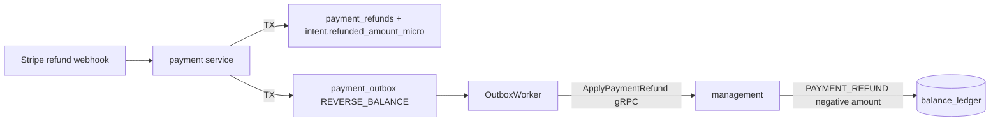

# Payment Payback (Stripe Refunds) — Technical Report

Date: 2026-07-05  
Status: Implemented

## Executive summary

Stripe refund webhooks (`refund.created`, `refund.updated`, `refund.failed`) now drive a symmetric payback path: payment schema records the refund, enqueues `REVERSE_BALANCE` on the payment outbox, and management debits `balance_ledger` with type `PAYMENT_REFUND`. The design mirrors the existing top-up pipeline (webhook dedup → transactional outbox → settlement gRPC → idempotent ledger write).

## Motivation

Top-ups were fully wired (`payment_intent.succeeded` → `SETTLE_BALANCE` → `PAYMENT_TOPUP`) but money leaving the platform via Stripe refunds had no ledger counterpart. That gap broke balance truth when customers received paybacks and blocked finance reconciliation.

## Architecture



### Happy path

1. `refund.created` / `refund.updated` with `status=succeeded` hits `POST /webhooks/stripe`.
2. `ProcessStripeRefundWebhook` (same TX):
   - dedupes on `webhook_events (provider, provider_event_id)`
   - locks intent by `payment_intent` provider ref
   - validates intent is `SUCCEEDED` or partial `REFUNDED` path
   - rejects refund if `refunded_amount_micro + delta > amount_micro`
   - inserts `payment_refunds` (unique on `provider_refund_id`)
   - increments `payment_intents.refunded_amount_micro`; sets `REFUNDED` when fully refunded
   - enqueues `REVERSE_BALANCE` outbox row
3. `OutboxWorker` calls `SettlementService.ApplyPaymentRefund`.
4. Management debits customer balance and inserts `PAYMENT_REFUND` ledger row (negative `amount`) with idempotency key `refund:{stripe_refund_id}`.

### Idempotency layers

| Layer | Key | Guard |
|-------|-----|-------|
| Webhook | `evt_*` | `payment.webhook_events` unique |
| Refund row | `re_*` | `payment.payment_refunds` unique |
| Ledger | `refund:re_*` | `balance_ledger.idempotency_hash` |
| Cap | intent + type | sum abs(`PAYMENT_REFUND`) ≤ `PAYMENT_TOPUP` for intent |

## Schema changes

| Migration | Change |
|-----------|--------|
| `internal/ads/migrations/00031_ledger_payment_refund.sql` | `ledger_type` value `PAYMENT_REFUND` |
| `internal/payment/migrations/00003_payment_refunds.sql` | `payment_refunds` table, `payment_intents.refunded_amount_micro` |

## API changes

| Surface | Change |
|---------|--------|
| `api/settlement.proto` | `ApplyPaymentRefund` RPC |
| `internal/management/service.go` | `ApplyPaymentRefund` — debit balance, ledger entry, audit |
| `internal/payment/service.go` | `ProcessStripeRefundWebhook` |
| `internal/payment/http_webhook.go` | routes refund event types |
| `internal/payment/outbox_worker.go` | `REVERSE_BALANCE` handler |

## Outbox event catalog (updated)

| Event | Trigger | Settlement RPC |
|-------|---------|----------------|
| `SETTLE_BALANCE` | `payment_intent.succeeded` | `ApplyPaymentCredit` |
| `REVERSE_BALANCE` | `refund.created` succeeded | `ApplyPaymentRefund` |

## Failure modes

| Condition | Webhook | Outbox | Ledger |
|-----------|---------|--------|--------|
| Unknown `payment_intent` | `IGNORED` | — | — |
| Refund > intent amount | `IGNORED` | — | — |
| Intent not `SUCCEEDED` | `IGNORED` | — | — |
| No `PAYMENT_TOPUP` for intent | — | `DEAD` | unchanged |
| Duplicate `re_*` webhook | `PROCESSED` (no second outbox) | — | — |
| `refund.failed` | `PROCESSED` / marks refund `FAILED` | — | — |

`SETTLEMENT_FAILED` is only set for fatal `SETTLE_BALANCE` failures (not refund outbox).

## Chaos tests (GUIDE_CHAOS_RELIABILITY)

| Test | `chaos_proof fault=` | Guard |
|------|----------------------|-------|
| `TestChaos_PaymentRefundConcurrentWebhookSameEventID` | `concurrent_refund_webhook_dedup` | 20 workers → 1 webhook row, 1 outbox row |
| `TestChaos_PaymentRefundDualOutboxWorkerRace` | `refund_outbox_worker_race` | 4 workers → 1 `PAYMENT_REFUND` ledger row |
| `TestChaos_PaymentRefundPostSettlementMarkGap` | `post_refund_mark_failed` | mark-processed gap → no double debit |
| `TestChaos_PaymentPartialRefundThenFull` | `partial_refund_then_full` | two partial refunds → intent `REFUNDED`, balance 0 |
| `TestChaos_PaymentRefundExceedsIntentIgnored` | `refund_exceeds_intent_ignored` | over-refund webhook → no outbox |
| `TestChaos_PaymentRefundWithoutTopupDead` | `refund_without_topup_dead` | no topup → outbox `DEAD`, ledger untouched |

Additional unit/integration coverage:

- `TestProcessStripeRefundWebhook_noDoubleDebit`
- `TestPaymentService_Integration` — extended with half refund settlement

## Stripe dashboard configuration

Enable webhook events:

- `refund.created`
- `refund.updated`
- `refund.failed`

Endpoint: existing `POST /webhooks/stripe` on `PAYMENT_WEBHOOK_PORT`.

## Test plan

```bash
go test ./internal/payment/... -run 'Refund|Integration' -count=1 -timeout 10m -v
go test ./internal/payment/... -run Chaos -count=1 -timeout 15m -v | grep chaos_proof
```

## Known limitations / follow-ups

- **Spent balance**: refund debits even if the customer already spent the top-up; negative balance is constrained by `chk_allowed_balance` (default overdraft 0). Ops may need overdraft adjustment or a collections workflow.
- **Stripe checkout stub** unchanged — refunds assume intents reached `SUCCEEDED` via mock or future live checkout.
- **Billing invoices**: `PAYMENT_REFUND` appears in ledger aggregation by type; invoice line presentation may need a dedicated label in billing UI.
- **Disputes/chargebacks**: implemented — see [PAYMENT_CHARGEBACK.md](./PAYMENT_CHARGEBACK.md).

## Files touched

| Path | Role |
|------|------|
| `internal/payment/refund.go` | outbox payload + idempotency helpers |
| `internal/payment/refund_chaos_test.go` | chaos suite |
| `internal/payment/refund_test.go` | unit dedup test |
| `internal/payment/fault_infra_test.go` | shared seed helpers |
| `internal/payment/integration_test.go` | E2E top-up + refund |
| `internal/ads/queries/management.sql` | `SumPaymentRefundAmountForIntent` |
| `internal/payment/queries/payment.sql` | refund CRUD + `ApplyIntentRefundAmount` |
