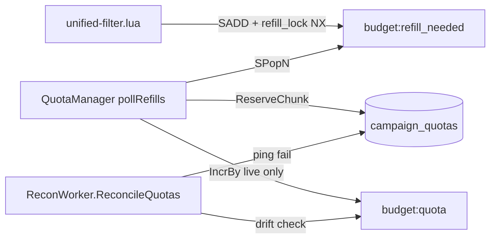

# QuotaManager (M0.1) — Technical Report

Date: 2026-07-05  
Status: Implemented

## Executive summary

`QuotaManager` is the management control-plane worker that drains `budget:refill_needed` on each Redis shard, reserves quota chunks in Postgres via `ads.QuotaRepo`, and (in `live` mode) credits `budget:quota:{campaign_id}` in Redis. `shadow` mode exercises the Postgres path and logs refills without mutating Redis budget keys. The worker is wired in `cmd/management/main.go` when `QUOTA_MODE=shadow|live`. Quota reconciliation on dead shards is handled by the existing `ReconWorker.ReconcileQuotas` tick (every 10 s).

## Architecture



### Refill sequence (live)

1. Hot path debits `budget:quota`; when remaining &lt; `chunk × threshold%`, Lua sets `budget:refill_lock:{id}` (NX) and `SADD budget:refill_needed`.
2. `QuotaManager.pollRefills` runs `SPopN` per shard (batch 100).
3. `refillCampaign` atomically claims work with `GETDEL budget:refill_lock:{id}` — only one concurrent worker proceeds.
4. `QuotaRepo.ReserveChunk` enforces `current_spend + reserved + chunk ≤ budget_limit` under row locks.
5. On success: `INCRBY budget:quota:{id}` by `chunk_size`; on Redis failure: `ReleaseChunk` + requeue lock and set membership.
6. On transient PG failure: requeue lock and set membership for retry.

### Shadow mode

| Step | Postgres | Redis `budget:quota` |
|------|----------|---------------------|
| Refill | `reserved_amount` incremented | not modified |
| Warm init | `reserved_amount` incremented once | not modified |

Shadow enables drift observation via `ReconcileQuotas` without changing hot-path Redis state.

## Runtime

| Env | Default | Meaning |
|-----|---------|---------|
| `QUOTA_MODE` | `off` | Worker not started; legacy `budget:campaign` path on tracker |
| `QUOTA_MODE` | `shadow` | PG reserve + log; no Redis quota writes |
| `QUOTA_MODE` | `live` | PG `reserved_amount` + Redis `budget:quota` |
| `QUOTA_CHUNK_SIZE` | `0` → 5_000_000 µ | Micro-units per refill chunk ($5.00 default) |
| `QUOTA_REFILL_THRESHOLD_PCT` | `20` | Lua refill trigger (% of chunk remaining) |

Wiring (`cmd/management/main.go`):

```go
if cfg.QuotaMode == "shadow" || cfg.QuotaMode == "live" {
    svc.StartBackgroundWorker(func() { NewQuotaManager(svc).Start(ctx) })
}
```

Poll interval: 100 ms (refill), 5 s (active-campaign warm).

## Invariants

- **R4 fencing:** `GETDEL` on `budget:refill_lock` collapses parallel refill workers to one claimant.
- **R5 budget:** `ReserveChunk` idempotency via `sync_idempotency` (`quota:{key}` prefix); PG invariant at reserve time.
- **Dead shard:** `ReconcileQuotas` zeroes `reserved_amount` on shards that fail ping when `updated_at < now() - 60s`.

## Chaos tests (GUIDE_CHAOS_RELIABILITY)

| Test | `chaos_proof fault=` | Hypothesis (R9) |
|------|----------------------|-----------------|
| `TestChaos_QuotaRefillRace` | `quota_refill_race` | 32 concurrent `refillCampaign` goroutines → exactly one PG chunk and one Redis credit |
| `TestChaos_QuotaDeadShardRelease` | `quota_dead_shard_release` | Stopped Redis shard → `ReconcileQuotas` releases stale `reserved_amount` |

Unit / integration:

| Test | Coverage |
|------|----------|
| `TestQuotaManager_refillCampaign_modes` | Table: `live` vs `shadow` Redis/PG behavior |
| `TestNewQuotaManager_defaultsChunkSize` | Default chunk 5M µ, threshold 20% |

## Test results (2026-07-05)

```text
go test ./internal/management/... -run 'Quota|quota' -count=1 -timeout 15m -v
```

| Test | Result | Key assertion |
|------|--------|---------------|
| `TestChaos_QuotaRefillRace` | PASS | `pg_reserved=1000000`, `redis_quota=1000000`, 32 workers |
| `TestChaos_QuotaDeadShardRelease` | PASS | `reserved_after=0`, `released_micro=2000000` |
| `TestQuotaManager_refillCampaign_modes/live` | PASS | PG + Redis credited |
| `TestQuotaManager_refillCampaign_modes/shadow` | PASS | PG only, Redis key absent |
| `TestNewQuotaManager_defaultsChunkSize` | PASS | Defaults applied |

`chaos_proof` lines emitted:

```text
chaos_proof fault=quota_refill_race workers=32 pg_reserved=1000000 redis_quota=1000000 subsystem=management_quota baseline_ok=true budget_consistent=true
chaos_proof fault=quota_dead_shard_release fault_verify=redis_container_stopped released_micro=2000000 subsystem=management_quota_recon shard=0 reserved_after=0 baseline_ok=true
```

## Test plan

```bash
go test ./internal/management/... -run 'Quota|quota' -count=1 -timeout 15m -v
go test ./internal/management/... -run Chaos_Quota -count=1 -timeout 15m -v | grep chaos_proof
```

## Known limitations

- `off` mode: worker not started; tracker must also use `QUOTA_MODE=off` for consistent behavior.
- Shadow warm loop skips re-reserve when PG `reserved_amount > 0` but `budget:quota` is absent — intentional drift for recon validation.
- Requeue on PG/Redis failure re-adds to `budget:refill_needed`; duplicate pops are prevented by lock + idempotency, not by set cardinality alone.

## Related

- [MILESTONE.md](../MILESTONE.md) — M0.1 scope
- [GUIDE_CHAOS_RELIABILITY_RU.md](../../GUIDE_CHAOS_RELIABILITY_RU.md) — chaos protocol
- `internal/ads/quota_repo.go` — Postgres reserve/release
- `internal/management/recon_worker.go` — `ReconcileQuotas`
